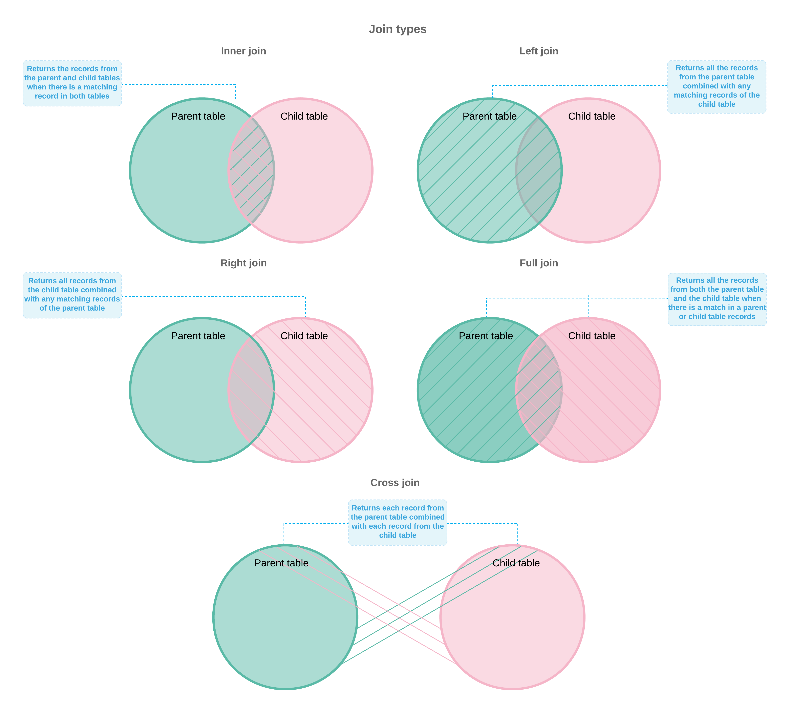
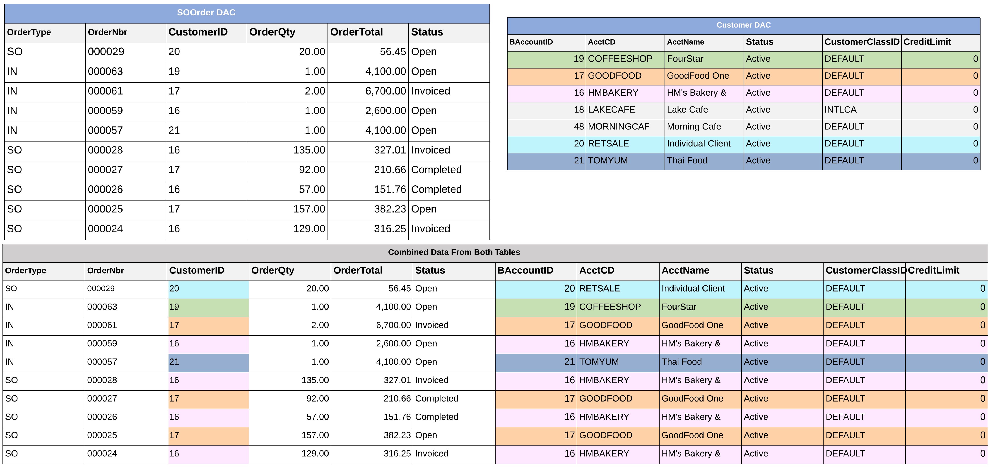

# Data from Multiple Data Sources: General Information {#_6b3546f4-43f3-4adc-b63a-292384571415 .concept}

In most cases, you want generic inquiry forms to give users the ability to review the data of some entity along with the data from other related entities. For example, suppose that you are creating a generic inquiry that lists open sales orders by customer. To build such an inquiry, you need to combine data from two data access classes \(DACs\): one that holds information about sales orders, and another that holds information about customers. For details on data access classes, which are referred to as *tables* on the user interface of the [Generic Inquiry](SM_20_80_00.md) \(SM208000\) form, see [DAC Discovery: General Information](GI_Discovering_DACs_General_Info.md).

**Tip:** We recommend that before you work with table relations, you have basic knowledge of SQL \(which is used for storing, manipulating, and retrieving data in databases\), so that you can understand how inquiries retrieve data.

You can use other generic inquiries as data sources, or have both DACs and inquiries as data sources for an inquiry, and combine then into query by setting relations between the sources. For details on using generic inquiries as data sources, see [Data from Multiple Data Sources: Use of Generic Inquiry as Data Source](GI_Use_of_Generic_Inquiry_as_Data_Source_Concept.md).

## Learning Objectives { .section}

In this chapter, you will learn how to construct a data request to retrieve data from multiple data access classes.

## Applicable Scenarios { .section}

You may find the information in this chapter useful when you are responsible for the customization of Acumatica ERP in your company, including developing and modifying generic inquiries to give users information they need to do their jobs. You need to deliver different inquiries that your colleagues may need to perform their jobs effectively. Many of these inquiries require the retrieval of data from multiple related data access classes.

## Construction of a Data Request from Multiple Tables { .section}

You start from inspecting the related forms \(that is, the data entry forms of the data you will use\) to determine the list of data access classes and fields you need to have in the results grid and use in formulas.

After the list of the tables is prepared, you determine how the tables will relate to each other \(parent-child pairs\) and what join type the system should use. Thus, you define how the system returns combined records in case either a parent or a child table is missing a record to combine.

Then for each pair you map a field from the parent table to the corresponding field from the child table. Thus, you define how the system will combine the records of the paired tables—that is, join conditions in SQL terms.

We recommend using the **Related Tables** dialog box to simplify configuration of relations between the tables. If the system offers you multiple suggestions on how a pair of tables can be linked, you can read detailed information about the tables and their fields in the DAC Schema Browser.

You can construct a data request manually \(or you can change automatically configured settings\) by using the instructions for the manual procedure. For more information, see [Data from Multiple Data Sources: Discovery of Key Fields](GI_Manual_Configuration_of_Relations_Concept.md).

## Definition of Relations Between Data Sources { .section}

After you have determined all the data sources you need for your inquiry, you need to decide how you will pair the sources and in what order you will list the pairs.

For each pair you determine which source is considered the parent table and which is the child one. Usually, the parent table is the one that provides the primary data and the child table provides additional information. For example, for an inquiry that lists sales orders by customers, you specify `SOOrder` as the parent table, because the primary data that the inquiry is displaying is provided by the `SOOrder` class. The `Customer` class provides additional information, so you select it as the child table.

The order in which you add the pairs to the system determines the sequence in which the system will retrieve the data. First, the system retrieves and combines data for the first pair of the sources to the single table. Then, the system adds up to this constructed table the data retrieved and combined from the next pair of the sources until there are no more pairs.

## Selection of a Join Type {#section_zdw_g32_xrb .section}

After you have decided which data source is considered the parent table and which is the child one, you decide on a type of join for these sources. In Acumatica ERP you can use one of the following join types:

**Tip:** The join types that you can select in Acumatica ERP work in exactly the same way as the corresponding SQL JOIN statements do.

-   *Inner*: An *Inner* join creates a result by combining the records of the parent and child tables when there is at least one match in both tables \(see the figure below\). For example, suppose that for an inquiry that lists open sales orders by customers, you join `SOOrder` and `Customer` with an *Inner* join. The system will return only those open sales orders \(from `SOOrder`\) for which there are customer records in the `Customer` table. The system will not display customers who do not have open sales orders.
-   *Left*: A *Left* join returns all the records from the parent table combined with any matching records of the child table \(see the figure below\). For example, suppose that for an inquiry that lists open sales orders by customers, you join `SOOrder` \(the parent table\) and `Customer` \(the child table\) with the *Left* join. The system returns all open sales orders. For an open sales order for which the customer record was not found, the system returns an empty value in the column with customer information.
-   *Right*: A *Right* join returns all the records from the child table combined with any matching records from the parent table \(see the figure below\). For example, suppose that for an inquiry that lists open sales orders by customers, you join `SOOrder` \(parent table\) and `Customer` \(child table\) with the *Right* join. The system will return all customers. For a customer for which a sales order record was not found, the system returns an empty value in the column with sales order information.
-   *Full*: A *Full* join returns all the records from both the parent table and the child table when there is a match in a parent or child table record \(see the figure below\). For example, suppose that for an inquiry that lists open sales orders by customers, you join `SOOrder` and `Customer` with a *Full* join. The system will return all open sales orders \(from `SOOrder`\) and all customers \(from the `Customer` table\). A *Full* join can return a huge number of records.
-   *Cross*: A *Cross* join returns each record from the parent table combined with each record from the child table. For example, suppose that your company produces clothes. The `ItemSize` table stores available sizes, and the `ItemColor` table stores available colors. You can use the *Cross* join to obtain all possible combinations of sizes and colors. Thus, the number of records in the result set is the number of records in the parent table multiplied by the number of records in the child table \(see the figure below\). Unlike the *Inner*, *Left*, *Right*, and *Full* join, the *Cross* join does not require a joining condition.

**Tip:** The inquiry results may be empty because of your access rights to Acumatica ERP forms, or because some data has been deleted in the database. For example, with the *Inner* join, the system will not display the open sales orders of the customers to whose accounts your access is restricted or whose accounts were deleted for some reason.

## Definition of Join Conditions {#section_jfl_d32_xrb .section}

After you have specified how the system should return combined records, you need to specify what data needs to be combined. To link the parent and child tables, you should specify the fields and conditions to link.

**Tip:** You can use any fields to join the tables. We recommend using the key fields because it allows the system to retrieve the data more quickly.

For example, suppose that for an inquiry that lists open sales orders by customers, you joined `SOOrder` as the parent table and `Customer` as the child table \(the type of join does not matter for linking fields\). This means that the system should combine the records of these two tables by adding data from the child table to the parent one. The child table provides customer details, so you should indicate to the system that the data of the particular customer needs to be joined with the data of particular open sales order of this customer. To do this, you add the link that indicates to the system that the `customerID` field from the `SOOrder` table equals the BAccountID field from the `Customer` table. The `BAccountID` field is a key field in the `Customer` table. The system finds an open sales order, identifies the value of the `customerID` field, and searches for the same value in the `BAccountID` column of the `Customer` table. When the customer record is found, the system combines these two records into one and proceeds to the next open sales order. The following screenshot shows the `SOOrder` and `Customer` tables and the result of their combination.

You can link the same two tables by using different join conditions. The join conditions you specify should be determined by the result that you need to receive. For example, you establish a relation between the `Users` \(parent\) and `CRActivity` \(child\) tables. You can use the *PKID* field for the `Users` table and one of the *CreatedByID* and *LastModifiedByID* fields in the `CRActivity` table.

If you are designing a generic inquiry to get data about users who created records in the `CRActivity` table, you link the *PKID* field with the *Equal* condition to the *CreatedByID* field.

If you are designing a generic inquiry to get data about users who modified records in the `CRActivity` table, you link the *PKID* field with the *Equal* condition to the *LastModifiedByID* field.

**Parent topic:**[Getting Data from Multiple Data Sources](../UserGuide/GI_Getting_Data_from_Multiple_Tables_Mapref.md)

