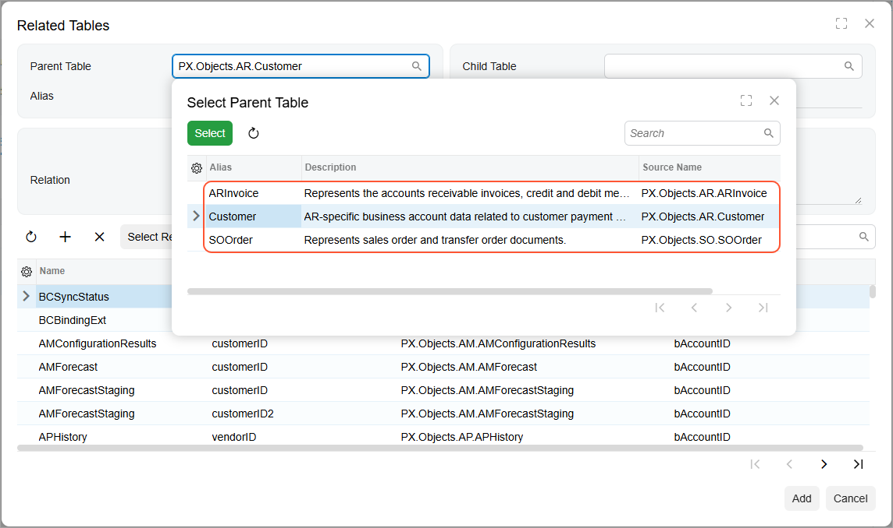
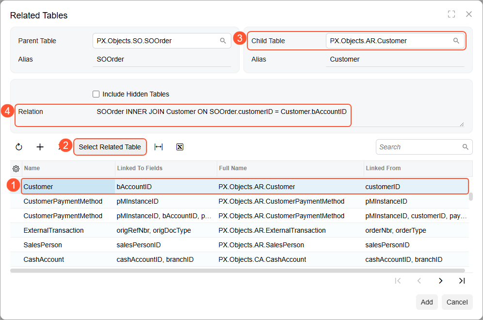
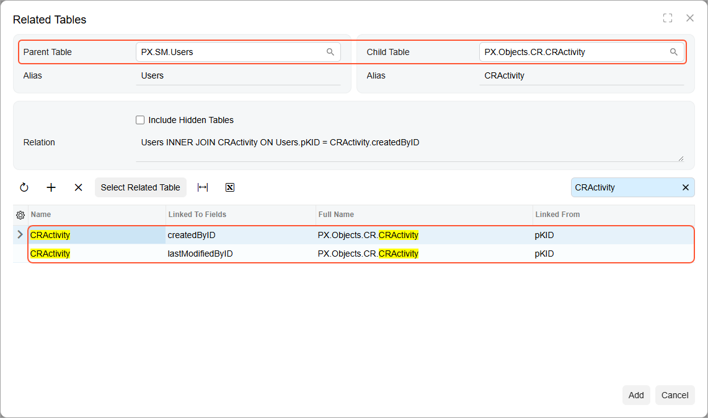
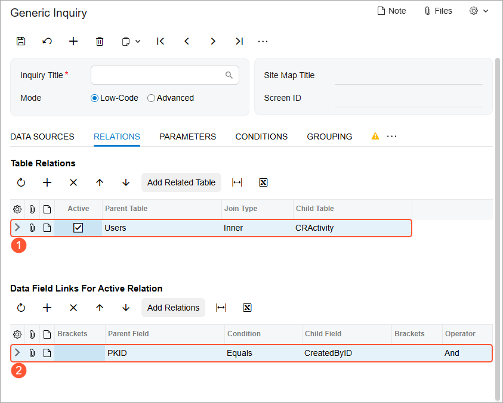

# Data from Multiple Data Sources: Use of Related Tables Dialog Box {#_071791bb-d704-423e-aec3-622d2515a226 .concept}

After you collected the list of the tables and decided how you need to pair the tables and in which order, you specify this information on the [Generic Inquiry](SM_20_80_00.md) \(SM208000\) form. You first add a table \(or multiple tables\) on the **Data Sources** tab and then use the **Related Tables** dialog box to add related tables and specify the relation settings. The system will guide you through the process and suggest possible options of linking records of paired tables.

## Selection of a Parent Table {#section_kml_3sd_xrb .section}

You add a parent table on the **Data Sources** tab by clicking **Add Row** on the table toolbar and selecting the needed table in the **Source Name** column of the added row.

With the row with the added table selected, you then open the **Related Tables** dialog box by clicking **Add Related Table** on the table toolbar. In the **Parent Table** box of the dialog box, the system displays the selected table \(see the following screenshot\).

")

If multiple tables are listed on the **Data Sources** tab, you can then select any of them as a parent table in the **Parent Table** box \(see the following screenshot\).

**Tip:** The **Add Related Table** button is unavailable until you add a table to the **Data Source** tab. It is also unavailable if a generic inquiry is selected as a source.

## Selection of a Child Table {#section_tms_zjx_xrb .section}

After you selected a parent table, you can select a child table. You select a child table in the list of tables \(which includes only the tables that can be linked to the selected parent table\). The row with a child table provides information about fields that can be used for linking the parent and child tables \(see Item 1 in the screenshot below\). For example, the information in the row for the `Customer` table shown in the screenshot below you can read as follows: The table with the `Customer` alias \(**Name**\) can be combined with the parent table by linking the `customerID` field from the parent table \(**Linked From**\) to the `bAccountID` field \(**Linked To Fields**\).

**Tip:** To find the necessary table in the list, you can use the search box below the list.

To select the child table, you click **Select Related Table** on the table toolbar \(Item 2\). The system displays the selected table in the **Child Table** box \(Item 3\) and the relation between the parent and child tables in the **Relation** box \(Item 4\). The relation is described as a part of the SQL statement and includes a type of join and data field links. By default, the *Inner* join type is used.

If a child table can be joined using different join conditions \(set of fields\), the system offers available options for the selection in the list of child tables, as the following screenshot demonstrates for the `Users` \(parent\) and `CRActivity` \(child\) tables. You select the needed option and click **Select Related Table**.

## Confirmation of the Configuration {#section_a3n_bkx_xrb .section}

To confirm the specified configuration and close the **Related Tables** dialog box, you click **Add** in the dialog box. The system closes the dialog box and does the following on the [Generic Inquiry](SM_20_80_00.md) \(SM208000\) form:

-   Adds the tables you selected to the list on the **Data Sources** tab of the form.
-   Adds the relation record to the **Table Relations** table on the **Relations** tab \(see Item 1 in the following screenshot\).
-   Adds join conditions for the relation record to the **Data Field Links For Active Relation** table on the **Relations** tab \(Item 2\).

After the relation between the pair of tables has been configured, you can change the following settings, which have been inserted by the system based on your selections in the **Related Tables** dialog box:

-   Join type: On the **Relations** tab, in the **Join Type** column of the **Table Relations** table
-   Data field links: On the **Relations** tab, in the **Data Field Links for Active Relation** table

At any time after the relation between the parent and child tables has been configured, you can view the relation by clicking **Add Relations** on the table toolbar of the **Data Field Links for Active Relation** table on the **Relations** tab. In this case, the system displays the **Related Tables** dialog box with the boxes filled in with values. Even though the boxes in the **Related Tables** dialog box are filled with values, you can configure the relation between a new pair of tables.

**Parent topic:**[Getting Data from Multiple Data Sources](../UserGuide/GI_Getting_Data_from_Multiple_Tables_Mapref.md)

