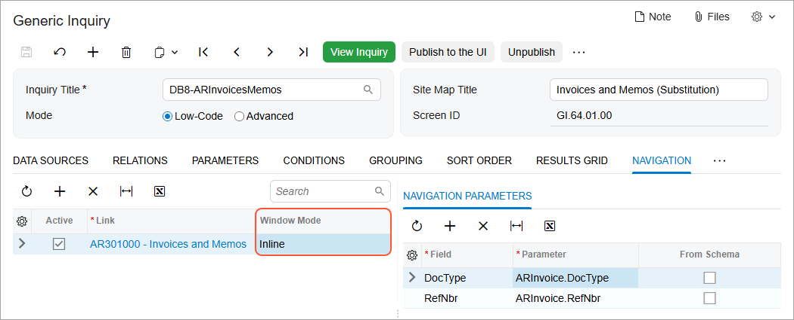

# Generic Inquiry as a Substitute Form: General Information {#_2c051f97-c884-4d23-81d1-38fb4336dd52 .concept}

In Acumatica ERP, you can create a generic inquiry that presents a list of records that were entered on a particular data entry form \(which is called the *primary form* in this context\). Once you have created the generic inquiry form, you can use it as an *entry point* to the primary form. This means that when you click the name of the primary form while searching for or navigating to it, you will instead access the generic inquiry form that contains the list of records. If you click the link of a record identifier in the list, the primary form \(that is, the data entry form\) opens with that record displayed. The generic inquiry form is called the *substitute form* in this context.

## Learning Objectives { .section}

In this chapter, you will learn how to substitute an inquiry form for a data entry form.

## Applicable Scenarios { .section}

You are responsible for the customization of Acumatica ERP in your company, including developing and modifying generic inquiries to give users information they need to do their jobs. You need to give users the ability to scan lists of records and find needed records quickly. You will accomplish this task by substituting inquiry forms \(lists of records\) for the related data entry forms.

## Substitution of an Inquiry Form for a Primary Form { .section}

You configure the replacement of a primary form with a substitute form on the **Entry Point** tab of the [Generic Inquiry](SM_20_80_00.md) \(SM208000\) form. To do this, in the **Entry Screen Settings** section of the form, you specify the primary form in the **Entry Screen** box and then select **Replace Entry Screen With This Inquiry in Menu** check box.

**Tip:** Replacing a primary form with a substitute form in this way does not remove the primary form, which can still be used. This setting affects only which form is *initially* opened when a user clicks the form name in a workspace menu or the search results.

When you replace a primary form with an inquiry form, the system automatically adds the corresponding navigation settings for this inquiry on the **Navigation** tab. It also sets the **Window Mode** for the path to the *Inline* option \(as shown in the following screenshot\), which is not available for selection by users.

When you save an inquiry with the replacement of a data entry form configured for this inquiry, the system adds a row to the [Lists as Entry Points](SM_20_85_00.md) \(SM208500\) form. This row contains the entry screen identifier and name in the **Entry Screen ID** column, the substitute screen identifier and name in the **Substitute Screen ID** column, and the indicator of whether the replacement is active in the **Active** column.

## Suspension of the Replacement of an Entry Form with a Substitute Form { .section}

You can activate or suspend the replacement of any entry form any time you want. You could, for example, do this temporarily, to make an inquiry form invisible to other users while you are making modifications to it. You can suspend the replacement in either of the following ways:

-   On the [Lists as Entry Points](SM_20_85_00.md) \(SM208500\) form, by clearing the check box in the **Active** column in the row for the entry form that was replaced
-   On the [Generic Inquiry](SM_20_80_00.md) \(SM208000\) form, by clearing the **Replace Entry Screen with This Inquiry in Menu** check box on the **Entry Point** tab \(**Entry Screen Settings** section\) for the generic inquiry that was used as a substitute form

On the [Lists as Entry Points](SM_20_85_00.md) form, if you delete the row containing the entry form and the corresponding substitute form, the following changes occur in the system:

-   The replacement is canceled, but the forms are not deleted.
-   On the [Generic Inquiry](SM_20_80_00.md) form, the **Replace Entry Screen with This Inquiry in Menu** check box on the **Entry Point** tab is cleared.

## Publication of a Generic Inquiry Form as a Substitute Form { .section}

You can use only a published generic inquiry form as a substitute form. When an inquiry has been created, you can publish it. To publish the generic inquiry, on the toolbar of the [Generic Inquiry](SM_20_80_00.md) \(SM208000\) form, you click the **Publish to the UI** button. In the **Publish to the UI** dialog box, you may change the default settings of the title, workspace, and category. Also, you may change the automatically assigned screen identifier.

In the **Access Rights** section of the dialog box, you select what access rights should be assigned to the substitution form. In this case, the system shows a warning in the **Publish to the UI** dialog box. The warning explains that the inquiry is a substitute form and access rights that you select for this inquiry will be applied to its data entry form. If you do not need to change access rights to the data entry form, you select the *Copy Access Rights from Screen* option and specify the data entry form for this option.

To complete the publication process, you click **Publish** in the dialog box.

## Modification of a Published Substitute Form { .section}

If you want to modify an inquiry that is currently used as a substitute form, you can temporarily hide it—that is, make the inquiry not visible to other users.

You can hide a published inquiry form that has been configured as a substitute form in one of the following ways:

-   By clearing **Active** on the [Lists as Entry Points](SM_20_85_00.md) \(SM208500\) form
-   By clearing the **Replace Entry Screen with This Inquiry in Menu** check box on the **Entry Point** tab of the [Generic Inquiry](SM_20_80_00.md) \(SM208000\) form

**Important:** We strongly recommend that you do not withdraw from publication an inquiry that has been published already. If you withdraw it, the system clears the assignment of screen identifier \(value of the **Screen ID** box\), which may cause issues with the widgets or pivot tables based on the published inquiry.

## Additional Operations on a Substitute Form { .section}

With the settings in the **Operations with Records** section of the **Entry Point** tab of the [Generic Inquiry](SM_20_80_00.md) \(SM208000\) form, you can specify additional operations that a user can perform on a substitute form. By selecting the appropriate check boxes in this section, you enable the following capabilities for the inquiry form:

-   Mass actions on records \(the **Enable Mass Actions on Records** check box\): When you select this check box, the **Mass Actions** tab appears on the [Generic Inquiry](SM_20_80_00.md) form. In the **Actions** column of this tab, you can select any of the available options from the drop-down list according to your needs. The available options depend on the commands that are available for the entry form for which you have created the inquiry form. For example, the following options might be available for the form: *Validate Address* and *Mark As Validated*.

    **Tip:** The ability to perform mass actions for the entry form that the inquiry replaces depends on the business logic of the form. It is possible that you could list some mass actions on the **Mass Actions** tab that cannot actually be performed.

    After you have selected the required options and saved your changes to the generic inquiry, the Included column is available on the substitute form, and the selected commands appear on the More menu \(under **Actions**\) of the substitute form. A user can select one record or multiple records on the substitute form and then apply any available command on the More menu \(under **Actions**\) to the selected records. Before you make the substitute form available to users, you need to test each of the commands on the More menu \(under **Actions**\) of the substitute form to make sure that the following requirements are met:

    -   The action can be performed properly.
    -   The action does not involve redirection to other forms.
    -   The action does not cause pop-up windows to be displayed.
    **Tip:** In Acumatica ERP, mass actions that involve redirection to other forms and display of pop-up windows are not supported because this scenario may cause performance issues.

    Based on the testing result, on the **Mass Actions** tab, you must delete the actions that do not meet the mentioned requirements.

-   Mass removal of records \(the **Enable Mass Record Deletion** check box\): If you select this check box, the **Delete** button and the Included column will be available on the substitute form. A user can select one record or multiple records and then delete them.
-   Automatic confirmation of record deletion \(the **Auto-Confirm Custom Delete Confirmations** check box\): If you select this check box, when a user tries to delete one record or multiple records, the system deletes the records without confirmation.
-   Mass update of records \(the **Enable Mass Record Update** check box\): If you select this check box, the **Update** and **Update All** commands will be available on the More menu \(under **Actions**\) of the substitute form; also, the Included column will be available on the substitute form, so that the user can select a record or multiple records for updating.

    If the **Enable Mass Record Update** check box is selected on the **Entry Point** tab, the **Mass Update Fields** tab appears on the [Generic Inquiry](SM_20_80_00.md) form. On this tab, you select the field or fields that should be updated if a user clicks one of the commands on the More menu \(under **Actions**\). A user can select one record or multiple records on the substitute form and then change the specified fields of the selected records.

    **Attention:**

    During the mass update on the inquiry form, the ability to update a particular field of the entry form that the inquiry replaces depends on the business logic of the field and may vary.

    Mass updating of attributes is not supported. For more information on attributes, see [Attributes](CS__con_Attributes.md).

-   Creation of records \(the **Enable New Record Creation** check box\): If you select this check box, the **New Record** button will be available on the form toolbar of the substitute form. When a user clicks the button, the entry form opens so that the user can add a new record.

    If you enable the creation of new records on the substitute form, you can define default values for the fields that appear when you add a record. The system will automatically enter these values in the corresponding UI elements when a user adds a new record. You define the default values in the **New Record Defaults** table on the **Entry Point** tab.

**Tip:** If you need to use additional operations on a substitute form \(that is, if you select any of the check boxes described above\), we recommend that you modify the predefined generic inquiry instead of creating a copy of the predefined generic inquiry and modifying the copy.

## Access Rights to Substitute Forms { .section}

In Acumatica ERP, every form has its own levels of access rights that you can specify for the user roles in the system by using the [Access Rights by Screen](SM_20_10_20.md) \(SM201020\) form. You can change the level of access rights to the data entry and generic inquiry forms independently of each other. However, when an inquiry form replaces the corresponding data entry form, it becomes the substitute form and inherits the level of access rights the users of each role have to the data entry form. Thus, to change the access rights users have to the substitute form, you need to change the access rights to the entry form. You can manage access rights to substitute forms in the same ways as you manage access rights to other generic inquiries. For more information about access rights, see [Managing Access Rights To Generic Inquiries](GI_Access_Rights_Mapref.md).

If you suspend an inquiry form’s replacement of a data entry form, the level of access to the inquiry form reverts to its initial state \(that is, the levels of access rights roles had to the inquiry form before it was defined to replace a data entry form\).

**Parent topic:**[Making a Generic Inquiry a Substitute Form](../UserGuide/GI_Gi_as_Entry_Point_Mapref.md)

