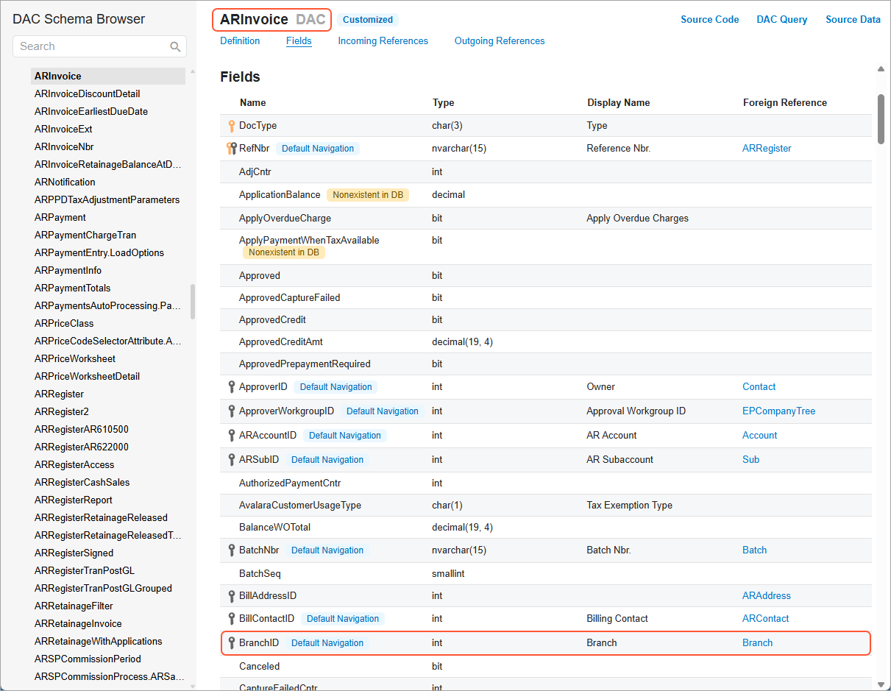
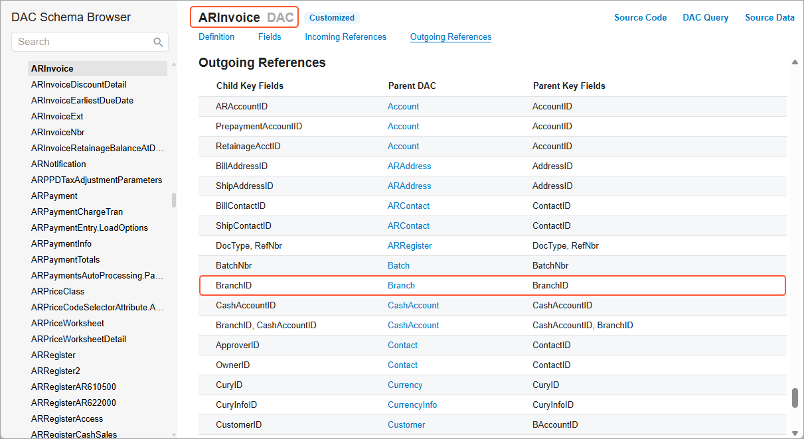
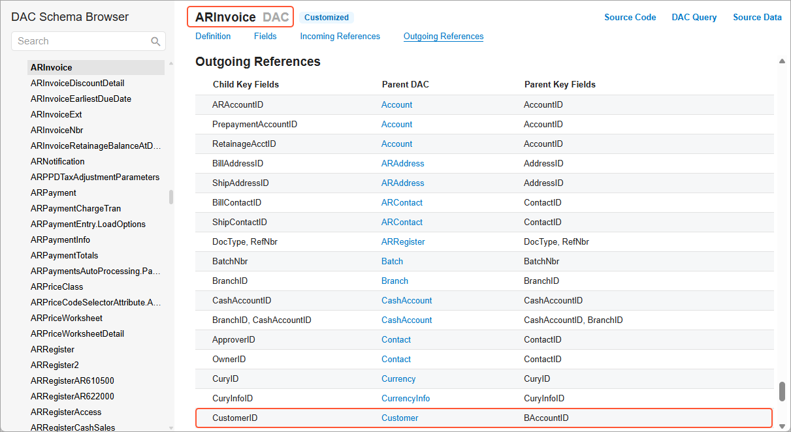
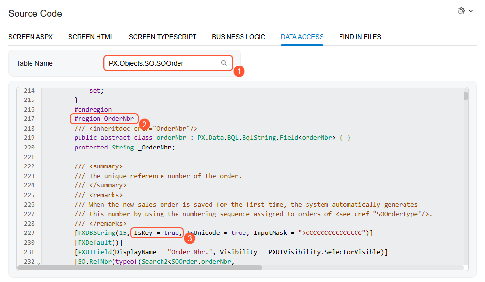

# Data from Multiple Data Sources: Discovery of Key Fields {#_2e4a1992-7372-4eac-a3b2-ef301b16c006 .concept}

On the [Generic Inquiry](SM_20_80_00.md) \(SM208000\) form, you can manually configure the relation between each pair of tables that you are going to use in your inquiry form. In this case, you should perform the following actions: to decide what type of join to use, to discover the key fields of the tables, and to define how to link the discovered fields to get the desired output.

If you are using the **Add Relation** wizard on the [Generic Inquiry](SM_20_80_00.md) form, you need to specify only a parent table and the system will suggest child tables with the possible linking options.

In this topic, you will read about the ways to discover key fields of a table that you can use for linking the tables.

**Tip:** You can use any fields to join the tables. We recommend using the key and foreign key fields because it allows the system to retrieve the data more quickly.

## Discovery of Key Fields by Using the DAC Schema Browser {#section_qjb_ljk_xrb .section}

Suppose that you need to create an inquiry that shows a list of AR invoices with detailed information about customers and the branch related to each AR invoice. You need to select the correct DACs for this inquiry and to specify the correct fields to link these DACs.

Your primary goal is to show the list of AR invoices. You open the [Invoices and Memos](AR_30_10_00.md) \(AR301000\) form and invoke the **Element Properties** dialog box for the **Reference Nbr.** box \(which holds a unique identifier of a document\) in the Summary area of the form. In the dialog box, you click the *PX.Objects.AR.ARInvoice* link in the **Data Class** box. The system opens the DAC Schema Browser in a separate browser tab with the detailed information about the *PX.Objects.AR.ARInvoice* DAC.

In the DAC Schema Browser, in the **Name** column of the **Fields** table, you look for the fields that hold information about the branch and customer of an AR invoice. These fields are *BranchID* and *CustomerID*, which are foreign keys, which means that there are DACs that reference these fields \(listed in the **Foreign Reference** column, as shown in the following screenshot\).

For the *BranchID* field, the *Branch* DAC is listed as a foreign reference. You can view the details of this DAC by clicking its link. You may want to make sure that this is the class that holds information about branches and it has all the fields you need for your inquiry. If you are satisfied with the DAC, you should look for it either in the **Incoming References** or **Outgoing References** section to find its key field that you should use for linking. \(See the following screenshot.\)

**Tip:** The first column in the **Incoming References** and **Outgoing References** sections lists the fields of the selected DAC.

For the *CustomerID* field, the *BAccount* and *Customer* DACs are listed. While reading about the *BAccount* DAC, you find out that it is the base class for the *Customer* DAC. That is, the *Customer* DAC uses information from the *BAccount* DAC and has additional fields. So, if the information about the customers that you need is available in the *BAccount* class, you should use this class for the performance reasons. Otherwise, you should use the *Customer* class. Suppose that you need to show only a customer's identifier, name, and default address. All this information is present in the *BAccount* class. You search for the *BAccount* class either in the **Incoming References** or **Outgoing References** section to find its key field that you should use for linking \(see the following screenshot\).

Thus, you determine that the following relations should be used for the selected DACs:

-   *ARInvoice* and *Branch*: *ARInvoice.BranchID = Branch.BranchID*
-   *ARInvoice* and *BAccount*: *ARInvoice.CusomerID = BAccount.BAccountID*

With this information, you add the DACs to the **Data Tables** tab and specify the relations on the **Relations** tab of the [Generic Inquiry](SM_20_80_00.md) form.

For details on DAC Schema Browser, see [Data from Multiple Data Sources: DAC Schema Browser](GI_Discovering_DACs_DAC_Schema_Browser_Concept.md).

## Discovery of Key Fields on the Source Code Form { .section}

The information about each key field—the field in the applicable record that holds unique data identifying that record from all the other records in the database—of the data access class you need is stored in the source code. You can get more information about the data access class you need on the [Source Code](SM_20_45_70.md) \(SM204570\) form, which you can access in the following ways:

-   From the **Element Properties** dialog box, as you are using it to explore a UI element on a particular form, by clicking **Actions** &gt; **View Data Class Source**. The form opens in a pop-up window. The specified data access class is shown on the **Data Access** tab \(see Item 1 below\).
-   By directly navigating to the [Source Code](SM_20_45_70.md) form. Then in the **Table Name** box on the **Data Access** tab, you select the data access class you need.

All fields of a data access class are listed on the **Data Access** tab, as shown in the following screenshot. You can explore any field further as you look for the key field; you generally focus on fields whose names seem to allude to numbers or identifiers. In the example shown in the screenshot, you would click `#region OrderNbr` to expand its attributes \(Item 2 in the screenshot\). Here you can find the string `IsKey = true`, which means that *OrderNbr* is included in the key of this class \(Item 3\).

Particular types of key fields are distinguished as follows:

-   On the application level, key fields are the fields that are marked with `IsKey = true`.
-   On the database level, key fields are the fields that are marked with the `PXDBIdentity` attribute and with `IsKey = true`. Key fields of this type are used to join data access classes. The key field with the `PXDBIdentity` attribute is a part of the database index, so the queries with the fields with the `PXDBIdentity` attribute execute faster than the queries with fields with only the `IsKey` attribute do.

Acumatica ERP master classes \(which are categorized as **Profiles** in the UI in workspaces and search results\), such as `Customer` and `InventoryItem`, usually have two key fields—that is, one with the `IsKey` attribute, and the other with the `PXDBIdentity` attribute. The key fields of the *InventoryItem* class are *InventoryID*, which is marked with the `PXDBIdentity` attribute, and *InventoryCD*, which is marked with the `IsKey` attribute. For these classes, you use the field with the `PXDBIdentity` attribute to join classes in queries and the field with the `IsKey` attribute in other cases, such as for inquiry or report parameters.

Acumatica ERP document and transaction classes \(which are mentioned as **Transactions** in the UI in workspaces and search results\)—such as `SOOrder`, `ARInvoice`, and `ARPayment`—usually have two or more key fields, which are marked with the `IsKey` attribute. For example, the key fields of the `ARInvoice` class are `RefNbr` and `DocType`. You can use both of these fields to join data access classes in queries.

You can perform similar actions to explore any element you need for your inquiry. For the key fields of the data access class, you have to observe the data access class and the database table. To reveal the relationships between the data access classes, you inspect the fields of the main data access class and the related data access classes and review the structure of the corresponding database tables.

**Parent topic:**[Getting Data from Multiple Data Sources](../UserGuide/GI_Getting_Data_from_Multiple_Tables_Mapref.md)

