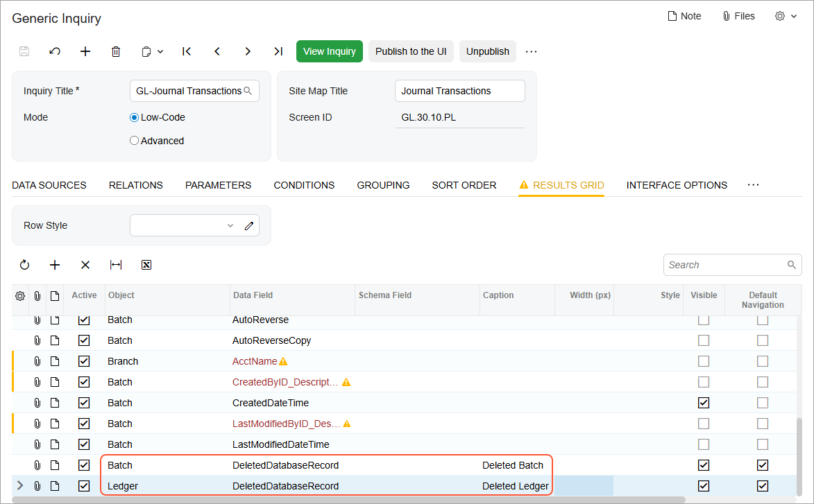
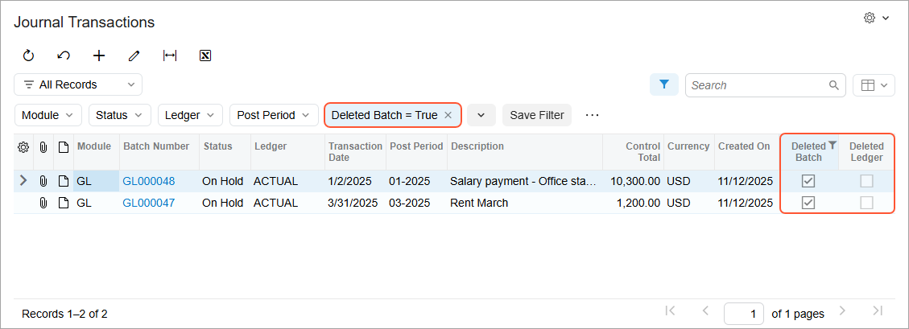

# Modification of Inquiry Results: Including Deleted Records {#_666a9a2d-ac8c-405f-9d95-a6f34813cedc .concept}

In some cases, you may want to include deleted records among the inquiry results.

For example, suppose that your company has provided services for a customer; it has generated the related invoice in Acumatica ERP and sent it to the customer.

The customer has later complained about the provided services, and a manager has approved the deletion of the invoice so that the customer no longer owes the company for the disputed services. You delete this invoice. \(Because the invoice hasn’t been released yet, it can be edited or deleted.\)

Then during your company’s audit, you generate the [AR Register](AR_62_15_00.md) \(AR621500\) report, in which the invoice number is missing. To give the interested parties a way to find and view invoices whose numbers are missing, you’ve decided to create an inquiry on the [Generic Inquiry](SM_20_80_00.md) \(SM208000\) form based on the *AR-Invoices and Memos* inquiry, except that the results will include deleted records.

To include deleted records in the inquiry results, on the [Generic Inquiry](SM_20_80_00.md) form, you do the following:

1.  On the **Interface Options** tab, select the **Show Deleted Records** check box, which is cleared by default.
2.  On the **Results Grid** tab, add a row and specify:
    1.  In the **Object** column, the DAC name whose deleted records you want to include
    2.  In the **Data Field** column, the *DeletedDatabaseRecord* field

With these settings, the system displays the deleted records in the inquiry results, indicating the deleted records by selecting the check box in the new column. By default, the **Is Deleted** caption is used for this column. If you want to display deleted records for multiple tables, we recommend entering a more descriptive caption for each of these columns in the **Caption** column of the **Results Grid** tab.

For example, the following screenshot shows the *GL-Journal Transactions* inquiry, where rows have been added to the **Results Grid** tab to show the deleted records of the Batch and Ledger tables. Notice that the *Deleted Batch* and *Deleted Ledger* column captions, respectively, have been specified for these tables.

The following screenshot shows the *Journal Transactions* generic inquiry form, which now includes the records of deleted batches and ledgers. The newly added columns can be used for filtering records, as shown below.

**Parent topic:**[Modifying Inquiry Results](../UserGuide/GI_Modifying_Inquiry_Results_Mapref.md)

