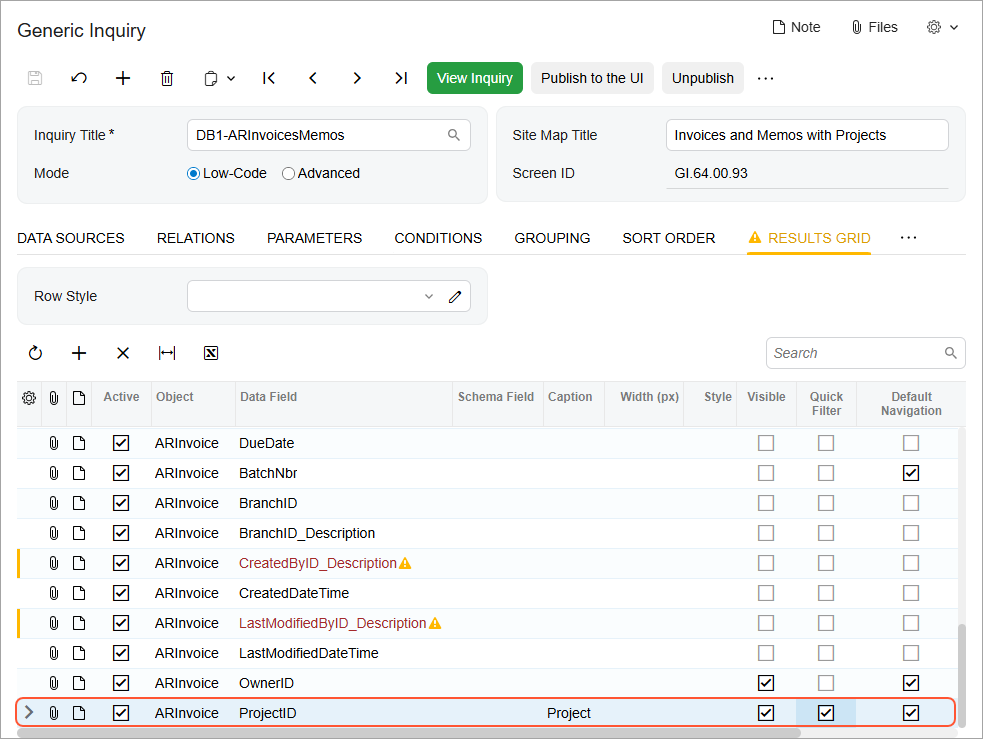
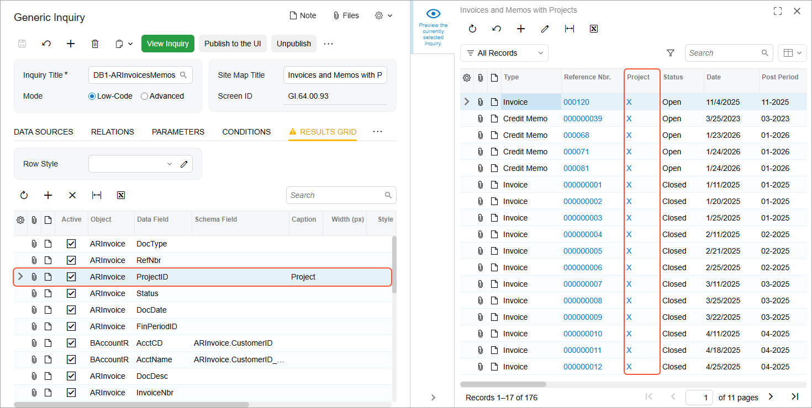

# Modification of Inquiry Results: To Include an Additional Output Field {#_86bf3daa-ffe8-411a-8a39-6450b22c02d2 .task}

In this activity, you will learn how to modify an existing generic inquiry to include an additional column of data in the results grid.

**Attention:** This activity is based on the *U100* dataset. If you are using another dataset or if any system settings have been changed in *U100*, these changes can affect the workflow of the activity and the results of the processing. To avoid issues, restore the *U100* dataset to its initial state.

## Story { .section}

Suppose that you’re a technical specialist in your company who is working on simple customizations, including those involving the creation, modification, and use of generic inquiries. An accountant of your company has requested an inquiry that displays data about invoices and memos. You have offered the predefined Invoices and Memos \(AR3010PL\) list of records—a generic inquiry form. After reviewing this inquiry, the accountant has requested the following changes:

-   Add to the inquiry results a column \(**Project ID**\) showing the identifier of the project related to each listed invoice
-   Place the **Project ID** column after the column that holds the reference numbers of the invoices and memos
-   Add the ability to view the details of any project by clicking its identifier in the **Project ID** column
-   Add the ability to filter the inquiry results by the identifier of an invoice-related project

## Configuration Overview {#section_ayf_13q_3rb .section}

You will work with a copy of the predefined Invoices and Memos \(AR3010PL\) inquiry form, which has the *AR-Invoices and Memos* inquiry title and the *Invoices and Memos* site map title specified on the [Generic Inquiry](SM_20_80_00.md) \(SM208000\) form.

**Tip:** The Invoices and Memos \(AR3010PL\) generic inquiry form is the substitute form that is opened when a user clicks the *Invoices and Memos* link in a workspace or a list of search results.

The copy you will work with has the *DB1-ARInvoicesMemos* inquiry title and the *S130 Invoices and Memos* site map title specified on the [Generic Inquiry](SM_20_80_00.md) form.

## Process Overview { .section}

In the Summary area of the [Invoices and Memos](AR_30_10_00.md) \(AR301000\) form, you’ll inspect the **Project** element to find the related data access class \(DAC\) and data field. Then you will make changes to the copied inquiry on the [Generic Inquiry](SM_20_80_00.md) \(SM208000\) form. You will add a data field on the **Results Grid** tab of the form.

## System Preparation {#section_xbc_14r_jrb .section}

Launch the Acumatica ERP website, and sign in to a tenant with the *U100* dataset preloaded as system administrator Kimberly Gibbs. You should sign in by using the *gibbs* username and the *123* password.

**Tip:** The *gibbs* user is assigned the *Administrator* role, which has sufficient access rights to manage the system configuration and to modify generic inquiries, advanced filters, pivot tables, and dashboards.

## Step 1: Inspecting UI Elements { .section}

To learn the data access classes and data fields you’ll need to use in future steps, do the following:

1.  Inspect the **Project** element in the Summary area of the [Invoices and Memos](AR_30_10_00.md) \(AR301000\) form to find the related data access class \(DAC\) and data field. For the exact steps to do this, see [DAC Discovery: To Inspect UI Elements](GI_Discovering_DACs_inspect_element_Activity.md).

    **Tip:** While you are working with a generic inquiry on the [Generic Inquiry](SM_20_80_00.md) \(SM208000\) form, you may find it convenient to have the form or forms containing the UI elements open in a separate browser tab. This lets you quickly switch between the [Generic Inquiry](SM_20_80_00.md) form and the form where you’re inspecting the elements.

2.  Make a note of the DAC and data field of the **Project** element \(*PX.Objects.AR.ARInvoice* and *ProjectID*, respectively\).

## Step 2: Adding a Data Field, Changing the Caption, and Setting Up Default Navigation and Filtering { .section}

To add a column to the results grid of the existing inquiry, do the following:

**Tip:** If some columns mentioned in the activity aren’t available in the table, make them visible by using the Column Configuration dialog box.

1.  Open the [Generic Inquiry](SM_20_80_00.md) \(SM208000\) form.
2.  In the **Inquiry Title** box of the Summary area, select *DB1-ARInvoicesMemos*.
3.  In the **Site Map Title** box of the Summary area, type `Invoices and Memos with Projects`.
4.  On the **Data Sources** tab, verify that the `PX.Objects.AR.ARInvoice` table is listed. This means that you do not need to add the table to retrieve identifiers of projects associated with invoices.
5.  On the **Results Grid** tab, add a row, and specify the following settings in the added row:

    -   **Object**: ARInvoice
    -   **Data Field**: ProjectID
    Notice that the **Visible** check box is selected by default, which indicates that the system will display the added column in the generic inquiry form.

    Also notice that the **Default Navigation** check box is selected by default, indicating that the values in this column will be shown as links; this is because the [Projects](PM_30_10_00.md) \(PM301000\) form is specified for the data field as the default form defined in the source code. In the generic inquiry form, when a user clicks a link in this column, the system opens the [Projects](PM_30_10_00.md) form in a pop-up window with the selected project details.

6.  In the **Caption** column, which is hidden by default, type the caption \(name\) of the requested column: *Project ID*.
7.  In the **Quick Filter** column, which is hidden by default, select the check box for the added row.
8.  On the form toolbar, click **Save**.

You have added the row that corresponds to the **Project ID** column. Currently, it is the last row \(as shown below\), so **Project ID** will be the rightmost column on the generic inquiry form.

In the next step, you will move the row so that the column appears in the needed place on the inquiry form.

## Step 3: Moving the Row and Previewing Your Changes { .section}

To move the new row and preview the resulting generic inquiry form, do the following:

1.  While you are still viewing the [Generic Inquiry](SM_20_80_00.md) \(SM208000\) form with the *DB1-ARInvoicesMemos* generic inquiry selected, again open the **Results Grid** tab.
2.  Drag the added row immediately after the row that holds the reference number information \(that is, the row with a **Data Field** setting of *RefNbr*\).
3.  On the form toolbar, click **Save**.
4.  Click the eye icon on the side panel to preview how your changes have affected the resulting generic inquiry form \(which has the *Invoices and Memos with Projects* site map title\). Notice that the **Project ID** column has been moved after the **Reference Nbr.** column \(shown below\) so that an accountant can see the related projects while viewing the list of invoices and memos in the results grid.

    

**Parent topic:**[Modifying Inquiry Results](../UserGuide/GI_Modifying_Inquiry_Results_Mapref.md)

