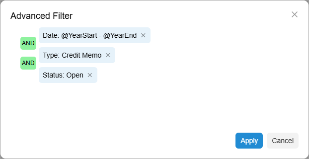

# Advanced Filters: To Create a Personal Filter Based on a Shared Filter {#_9897f0fc-5fde-4b61-a72f-1d7c041c2cda .task}

In this activity, you will learn how to create a personal advance filter based on a shared advanced filter.

## Story { .section}

Suppose that you are an accountant in your company. Some time ago, a set of shared filters was configured for the Invoices and Memos \(AR3010PL\) generic inquiry form,which is a list of records.

Further suppose that you are responsible for tracking the open credit memos for the current year. The generic inquiry has no filter you can use to quickly view these documents, so you have decided to create a personal filter and define it as your default filter, to streamline your work.

## Process Overview { .section}

On the Invoices and Memos \(AR3010PL\) generic inquiry form, you will copy the **Current Quarter** filter and modify it to suit your needs.

## System Preparation { .section}

1.  Launch the Acumatica ERP website, and sign in to a tenant with the *U100* dataset preloaded as system administrator Kimberly Gibbs. You should sign in by using the *gibbs* username and the *123* password.

    **Tip:** The *gibbs* user is assigned the *Administrator* role, which has sufficient access rights to manage the system configuration and to modify generic inquiries, advanced filters, pivot tables, and dashboards.

2.  Complete the [Advanced Filters: To Create Advanced Shared Filters](GI_Reusable_Filters_Creating_Shared_Reusable_Filter_Activity.md) activity.

## Step: Creating a Personal Filter by Copying a Shared Filter { .section}

To create an advanced personal filter, do the following:

1.  Open the Invoices and Memos \(AR3010PL\) generic inquiry form.

    Notice that the **My Documents** filter is opened by default. This happens because for this filter, the **Default** check box was selected in the **Save Filter As** dialog box.

2.  On the table toolbar, click **Filter Settings** to expand the filtering area.
3.  In the Filter List drop-down menu in the upper-left corner, select **Current Quarter**.
4.  In the filtering area, click **...** and then **Save As**.
5.  In the **Save Filter As** dialog box, which opens, type `Open Memos for Current Year`, select the **Default** check box, and click **Save**.
6.  In the filtering area, click **...** and then **Open Advanced Filter**.
7.  In the **Advanced Filter** dialog box, modify the clause to the following settings:
    -   **Property**: *Date*
    -   **Condition**: *Is Between*
    -   **From**: *@YearStart*
    -   **To**: *@YearEnd*
8.  Add a second clause with the following settings:
    -   **Property**: *Type*
    -   **Condition**: *Equals*
    -   **Value**: *Credit Memo*
9.  Add a third clause with the following settings:

    -   **Property**: *Status*
    -   **Condition**: *Equals*
    -   **Value**: *Open*
    Below you can see the updated settings of the *Open Memos for Current Year* filter.

    

10. Click **Apply**, which closes the dialog box.
11. In the filtering area, click **Save Filter**.

    Notice that *Open Memos for Current Year* has been added to the Filter List drop-down menu.

12. Go to any other form and then open the Invoices and Memos \(AR3010PL\) generic inquiry form again.

    Notice that the system has applied the *Open Memos for Current Year* filter by default.

**Parent topic:**[Managing Advanced Filters](../UserGuide/GI_Reusable_Filters_Mapref.md)

