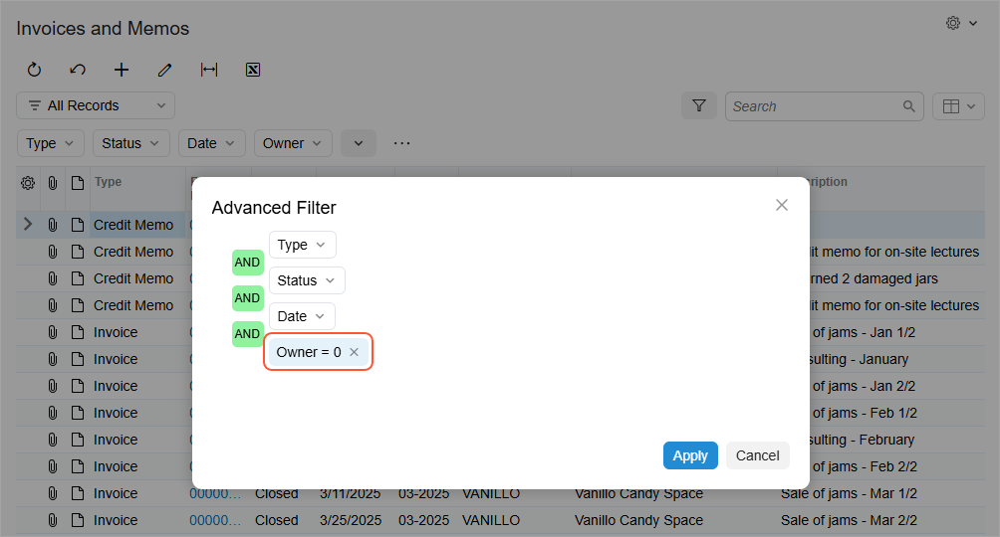
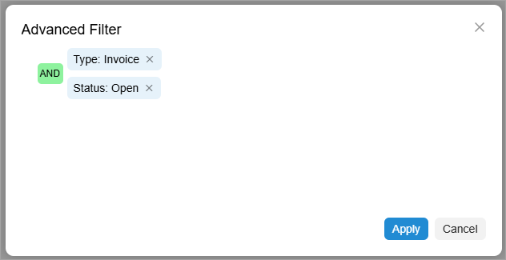
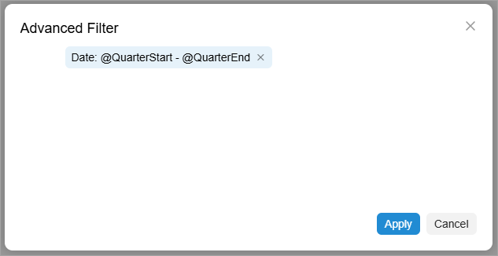
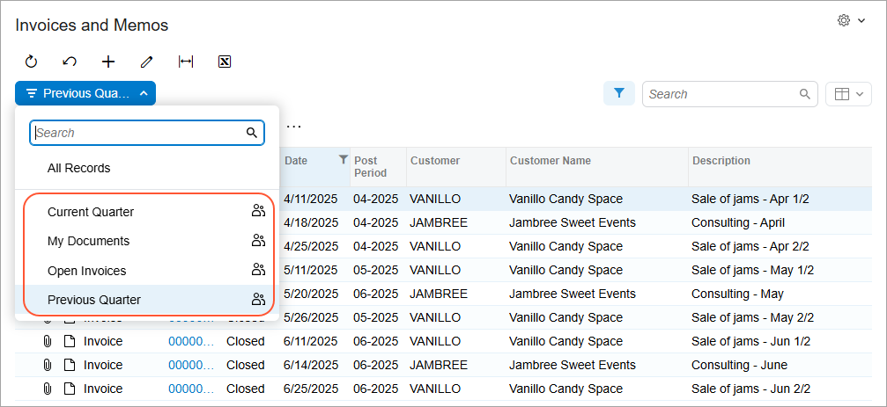

# Advanced Filters: To Create Advanced Shared Filters {#_242682e5-59cf-449c-90df-bc70f4c4dd6b .task}

In this activity, you will learn how to create advanced filters and make these filters available to other users.

**Attention:** This activity is based on the *U100* dataset. If you are using another dataset or if any system settings have been changed in *U100*, these changes can affect the workflow of the activity and the results of the processing. To avoid issues, restore the *U100* dataset to its initial state.

## Story { .section}

Suppose that you’re a technical specialist in your company who’s working on simple customizations. An accountant of your company has asked you to add multiple filters \(that is, filter tabs\) for the Invoices and Memos \(AR3010PL\) generic inquiry form. This form is the predefined generic inquiry with the *AR-Invoices and Memos* inquiry title and the *Invoices and Memos* site map title specified on the [Generic Inquiry](SM_20_80_00.md) \(SM208000\) form.

The following filters, which should be available to all users with access to the generic inquiry form, need to be added:

-   *My Documents*: The documents owned by the user who is currently signed in to the system. When a user accesses the inquiry form, the system should open this filter by default instead of the *All Records* filter.
-   *Open Invoices*: Only invoices that have the *Open* status.
-   *Current Quarter*: Documents for the current quarter.
-   *Previous Quarter*: Documents for the previous quarter.

## Process Overview { .section}

On the Invoices and Memos \(AR3010PL\) generic inquiry form, you will create the requested filters by the **Advanced Filter** dialog box.

## System Preparation { .section}

Launch the Acumatica ERP website, and sign in to a tenant with the *U100* dataset preloaded as system administrator Kimberly Gibbs. You should sign in by using the *gibbs* username and the *123* password.

**Tip:** The *gibbs* user is assigned the *Administrator* role, which has sufficient access rights to manage the system configuration and to modify generic inquiries, advanced filters, pivot tables, and dashboards.

## Step 1: Creating an Advanced Filter with a User-Relative Clause { .section}

To create an advanced filter with a user-relative clause, do the following:

1.  Open the Invoices and Memos \(AR3010PL\) generic inquiry form.
2.  On the table toolbar, click **Filter Settings** to expand the filtering area.
3.  In the filtering area, click **...** and then **Open Advanced Filter**.
4.  In the **Advanced Filter** dialog box, which opens, add a clause with the following settings \(shown below\):

    -   **Property**: *Owner*
    -   **Condition**: *Equals*
    -   **Value**: `@Me`
    

5.  Click **Apply**. This closes the dialog box and applies the filter.
6.  Click **Save Filter** in the filtering area.
7.  In the **Save Filter As** dialog box, which opens, type `My Documents` and select the **Shared** and **Default** check boxes.
8.  Click **Save**, which closes the dialog box.

    On the generic inquiry form, notice that *My Documents* has been added to the Filter List drop-down menu.

## Step 2: Creating an Advanced Filter with Multiple Filter Clauses { .section}

To create an advanced filter with multiple filter clauses, do the following:

1.  While you are still on the Invoices and Memos \(AR3010PL\) generic inquiry form, in the filtering area, click **...** and then **Open Advanced Filter**.
2.  In the **Advanced Filter** dialog box, add a clause with the following settings:
    -   **Property**: *Type*
    -   **Condition**: *Equals*
    -   **Value**: *Invoice*
3.  Join the clause with the *And* logical operator, and add another clause with the following settings \(shown below\):

    -   **Property**: *Status*
    -   **Condition**: *Equals*
    -   **Value**: *Open*
    

4.  Click **Apply**, which closes the **Advanced Filter** dialog box.
5.  Click **Save Filter** in the filtering area.
6.  In the **Save Filter As** dialog box, which opens, type `Open Invoices` and select the **Shared** check box.
7.  Click **Save**, which closes the dialog box.

    On the inquiry form, notice that *Open Invoices* has been added to the Filter List drop-down menu.

## Step 3: Creating Advanced Shared Filter with a Date-Relative Clause { .section}

To create advanced filter with a date-relative clause, do the following:

1.  While you are still on the Invoices and Memos \(AR3010PL\) inquiry form, in the filtering area, click **...** and then **Open Advanced Filter**.
2.  In the **Advanced Filter** dialog box, add a clause with the following settings \(see below\):

    -   **Property**: *Date*
    -   **Condition**: *Is Between*
    -   **From**: *@QuarterStart*
    -   **To**: *@QuarterEnd*
    

3.  Click **Apply**, which closes the **Advanced Filter** dialog box.
4.  Click **Save Filter** in the filtering area.
5.  In the **Save Filter As** dialog box, which opens, type `Current Quarter` and select the **Shared** check box.
6.  Click **Save**; this closes the dialog box.
7.  In the filtering area, click **...** and then **Save As**.
8.  In the dialog box that opens, type `Previous Quarter`, select the **Shared** check box, and click **Save**.
9.  In the filtering area, click **...** and then **Open Advanced Filter**.
10. In the **Advanced Filter** dialog box, change the clause to the following:
    -   **From**: `@QuarterStart-1`
    -   **To**: `@QuarterEnd-1`
11. Click **Apply**, which closes the **Advanced Filter** dialog box.
12. Click **Save Filter** in the filtering area.

    Notice that *Current Quarter* and *Previous Quarter* have been added to the Filter List drop-down menu—along with menu commands for the other filters you’ve added in the activity, as shown below.

    

**Parent topic:**[Managing Advanced Filters](../UserGuide/GI_Reusable_Filters_Mapref.md)

