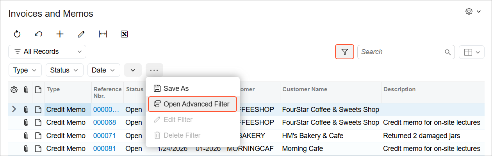
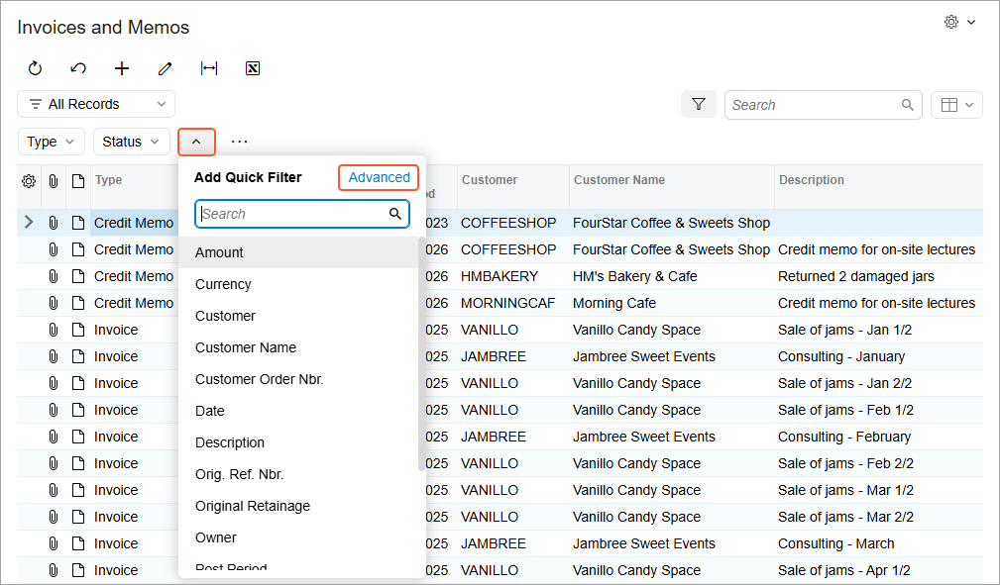
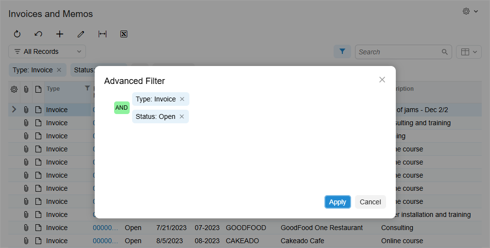
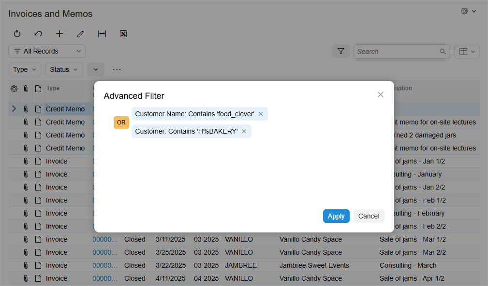
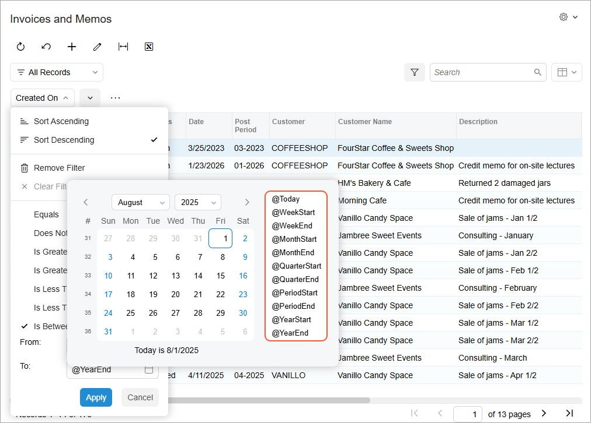

# Advanced Filters: General Information {#_f6bd0804-543a-4e52-9fe9-4cd8305c575b .concept}

In Acumatica ERP, you can use simple and quick filters to quickly filter the data in the tables of forms based on the values of columns. In addition, you can create advanced filters for any mass processing, inquiry, or generic inquiry form to filter the data in the table shown on the form.

A form’s saved filters are listed in the Filter List drop-down menu. Once you create an advanced filter for a form and save the filter, you can reuse it when you use that form in the future. You can create advanced filters for your personal use or share them with other users.

## Learning Objectives { .section}

In this chapter, you will learn how to do the following:

-   Create advanced filters
-   Share advanced filters
-   Modify advanced filters
-   Delete advanced filters
-   Create personal filters based on shared filters

## Applicable Scenarios { .section}

You may find the information in this chapter useful when you are responsible for the customization of Acumatica ERP in your company, including defining advanced filters. You may need to create different advanced filters to filter specific types of data in forms and make them available to all users of the system. With these filters, every user of the form will have a consistent basis for analysis without needing to spend time on configuring personal filters.

## Personal and Shared Filters { .section}

When you work with a form, you can create advanced filters, which save time spent on filtering data. When you save an advanced filter, the system adds it to the Filter List drop-down menu. You can create as many filters as you need for a particular form. All the filters that you create are your personal filters; they aren’t available to other users in the system. You can modify the conditions of these filters or delete the filters if you don’t need them anymore.

If you would like to share your advanced filters with other users, you need to have sufficient access rights to the [Filters](CS_20_90_10.md) \(CS209010\) form. If you do, you can modify filter clauses, rename or delete shared advanced filters, either by selecting the filter on this form or directly on the related form.

By default, users with the built-in *Administrator* role have access to this form. These users, generally system administrators or technical specialists that perform customizations, can create advanced filters and share them with other users. If an advanced filter is shared, it cannot be modified or deleted by users that do not have sufficient access rights to the [Filters](CS_20_90_10.md) form.

**Tip:** By default, a new filter created on the [Filters](CS_20_90_10.md) form is shared.

If you do not have access rights to modify advanced shared filters but would like to use an advanced shared filter as a basis for your filtering conditions, you can copy this filter and modify its copy as your advanced personal filter.

## Creation of Advanced Filters { .section}

If you have sufficient access rights to the [Filters](CS_20_90_10.md) \(CS209010\) form, you can use this form to create advanced shared filters for processing, inquiry, and generic inquiry forms.

We recommend, however, that you instead create an advanced filter directly on the form by opening the **Advanced Filter** dialog box from the form's filtering area. This way, you can view the results immediately after applying the filter and modify the filter conditions, if needed. You can also share the filter with other users directly from the form if you have access rights to the [Filters](CS_20_90_10.md) form.

**Tip:** Users with any level of access rights can create both quick and advanced filters.

To open the **Advanced Filter** dialog box, do either of the following:

-   Click the **...** button in the filtering area and then click **Open Advanced Filter**, as shown below.

    

-   Click the **Add Quick Filter** button and click **Advanced** in the dialog box that opens, as shown below.

    

By using the **Advanced Filter** dialog box, you can manage your advanced personal filters created for this form. If you have sufficient access rights, you can also manage advanced shared filters that have been created for this form by other users.

## Filter Clauses { .section}

Any advanced filter consists of either one filter clause or multiple filter clauses. For each clause, you specify the following settings:

-   **Property**: The data field of the form that the filter will be applied to. You select a property from the list of available data fields, including those that are hidden in the table on the form.
-   **Condition**: The logical operation that applies to the value of the selected property. You select a condition from the list of available conditions.
-   **Value**: A value for the logical condition used to filter the data. Depending on the selected property and condition, you enter a value \(and sometimes a second value as well, depending on the condition\). Each value must conform with the data type of the selected property. Generally, there are a series of fixed values for the property—for example, the *Completed* value for the *Status* property. For date-relative clauses, you can specify parameters, such as *@WeekStart* and *@Today*, as values. The filtering process is not case-sensitive; that is, the system does not differentiate between uppercase and lowercase letters in values.

    A value is not used for the *Is Empty* and *Is Not Empty* conditions.

To define a clause, you specify the property, the condition, and the applicable values in the table row. You can use *And* and *Or* operators and parentheses to group clauses into logical expressions. Parentheses can be used in logical statements to define the order of operations. The *And* and *Or* operators work on a unit in parentheses as if the unit was a single clause.

For example, on the Invoices and Memos \(AR3010PL\) list of records, you can search for invoices with the open status by specifying a filter that has two conditions combined with the *And* operator. The first condition has *Type* specified as the property, *Equals* specified as the condition, and *Invoice* specified as the value. The second condition has *Status* specified as the property, *Equals* specified as the condition, and *Open* specified as the value \(as shown in the following screenshot\).

## Wildcards in Filter Clauses { .section}

When you filter data by using the **Advanced Filter** dialog box or on the [Filters](CS_20_90_10.md) \(CS209010\) form, you can use a pattern for the string value in the *Value* column. In the pattern, you can substitute any symbols with wildcard characters. You can use the following wildcard characters:

-   Underscore \(*\_*\): You can use this character if you want to filter the data according to a pattern in which only one symbol is substituted. For example, if you try to filter the data by a customer name that contains the *Customer\_Name* string, the system will return all the customers whose name contains any of the following strings: *Customer\_Name*, *Customer-Name*, and *Customer Name*.
-   Percentage \(*%*\): You can use this character if you want to filter the data according a pattern in which multiple symbols are substituted. For example, if you try to filter the data by a customer name that contains the *Da%n* string, the system will return all the customers whose name starts with *Da* and ends with *n*, such as *Dalton* and *Damian*.

Note that you should use the *Contains* condition if you are using wildcards \(see the following screenshot\).

## User-Relative Filter Clauses {#_2a79b8bb-e461-43cf-b440-2d0388974211 .section}

To simplify the process of filtering data by owner or by workgroup in the **Advanced Filter** dialog box or on the [Filters](CS_20_90_10.md) \(CS209010\) form, you can use three predefined user-relative parameters in the **Value** column. By using these parameters, you can configure *user-relative clauses*. When you use these parameters, you do not need to create multiple rows with specific values—for example, to specify each workgroup in which you are a member for the *Workgroup* property. Instead, you can use only one parameter, such as *@MyGroups*, to filter all the records of the workgroups you are a member of.

The following predefined user-relative parameters are available:

-   `@Me`: The current user. This parameter can be used only for the user-related properties \(such as *Owner* or *Custodian*\) that have *Equal* and *Does Not Equal* conditions. These user-related properties include the following: a user ID of the `Guid?` type \(in the database, it relates to the `PKID` field of the `uniqueidentifier` type\), a contact ID of the integer type, and a username \(or an owner name\) of the string type.

    If the *Customer and Vendor Visibility Restriction* feature is enabled on the [Enable/Disable Features](CS_10_00_00.md) \(CS100000\) form, the system filters the records according to the access rights of the current user.

-   `@MyGroups`: The workgroups in which the current user is a member, excluding the workgroups that are the subordinates of these workgroups. You can use this parameter for the *Workgroup* property, which has the *Is In* and *Is Not In* conditions.
-   `@MyWorktree`: The workgroups in which the current user is a member, including the groups that are subordinates of these groups according to the company tree structure. You can use this parameter for the *Workgroup* property, which has the *Is In* and *Is Not In* conditions.

## Date-Relative Filter Clauses {#_12755b03-7718-4fe5-af41-1a2981b7c175 .section}

To make date clauses in advanced filters more flexible, you can use date-relative parameters—parameters that are relative to the business date—in the **Advanced Filter** dialog box or on the [Filters](CS_20_90_10.md) \(CS209010\) form.

**Tip:** For the date-relative parameters, as the current date, the system uses the date \(in coordinated universal time, or *UTC*\) of the server used to run the Acumatica ERP instance. Changing the business date \(in the upper-right corner of the screen\) does not affect the filter results.

You can use the following date-relative parameters:

-   `@Today`: The business date. You can modify this parameter by adding or subtracting days.

    **Attention:** If the data field contains a value that consists of a date and time, only records for which all of the following conditions are met match this parameter:

    -   the date is the same as the business date
    -   the time is *00:00:00*
-   `@WeekStart`: The date of the start of the current week. You can modify this parameter by adding or subtracting weeks.

    **Tip:** The start and end of the week are determined based on the default system locale or the locale that you selected when you signed in to Acumatica ERP. The system locales are specified and configured on the [System Locales](../Shared/../UserGuide/SM_20_05_50.md) \(SM200550\) form.

-   `@WeekEnd`: The date of the end of the current week. You can modify this parameter by adding or subtracting weeks.
-   `@MonthStart`: The date representing the start of the current month.
-   `@MonthEnd`: The date that’s the end of the current month.
-   `@QuarterStart`: The date that’s the start of the current quarter.
-   `@QuarterEnd`: The date of the end of the current quarter.
-   `@PeriodStart`: The date representing the start of the current financial period.
-   `@PeriodEnd`: The date marking the end of the current financial period; the financial periods in your system are defined on the [Financial Year](../Shared/../UserGuide/GL_10_10_00.md) \(GL101000\) form.
-   `@YearStart`: The start date of the current calendar year.
-   `@YearEnd`: The end date of the current calendar year.

To add a filter clause with a date-relative parameter, you select the parameter from the list. \(See the following screenshot.\)

You can modify the parameters by adding or subtracting integers. The date is calculated according to the unit of measure of the parameter. For example, to view all tasks that are due next week, on the Tasks \(EP4040PL\) form, you add a filter clause as follows: You specify *Due Date* as the property, *Is Between* as the condition, *@WeekStart + 1* as the first value, and *WeekEnd + 1* as the second value. The integer \(*1*\) in these values represents a week because it is the unit of measure of the parameter.

**Tip:** If the modified date is out of range, the system will not be able to find any records and will return an error.

**Parent topic:**[Managing Advanced Filters](../UserGuide/GI_Reusable_Filters_Mapref.md)

