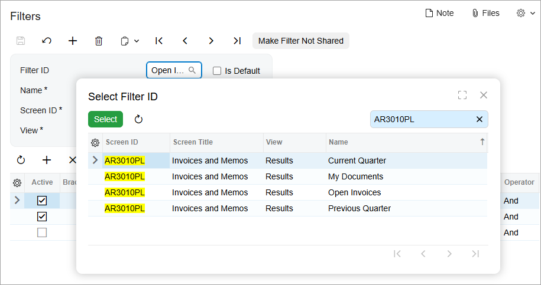

# Advanced Filters: To Modify an Advanced Shared Filter {#_f09b66bd-fb9f-4e79-b7ff-a0526ce4c7dd .task}

In this activity, you will learn how to modify an advanced shared filter.

## Story { .section}

Suppose that you are a technical specialist in your company who works on simple customizations. A year ago, you configured a set of shared filters for the Invoices and Memos \(AR3010PL\) generic inquiry form.

The accounting department has worked with the set of filters for some time and decided that the *Open Invoices* filter needs to list all open documents, regardless of their type; accordingly, its name should be *Open Documents*. Also, the *My Documents* filter is no longer needed.

## Process Overview { .section}

In this activity, on the [Filters](CS_20_90_10.md) \(CS209010\) form, you will modify the *Open Invoices* filter as requested and define the *My Documents* filter to not be shared.

## System Preparation { .section}

1.  Launch the Acumatica ERP website, and sign in to a tenant with the *U100* dataset preloaded as system administrator Kimberly Gibbs. You should sign in by using the *gibbs* username and the *123* password.

    **Tip:** The *gibbs* user is assigned the *Administrator* role, which has sufficient access rights to manage the system configuration and to modify generic inquiries, advanced filters, pivot tables, and dashboards.

2.  Complete the [Advanced Filters: To Create Advanced Shared Filters](GI_Reusable_Filters_Creating_Shared_Reusable_Filter_Activity.md) activity.

## Step 1: Modifying the Advanced Shared Filter { .section}

To modify the advanced shared filter, do the following:

1.  Open the [Filters](CS_20_90_10.md) \(CS209010\) form.
2.  In the **Filter ID** box, select *Open Invoices*.

    To locate the filter, click the selector button; in the search box of the lookup table, type its name or the screen identifier of the form the filter is applied to, which is *AR3010PL* \(as shown below\).

    

3.  In the **Name** box, change the name of the filter to *Open Documents*.
4.  In the table, delete the row with the condition that filters documents by the type.

    **Tip:** Instead of deleting the row, you can deactivate the condition by clearing the check box in the **Active** column for the row.

5.  On the form toolbar, click **Save**.

    Notice that the value in the **Filter ID** box has been changed and now is the same as the filter name.

## Step 2: Defining an Advanced Filter as Not Shared { .section}

To change the *My Documents* advanced filter so that it is no longer shared, do the following:

1.  In the **Filter ID** box of the [Filters](CS_20_90_10.md) \(CS209010\) form, select *My Documents*.
2.  On the form toolbar, click **Make Filter Not Shared**. In the warning dialog box that appears, click **Yes**.

    The filter is no longer shared; also, it’s no longer shown on the [Filters](CS_20_90_10.md) form, because you can manage only shared filters on this form.

3.  Open the Invoices and Memos \(AR3010PL\) generic inquiry form.
4.  Open the Filter List drop-down menu and verify that **My Documents** is not marked with the  icon, which denotes shared filters.

**Parent topic:**[Managing Advanced Filters](../UserGuide/GI_Reusable_Filters_Mapref.md)

