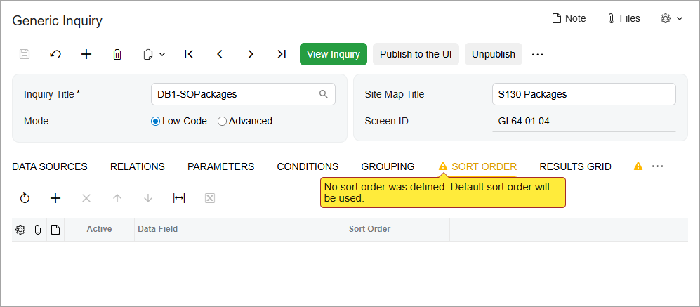
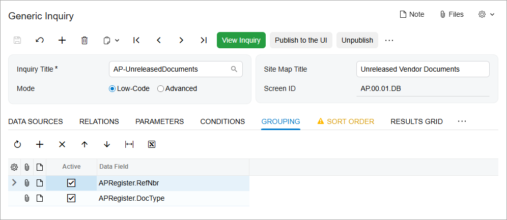

# Sorting and Grouping: General Information {#_98a9f17d-59a3-4d5b-aeb9-b6753265a889 .concept}

While a user is viewing the results in the results grid of a generic inquiry, the user can sort the data by using simple filters in column headers. In the settings of the generic inquiry, you can define how the inquiry data is sorted by default by specifying the columns to be used for sorting.

Also, you can group inquiry data by specifying grouping settings and by adding rows that return aggregated values for a group.

## Learning Objectives { .section}

In this chapter, you will learn how to modify an existing generic inquiry in the following ways:

-   By grouping the inquiry output
-   By aggregating the inquiry output
-   By adding a default sort order for the inquiry output

## Applicable Scenarios { .section}

You may find the information in this chapter useful when you are responsible for the customization of Acumatica ERP in your company. To speed up inquiry creation, you have copied an existing generic inquiry that provides results similar to those you need. Now you want to group and aggregate the inquiry output and add a sort order to suit your needs.

## Sorting Settings { .section}

You can use the settings on the **Sort Order** tab of the [Generic Inquiry](SM_20_80_00.md) \(SM208000\) form to specify how the inquiry data is sorted—that is, the default order in which the results should be displayed on the generic inquiry form. For example, the inquiry results can be sorted by date and by customer name. To do this, on the **Sort Order** tab, you add a row for each data field of each particular column that you want to use for sorting the inquiry results. In these rows, you specify whether the results are sorted in ascending or descending order of the values in the column; the default *Ascending* sort order is selected when you add a row.

**Tip:** Any user-defined sorting that a user of an inquiry specifies \(by clicking the column header and specifying a condition in the dialog box\) overrides any default sorting you specify on the **Sort Order** tab.

If an inquiry has no sorting settings specified on the **Sort Order** tab, the system displays a warning in the tab title, as shown in the following screenshot. Until you define sorting settings, the default ones are used for the inquiry.

## Grouping Settings { .section}

On the **Grouping** tab \(shown in the following screenshot\) of the [Generic Inquiry](SM_20_80_00.md) \(SM208000\) form, you can specify the data field or fields by which you would like to group data. On the **Results Grid** tab, you can also add rows that will hold the aggregated values of these groups. For example, you may want to group sales orders by date and status to get the count of sales orders, as well as their total and average amounts for each day and status.

For data fields specified on the **Grouping** tab, you use the **Aggregate Function** column, which is hidden by default, on the **Results Grid** tab to define how the resulting values should be calculated for the grouped values. The following aggregate functions are available:

-   *AVG*: Returns the average of all non-null values of the group
-   *COUNT*: Returns a count of all values of the group
-   *MAX*: Returns the maximum value of all values of the group
-   *MIN*: Returns the minimum value of all values of the group
-   *SUM*: Returns the sum of all values of the group
-   *STRINGAGG*: Concatenates the values of the group into a string

If no function is selected in the **Aggregate Function** column for a data field used for grouping, the following aggregate functions are applied by default:

-   *SUM* is applied to the columns with the numeric type.
-   *MAX* is applied to the other columns.

**Attention:** The aggregate function must correspond with the type of the field selected in the **Data Field** column. Selecting the *SUM* function for a character data type \(such as a customer's name, an address, or an email address\) causes a runtime error. For the calculated columns, you have to select the appropriate aggregation function manually, because no single function applies to them by default.

**Parent topic:**[Applying Sorting and Grouping](../UserGuide/GI_Sorting_and_Grouping_Mapref.md)

