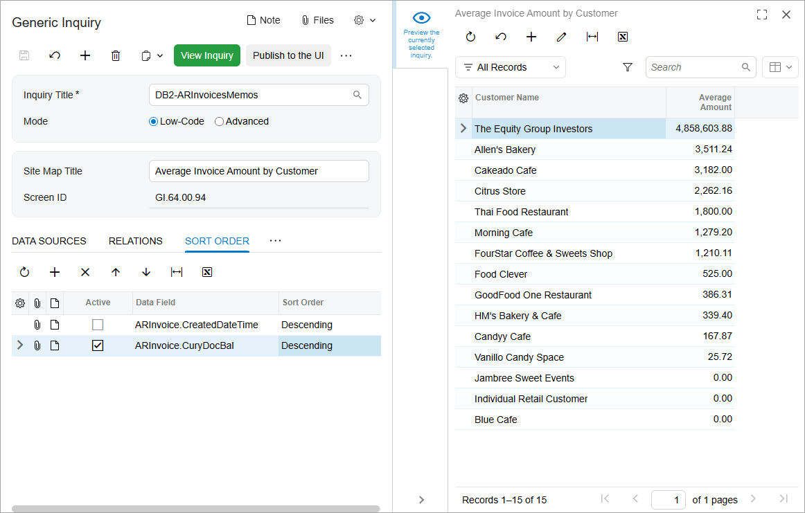

# Sorting and Grouping: To Group and Sort Inquiry Data {#_61ee434c-549b-408c-a4ab-1415a713bf9b .task}

In this activity, you will learn how to modify an existing generic inquiry to add grouping and sorting conditions.

**Attention:** This activity is based on the *U100* dataset. If you are using another dataset or if any system settings have been changed in *U100*, these changes can affect the workflow of the activity and the results of the processing. To avoid issues, restore the *U100* dataset to its initial state.

## Story { .section}

Suppose that you are a technical specialist in your company who is working on simple customizations, including those involving the creation, modification, and use of generic inquiries. An accountant of your company has requested a generic inquiry that collects data about invoices and memos. You have offered the predefined Invoices and Memos \(AR3010PL\) generic inquiry form, but the accountant would like the results to list not individual invoices but instead the average invoice amount of each customer, with these rows sorted in descending order by the average invoice amount.

## Configuration Overview {#section_ayf_13q_3rb .section}

You will work with a copy of the predefined Invoices and Memos \(AR3010PL\) inquiry form, which has the *AR-Invoices and Memos* inquiry title and the *Invoices and Memos* site map title specified on the [Generic Inquiry](SM_20_80_00.md) \(SM208000\) form.

**Tip:** The Invoices and Memos \(AR3010PL\) generic inquiry form, which is the list of the invoices and memos that have been created on the [Invoices and Memos](AR_30_10_00.md) \(AR301000\) form, is the substitute form that is opened when you click the *Invoices and Memos* link in a workspace or a list of search results.

The copy you will work with has the *DB2-ARInvoicesMemos* inquiry title and the *S130 Invoices and Memos* site map title specified on the [Generic Inquiry](SM_20_80_00.md) form.

## Process Overview { .section}

On the **Results Grid** tab of the [Generic Inquiry](SM_20_80_00.md) \(SM208000\) form for the copied inquiry, you will look for the row that corresponds to the **Customer Name** column in the inquiry results and note the value in the **Data Field** column. You will add a grouping condition with the noted data field on the **Grouping** tab. Then you will add a row that will hold the average invoice amount on the **Results Grid** tab, and you will sort these rows in descending order by this amount.

## System Preparation {#section_xwj_fpr_jrb .section}

Launch the Acumatica ERP website, and sign in to a tenant with the *U100* dataset preloaded as system administrator Kimberly Gibbs. You should sign in by using the *gibbs* username and the *123* password.

**Tip:** The *gibbs* user is assigned the *Administrator* role, which has sufficient access rights to manage the system configuration and to modify generic inquiries, advanced filters, pivot tables, and dashboards.

## Step 1: Adding a Grouping Condition { .section}

To modify the generic inquiry to add a grouping condition, do the following:

1.  Open the [Generic Inquiry](SM_20_80_00.md) \(SM208000\) form.
2.  In the **Inquiry Title** box of the Summary area, select *DB2-ARInvoicesMemos*.
3.  In the **Site Map Title** box, type `Average Invoice Amount by Customer`.
4.  On the **Results Grid** tab, look for the row with *AcctName* in the **Data Field** column; this row corresponds to the **Customer Name** column in the inquiry results.

    **Tip:** If the **Visible** check box is cleared for a row, the corresponding column is not visible initially on the resulting inquiry form, but a user can make it visible as needed by using the **Column Configuration** dialog box of the table.

5.  On the **Grouping** tab, click **Add Row** on the table toolbar; in the **Data Field** column of the added row, specify the value you found \(that is, *BAccountR.AcctName*\).

    **Tip:** This value consists of the name of the source table, which is specified in the **Object** column of the **Results Grid** tab, and the **Data Field** value.

6.  On the form toolbar, click **Save**.

## Step 2: Adding a Row to Hold the Aggregated Value { .section}

To modify the generic inquiry to add a row with an aggregation function, do the following:

**Tip:** If some columns mentioned in the activity aren’t available in the table, make them visible by using the Column Configuration dialog box.

1.  While you are still viewing the [Generic Inquiry](SM_20_80_00.md) \(SM208000\) form with the *DB2-ARInvoicesMemos* generic inquiry selected, on the **Results Grid** tab, find the row that holds the document balance \(*CuryDocBal*\), and specify the following settings:
    -   **Visible**: Selected
    -   **Caption**: `Average Amount`
    -   **Aggregate Function**: *AVG*
2.  Clear the **Visible** check box for all rows except for the requested two—that is, except for the rows with *AcctName* and *CuryDocBal* in the **Data Field** column.
3.  On the form toolbar, click **Save**.

## Step 3: Adding the Default Sorting Order { .section}

To modify the generic inquiry to add a sorting condition, do the following:

1.  While remaining on the [Generic Inquiry](SM_20_80_00.md) \(SM208000\) form with the *DB2-ARInvoicesMemos* generic inquiry selected, on the **Sort Order** tab, clear the check box in the **Active** column of the only row. This deactivates the sorting condition that was copied from the source inquiry.
2.  Click **Add Row** on the table toolbar, and specify the following settings in the added row:
    -   **Active**: Selected
    -   **Data Field**: *ARInvoice.CuryDocBal*
    -   **Sort Order**: *Descending*
3.  On the form toolbar, click **Save**.
4.  Click the eye icon on the side panel to preview how your changes have affected the generic inquiry form. The generic inquiry form now has two columns, as shown in the following screenshot. The records are grouped so that the **Customer Name** column displays the customer names, with one row shown for each customer. The values in the **Average Amount** column display the average invoice amount of the customer listed in a row instead of the inquiry displaying each invoice value in a separate row. Also notice that the rows are sorted by the amounts in descending order \(also shown in the following screenshot\).

    

## Self-Test Exercise { .section}

Now that you have learned how to use sorting and grouping conditions, try to apply this knowledge. Working with the inquiry you have created in this activity, observe how the values in the **Average Amount** column of the inquiry change when you select different functions in the **Aggregate Function** column on the **Results Grid** tab of the [Generic Inquiry](SM_20_80_00.md) \(SM208000\) form.

**Parent topic:**[Applying Sorting and Grouping](../UserGuide/GI_Sorting_and_Grouping_Mapref.md)

