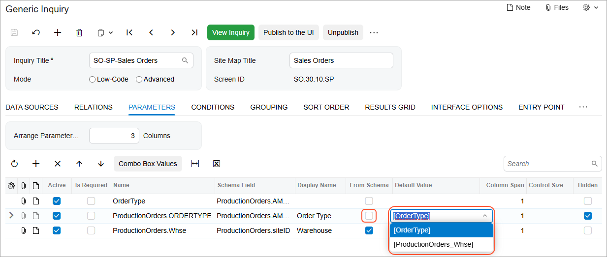

# Data from Multiple Data Sources: Use of Generic Inquiry as Data Source {#_ec13bad9-956f-4985-ad85-c4eedfd9c366 .concept}

You can specify generic inquiries as data sources for a generic inquiry. That is, you can create multiple simple generic inquiries and reuse them as data sources for a generic inquiry. You build a complex request by combining the simple inquiries into one.

## Adding a Generic Inquiry as a Data Source {#section_tbr_4nv_j1c .section}

When you use generic inquiries as data sources for other inquiries, the system does not limit the number of levels of nesting. It ensures only that an inquiry is not a parent to another inquiry that uses it as data source.

**Tip:** The term *parent* refers to a generic inquiry that uses another generic inquiry as its data source.

To add a generic inquiry as a data source, you click **Add Row** on the table toolbar of the **Data Sources** tab. In the new row, you open the lookup table for **Source Name**. On the **Generic Inquiries** tab of the lookup table, you select the needed inquiry. The system adds the inquiry to the table and switches focus to the **Alias** column. You can type an alias for the inquiry or skip this step. The system inserts the value from **Source Name** if no alias has been specified.

**Important:** On the **Generic Inquiries** tab of the lookup table, the system displays \(that is, makes available for selection\) only inquiries that are not using the current inquiry as a source.

If the added generic inquiry is a parent to an inquiry that in turn is a parent to an inquiry \(and so on in a chain of relations\), each contained inquiry is considered a data source for the selected inquiry. However, the system does not add all the nested inquiries to the table of the **Data Sources** tab, only the selected one.

For each added data source, you specify the relations between pairs of data sources \(tables or inquiries\) on the **Relations** tab. For each pair of related data sources added to the **Table Relations** table, you specify the links between these two data sources in the **Data Field Links for Active Relation** table. If a field from the source inquiry is not stored in the database, it cannot be used to define a relation.

**Tip:** The **Related Tables** dialog box, which can be used to add relations between tables, is not available for adding relations between inquiries. When you select a row with an inquiry in the table on the **Data Sources** tab or in the **Table Relations** table on the **Relations** tab, the **Add Related Table** button becomes unavailable.

## Adding Fields from a Source Inquiry to the Results Grid {#section_wc5_jvg_j1c .section}

When you add a generic inquiry as a data source on the [Generic Inquiry](SM_20_80_00.md) \(SM208000\) form, the system does not add its fields to the **Results Grid** tab of the form. You should manually add the needed fields.

When you add a field from the source inquiry on the **Results Grid** tab, the system copies the following settings from the source:

-   **Use in Quick Search**
-   **Quick Filter**
-   **Caption**
-   **Width \(px\)**
-   **Schema Field**
-   **Style**

For the rest of the settings the system inserts default values. The system modifies the copied settings to include the source inquiry name in the field names used in these settings. For example, if a field from source inquiry *A* is used in a style formula, the system will modify the field name to `A.field_name`.

The system does not copy the navigation settings for the fields from the source inquiry. However, if such a field has customized navigation settings \(that is, different from the default behavior\), the system will use these settings. These settings will apply for all parent inquiries where this field is added to the **Results Grid** tab. You can modify the navigation settings for the current inquiry to achieve the needed behavior.

## Using Parameters from a Source Inquiry {#section_xgy_c34_j1c .section}

The system does not add parameters from source inquiries automatically to the **Parameters** tab of the [Generic Inquiry](SM_20_80_00.md) \(SM208000\) form. You can add any needed parameters manually. As with the field names, the system will display parameter names with the alias of the source inquiry preceding the parameter name.

When you add a row on the **Parameters** tab and select a parameter from a source inquiry in the drop-down list in the **Name** column, the system adds the parameter and copies its settings. If you type some name in the **Name** column and then open the drop-down list in this cell and select a parameter from a source inquiry, the system adds the parameter with the typed name and the settings from the selected parameter.

When parameters in the parent and source inquiry share the same names, the system creates a link between these parameters. You can adjust the parameter settings. However, these modifications must align with the settings in the source inquiry. For instance, if a parameter is defined as an integer type in the source inquiry, it should not be redefined as a string.

Modifications made in the parent inquiry do not affect the linked source. However, if you modify a parameter in the source inquiry, the system will show a warning indicating that the changes will affect the parent inquiry.

If you change the name of the parameter with the linked source, the system removes the link between these parameters. If you reverse the name change, the system restores the link.

You can also use the parameter values from source inquiries. When you define a parameter for a child inquiry and the **From Schema** check box isn’t selected, the **Default Value** column displays a drop-down list with the values of the parent inquiry parameters. \(See the child inquiry below.\) The parameter names are displayed in brackets to avoid confusion with text values.

## Application of Access Rights {#section_dhm_sk4_j1c .section}

A user with access rights to view a generic inquiry will see all the data that this inquiry returns, regardless of the user's access rights to the source inquiries that are included in the query.

If data from the source inquiry is restricted through the use of restriction group settings, the system may limit the display of data based on these settings.

## Modifying an Inquiry Used as a Data Source {#section_kw5_skg_j1c .section}

After a generic inquiry has been added to the table on the **Data Sources** tab of [Generic Inquiry](SM_20_80_00.md) \(SM208000\) form, its name is displayed as a link. If you click the link, the [Generic Inquiry](SM_20_80_00.md) form opens in a new browser tab with the inquiry selected. The system will display a warning indicating that the inquiry is used as a data source for another inquiry. If you modify the inquiry used as a data source, the system opens the **Copy Generic Inquiry** dialog box. The dialog box asks you if you want to create a copy to save modifications \(which leaves the original inquiry intact\) rather than overwriting it.

If you click **Copy**, the system saves a copy of the original inquiry with the modifications; it adds after the original value in **Inquiry Title** a hyphen and a number. The system increments the number each time a copy of that inquiry is saved.

## Deleting an Inquiry Used as a Data Source {#section_l41_khh_j1c .section}

You may want to delete an inquiry that is used as a data source by opening this inquiry on the [Generic Inquiry](SM_20_80_00.md) \(SM208000\) form and clicking **Delete** on the form toolbar. The system displays a warning that lists the inquiries that use this inquiry as a data source.

If you choose to delete this inquiry, the system will mark its fields with a warning when you open a parent inquiry on the [Generic Inquiry](SM_20_80_00.md) form. Suppose that a field from the deleted source inquiry was earlier added on the **Results Grid** tab of the parent inquiry. When you open the parent inquiry \(after deleting the source inquiry\), the system will display a warning in the row with the field from the deleted source inquiry on the **Results Grid** tab.

Similarly, if you delete a field on the **Results Grid** tab of a source inquiry that is somehow used in its parent inquiry, the system will display a warning for the deleted fields when you open a parent inquiry on the [Generic Inquiry](SM_20_80_00.md) form.

## Exporting and Importing Inquiries {#section_rb2_5mn_j1c .section}

When you export a generic inquiry that has other inquiries as data sources, the system includes all the inquiries from the chain of sources in the export file.

Also, when you import a file with generic inquiries and inquiries in the system have the same identifiers, the system displays a warning with the list of the inquiries. You can cancel the import, or you can confirm the import of the inquiries, causing the system to overwrite the inquiries.

**Parent topic:**[Getting Data from Multiple Data Sources](../UserGuide/GI_Getting_Data_from_Multiple_Tables_Mapref.md)

