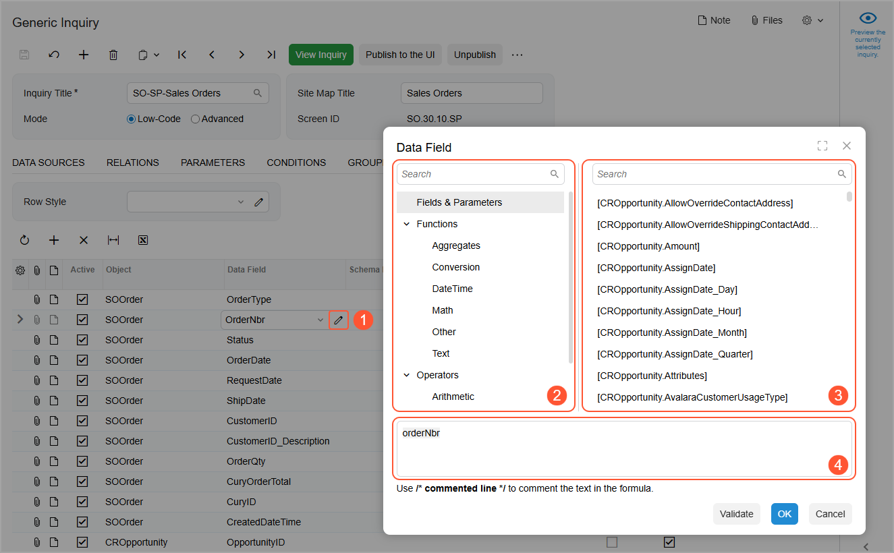
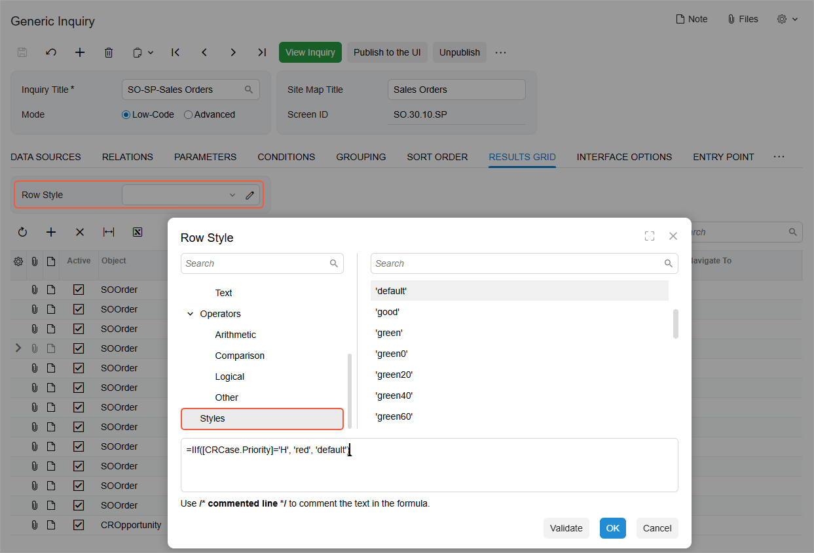

# Formulas in Inquiry Results: General Information {#_83d3edbc-ebf1-4cc2-8b96-0671c4530cb8 .concept}

When you are developing or modifying generic inquiries in Acumatica ERP, you can use formulas to perform different operations with the values in the columns in the results grid, for greater flexibility to present the information users need.

You can use formulas to perform different operations with the values of the columns in the results grid. Formulas give you the ability to use advanced calculations and data transformation functions if some values in the inquiry rows are calculated or depend on data in other data fields. To do this, you can type formulas manually into certain boxes, or you can use the Formula Editor dialog box to construct or edit these formulas. These formulas are similar to the formulas used in Excel. You can define parameters and construct a formula with the parameters by using operators and functions.

## Learning Objectives { .section}

In this chapter, you will learn how to modify an existing generic inquiry by using formulas as follows:

-   Highlight a row, a column, or a cell with a particular color based on the value returned by the inquiry
-   Concatenate multiple string values to make the contents of a column look like single values

## Applicable Scenarios { .section}

You may find the information in this chapter useful when you are responsible for the customization of Acumatica ERP in your company, including developing and modifying generic inquiries to give users information they need to do their jobs. In some situations, you may want to perform calculations on values before presenting them or transform the data in some way.

## Components of the Formula Editor Dialog Box { .section}

On the **Results Grid** tab of the [Generic Inquiry](SM_20_80_00.md) \(SM208000\) form, each row represents a column in the resulting inquiry form. To specify a formula that determines the value in a column of the resulting inquiry form, you use the Formula Editor dialog box. To invoke the dialog box, you click a cell in the column of the needed row and then click the Edit button \(see Item 1 in the following screenshot\).

The Formula Editor dialog box includes the following panes:

-   Component Type \(Item 2 in the screenshot above\): Displays the types of operators, functions, and fields that can be used as formula components. You click any of the types to display the corresponding list of available components in the Component Selection pane.
-   Component Selection \(Item 3\): For the component type selected in the Component Type pane, displays the list of available components. You click a component to add it to the formula at the bottom of the dialog box. You can search for the needed component by using the Search box at the top of the Component Selection pane.
-   Formula Text \(Item 4\): Contains the text of the formula, which you can edit manually. The formula may include the selected components, arguments of the manually inserted components, and other elements, all arranged in accordance with the syntax of the formula.

You can enter the formula directly in the Formula Text pane or compose it by selecting fields and using operators and functions.

## Use of Formulas to Highlight Rows and Columns { .section}

On the **Results Grid** tab of the [Generic Inquiry](SM_20_80_00.md) \(SM208000\) form, you can use formulas to specify the highlighting color of a row, a column or a particular cell in the inquiry results.

For example, suppose that you have an inquiry that lists open cases and shows the priority of each case in the **Priority** column, and that you would like to highlight with red the entire rows that display cases with a high priority. On the **Results Grid** tab of the [Generic Inquiry](SM_20_80_00.md) form, you invoke the Formula Editor in the **Row Style** box \(which is located in the Selection area of the tab\). You use the IIf function for this purpose and compose the following formula: =IIf\(\[CRCase.Priority\]='H', 'red', 'default'\). The system processes the formula as follows: If the value in the **Priority** column equals *H*, then highlight it with red; otherwise, use the default color \(which is predefined and has no highlighting\).

If you would like to use red highlighting for only the cell in the **Priority** column for a case with high priority, you add the formula to the **Style** column for the row with the data field that holds the value of the case priority.

When you invoke the Formula Editor in the **Row Style** box or in the **Style** column of the **Results Grid** tab, the system displays the **Styles** component type in the Component Type pane of the Formula Editor. The Component Selection pane lists the available colors from this component type, as shown in the following screenshot.

## Usage of Formulas for String Values { .section}

You can use formulas for text strings—for example, to change uppercase to lowercase, to select a part of a string, to replace a string value with a new one, or to concatenate multiple strings. When you select the text category, you can find all the available functions listed in the Formula Editor.

**Tip:** When you construct a formula in the **Data Field** box of any row, it does not matter what value is specified in the **Object** box in the same row.

When you need to concatenate strings, you use the *Concat\(\)* function. For example, suppose that in a column, you would like to see a value that is a combination of the sales order identifier and its description, separated by a space. In the **Data Field** box of the corresponding row, you construct the following formula: `= Concat([SOOrder.OrderNbr], ' ', [SOOrder.OrderDesc])`.

**Parent topic:**[Using Formulas](../UserGuide/GI_Using_Formulas_Mapref.md)

