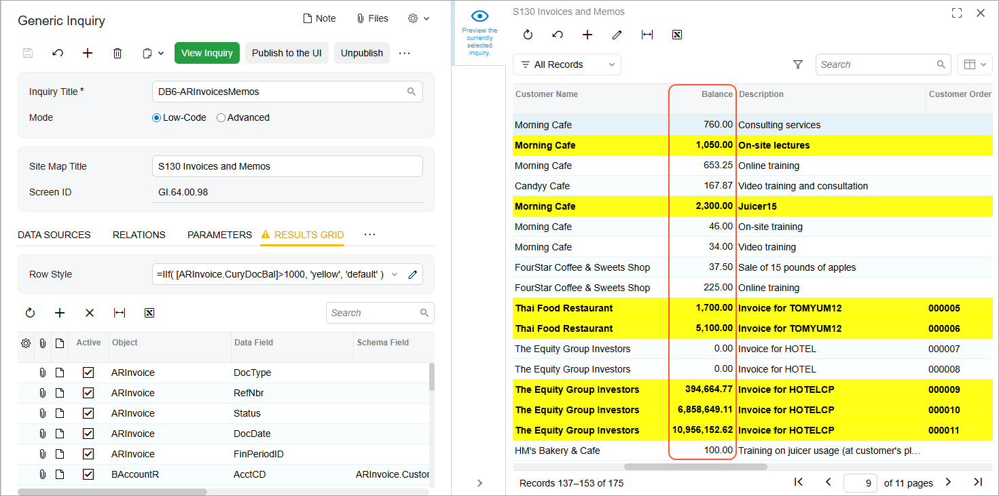

# Formulas in Inquiry Results: To Highlight Row with Color {#_19efa0ca-f6d5-4500-a598-fef5f4dd9a82 .task}

In this activity, you will learn how to modify an existing generic inquiry to highlight all rows in the results grid that meet a condition.

**Attention:** This activity is based on the *U100* dataset. If you are using another dataset or if any system settings have been changed in *U100*, these changes can affect the workflow of the activity and the results of the processing. To avoid issues, restore the *U100* dataset to its initial state.

## Story { .section}

Suppose that you are a technical specialist in your company who is working on simple customizations, including those involving the creation, modification, and use of generic inquiries. An accountant of your company has requested an inquiry form that displays data about invoices and memos. You offered the predefined Invoices and Memos \(AR3010PL\) generic inquiry form, but the accountant has asked you to develop a similar generic inquiry form in which you highlight with yellow the rows of documents whose balance exceeds $1000.

## Configuration Overview {#section_ayf_13q_3rb .section}

You will work with the copy of the predefined Invoices and Memos \(AR3010PL\) inquiry form, which has the *AR-Invoices and Memos* inquiry title and the *Invoices and Memos* site map title specified on the [Generic Inquiry](SM_20_80_00.md) \(SM208000\) form.

**Tip:** The Invoices and Memos \(AR3010PL\) generic inquiry form, which is the list of the invoices and memos that have been created on the [Invoices and Memos](AR_30_10_00.md) \(AR301000\) form, is the substitute form that is opened when you click the *Invoices and Memos* link in a workspace or a list of search results.

The copy you will work with has the *DB6-ARInvoicesMemos* inquiry title and the *S130 Invoices and Memos* site map title specified on the [Generic Inquiry](SM_20_80_00.md) form.

## Process Overview { .section}

In this activity, on the **Results Grid** tab of the [Generic Inquiry](SM_20_80_00.md) \(SM208000\) form, you will look for the row that corresponds to the **Balance** column of the copied generic inquiry form and note the value in the **Data Field** column for the row. You will add the formula in the **Row Style** box in the table toolbar of the tab by using the Formula Editor dialog box.

## System Preparation {#section_tcc_gpr_jrb .section}

Launch the Acumatica ERP website, and sign in to a tenant with the *U100* dataset preloaded as system administrator Kimberly Gibbs. You should sign in by using the *gibbs* username and the *123* password.

**Tip:** The *gibbs* user is assigned the *Administrator* role, which has sufficient access rights to manage the system configuration and to modify generic inquiries, advanced filters, pivot tables, and dashboards.

## Step 1: Inspecting the UI Elements { .section}

To inspect the UI elements, do the following:

1.  Open the [Invoices and Memos](AR_30_10_00.md) \(AR301000\) form, which displays a single invoice.
2.  Point to the **Balance** box, press Ctrl+Alt, and then click. The **Element Properties** dialog box opens.

    Make a note of the value in the **Data Field** box \(*CuryDocBal*\).

3.  Close the dialog box.

## Step 2: Invoking the Formula Editor Dialog Box { .section}

To invoke the Formula Editor dialog box in order to modify the generic inquiry to add a style formula for certain rows, do the following:

1.  Open the [Generic Inquiry](SM_20_80_00.md) \(SM208000\) form.
2.  In the **Inquiry Title** box of the Summary area, select *DB6-ARInvoicesMemos*.
3.  On the **Results Grid** tab, look for the row that corresponds to the **Balance** column, and note the value in the **Data Field** column \(*CuryDocBal*\). Select the **Visible** check box for the row.

    **Tip:** If the **Visible** check box is cleared for a row, the corresponding column is not visible initially on the resulting inquiry form, but a user can make it visible as needed by using the **Column Configuration** dialog box of the table.

4.  In the **Row Style** box, click the Edit button to invoke the Formula Editor dialog box.

## Step 3: Adding a Formula to Highlight Rows { .section}

On the table toolbar of the **Results Grid** tab of the [Generic Inquiry](SM_20_80_00.md) \(SM208000\) form working with the *DB6-ARInvoicesMemos* generic inquiry, you invoked the Formula Editor dialog box for the **Row Style** box. While you are still in the Formula Editor dialog box, do the following:

1.  In the Component Type \(upper left\) pane of the dialog box, click **Functions** &gt; **Other**. The system displays the list of available functions in the Component Selection \(upper right\) pane of the dialog box.
2.  In the Component Selection pane, double-click the *IIf\( expr, truePart, falsePart \)* function. The system copies it to the Formula Text \(bottom\) pane, where you can edit the formula.
3.  In the Formula Text pane, replace the *expr* parameter in the copied expression with the data field that holds the document balance as follows:
    1.  In the Component Type pane, click **Fields &amp; Parameters**.
    2.  In the search box in the top right of the dialog box, start typing the data field name you have noted earlier \(*CuryDocBal*\).
    3.  In the Formula Text pane, select only the *expr* string in the copied expression.
    4.  In the search results in the Component Selection pane, double-click *\[ARInvoice.CuryDocBal\]*. \(When you are indicating a data field in a formula, the DAC name precedes the data field name, and this complex name is enclosed in brackets.\)

        In the Formula Text pane, notice that the system has replaced the *expr* string with the selected data field name.

    5.  After the field name, type `>1000` to specify a condition for the field value exceeding $1000.
4.  In the Formula Text pane, replace the *truePart* parameter in the copied expression with the requested color as follows:
    1.  In the Component Type pane, click **Styles**.
    2.  In the Formula Text pane, select only the *truePart* string in the copied expression.
    3.  In the Component Selection pane, double-click the *'yellow'* value.

        Notice that the system has replaced the *truePart* string with the selected value.

5.  In the Formula Text pane, replace the *falsePart* parameter in the copied expression with the default color as follows:

    1.  In the Component Type pane, click **Styles**.
    2.  In the Formula Text pane, select only the *falsePart* string in the copied expression.
    3.  In the Component Selection pane, double-click the *'default'* value.

        Notice that the system has replaced the *falsePart* string with the selected value.

    The resulting formula should look as follows: *IIf\( \[ARInvoice.CuryDocBal\]&gt;1000, 'yellow', 'default' \)*. That is, highlight with yellow if the value of *ARInvoice.CuryDocBal* is more than 1000, and highlight with the default color if the value is less than 1000.

6.  Click **OK** to save your changes and close the Formula Editor dialog box.
7.  On the form toolbar, click **Save**.
8.  Click the eye icon on the side panel to preview how your changes have affected the inquiry. The system applies the row style you have added, so that the resulting generic inquiry uses yellow highlighting for the rows with documents whose balance exceeds $1000 \(see the following screenshot\).

    

## Self-Test Exercise { .section}

Now that you learned how to highlight rows of a generic inquiry form, try to apply this knowledge and highlight only cells that contain values exceeding $1000 in the **Balance** column of the inquiry.

**Tip:** On the **Results Grid** tab of the [Generic Inquiry](SM_20_80_00.md) \(SM208000\) form, you specify the formula in the **Style** column for the row with the *CuryDocBal* value in the **Data Field** column.

**Parent topic:**[Using Formulas](../UserGuide/GI_Using_Formulas_Mapref.md)

