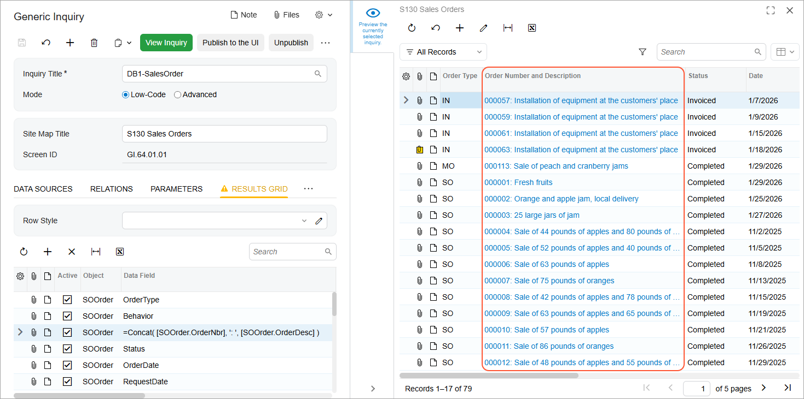

# Formulas in Inquiry Results: To Concatenate Strings {#_de99da1f-4517-45dd-85cf-b2d5f5dbd790 .task}

In this activity, you will learn how to modify an existing generic inquiry to concatenate string values.

**Attention:** This activity is based on the *U100* dataset. If you are using another dataset or if any system settings have been changed in *U100*, these changes can affect the workflow of the activity and the results of the processing. To avoid issues, restore the *U100* dataset to its initial state.

## Story { .section}

Suppose that you are a technical specialist in your company who is working on simple customizations, including those involving the creation, modification, and use of generic inquiries. The sales team of your company has requested that on the Sales Orders \(SO3010PL\) generic inquiry form, which has the *SO-SalesOrder* inquiry title and the *Sales Orders* site map title specified on the [Generic Inquiry](SM_20_80_00.md) \(SM208000\) form, you add each sales order’s description after its number in the **Order Nbr.** column, whose name \(caption\) should be changed to **Order Number and Description**. The column should contain this information in the following format: *&lt;order number&gt;: &lt;order description&gt;*.

## Configuration Overview {#section_ayf_13q_3rb .section}

You will work with a copy of the predefined Sales Orders \(SO3010PL\) generic inquiry form, which has the *SO-SalesOrder* inquiry title and the *Sales Orders* site map title specified on the [Generic Inquiry](SM_20_80_00.md) \(SM208000\) form.

**Tip:** The Sales Orders \(SO3010PL\) generic inquiry form, which is the list of the sales orders that have been created on the [Sales Orders](SO_30_10_00.md) \(SO301000\) form, is the substitute form that is opened when you click the *Sales Orders* link in a workspace or a list of search results.

The copy you will work with has the *DB1-SalesOrder* inquiry title and the *S130 Sales Orders* site map title specified on the [Generic Inquiry](SM_20_80_00.md) form.

## Process Overview { .section}

In this activity, on the **Results Grid** tab of the [Generic Inquiry](SM_20_80_00.md) \(SM208000\) form, you will look for the row that corresponds to the **Order Nbr.** column of the copied generic inquiry form. In this row, you will invoke the Formula Editor dialog box in the **Data Field** column and add a formula that corresponds to the requested format.

## System Preparation {#section_tcc_gpr_jrb .section}

Launch the Acumatica ERP website, and sign in to a tenant with the *U100* dataset preloaded as system administrator Kimberly Gibbs. You should sign in by using the *gibbs* username and the *123* password.

**Tip:** The *gibbs* user is assigned the *Administrator* role, which has sufficient access rights to manage the system configuration and to modify generic inquiries, advanced filters, pivot tables, and dashboards.

## Step 1: Invoking the Formula Editor Dialog Box { .section}

To invoke the Formula Editor dialog box in order to add a formula for a row, do the following:

1.  Open the [Generic Inquiry](SM_20_80_00.md) \(SM208000\) form.
2.  In the **Inquiry Title** box of the Summary area, select *DB1-SalesOrder*.
3.  On the **Results Grid** tab, in the **Data Field** column, look for the row that corresponds to the order number; it contains the *OrderNbr* value. Make sure the **Visible** check box is selected for the row.

    **Tip:** If the **Visible** check box is cleared for a row, the corresponding column is not visible initially on the resulting inquiry form, but a user can make it visible as needed by using the **Column Configuration** dialog box of the table.

4.  Double-click the cell that contains *OrderNbr* in the **Data Field** column to see the Edit button, and then click the button to invoke the Formula Editor dialog box.

## Step 2: Adding a Formula for String Values { .section}

While working with the *DB1-SalesOrder* generic inquiry on the **Results Grid** tab of the [Generic Inquiry](SM_20_80_00.md) \(SM208000\) form, you invoked the Formula Editor dialog box for the cell with *OrderNbr* in the **Data Field** column. While you are still in the Formula Editor dialog box, do the following:

1.  In the Component Type \(upper left\) pane of the dialog box, click **Functions** &gt; **Text**. The system displays the list of available functions in the Component Selection \(upper right\) pane of the dialog box.
2.  In the Component Selection pane, double-click the *Concat\( str1, str2, ... \)* function. The system copies it to the Formula Text \(bottom\) pane, where you can edit the formula.
3.  In the Formula Text pane, replace the *str1* parameter in the copied function with the data field that holds the order number as follows:
    1.  In the Component Type pane, click **Fields**.
    2.  In the Formula Text pane, select only the *str1* string in the copied expression.
    3.  In the search box in the top right of the dialog box, start typing the data field name you noted—*OrderNbr*—and in the search results in the Component Selection pane, double-click *\[SOOrder.OrderNbr\]*.

        In the Formula Text pane, notice that the system has replaced the *str1* string with the selected data field name. \(When you are indicating a data field in a formula, the DAC name precedes the field name, and this complex name is enclosed in brackets.\)

    4.  After the field name and the comma, type `': ',` to separate the values of two fields.
4.  By using actions similar to those in the previous instruction, replace the *str2* parameter in the function with the *OrderDesc* field name.

    Notice that the system has replaced the *str2* with the selected data field name.

5.  Delete the periods and comma after the second parameter of the function.

    The resulting formula should look as follows: *Concat\( \[SOOrder.OrderNbr\], ': ', \[SOOrder.OrderDesc\] \)*. This means that in the **Order Number** column, the system should display the concatenated string of the two strings retrieved from the *OrderNbr* and *OrderDesc* data fields.

6.  In the bottom of the dialog box, click **Validate** to validate the function that you have constructed. Correct any mistakes.
7.  Click **OK** to save your changes and close the Formula Editor dialog box.
8.  On the **Results Grid** tab, in the same row with the inserted formula, in the **Caption** column, type the new caption as follows: `Order Number and Description`.
9.  On the form toolbar, click **Save**.
10. Click the eye icon on the side panel to preview how your changes have affected the inquiry. The system applies the changes you have made, so that the resulting generic inquiry displays the order number and order description in the same column \(see the following screenshot\).

    

**Parent topic:**[Using Formulas](../UserGuide/GI_Using_Formulas_Mapref.md)

