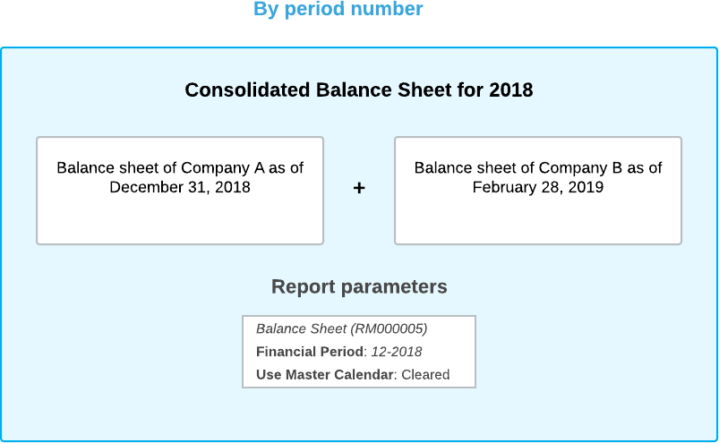
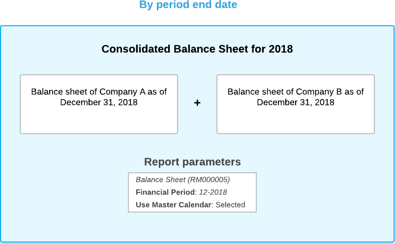

# Consolidated Reports for Companies with Different Calendars {#_3e2c3941-c8a6-445e-8253-cf18097beb2e .concept}

You may want to run consolidated reports and inquiries for related companies to receive a combined report on the financial condition of a group of companies. When you are running consolidated reports and inquiries for companies that use different financial calendars, the data in these reports and inquiries is consolidated based on either the financial period number or the end date of the financial period. These approaches are described in the following sections.

On the following reports and inquiries form, the **Use Master Calendar** check box defines which approach will be used for generating a report or inquiry:

-   [Trial Balance Summary](GL_63_20_00.md) \(GL632000\)
-   [Trial Balance Detailed](GL_63_25_00.md) \(GL632500\)
-   [Transactions for Period](GL_63_30_00.md) \(GL633000\)
-   [Transactions for Account](GL_63_35_00.md) \(GL633500\)
-   [AP Balance by GL Account](AP_63_20_00.md) \(AP632000\)
-   [AP Balance by Vendor](AP_63_25_00.md) \(AP632500\)
-   [AP Aged Period-Sensitive](AP_63_05_00.md) \(AP630500\)
-   [AP Aged Period-Sensitive by Project](AP_63_06_00.md)\(AP630600\)
-   [Vendor History Summary](AP_65_21_00.md) \(AP652100\)
-   [AR Balance by GL Account](AR_63_20_00.md) \(AR632000\)
-   [AR Balance by Customer](AR_63_25_00.md) \(AR632500\)
-   [AR Aged Period-Sensitive](AR_63_05_00.md) \(AR630500\)
-   [Customer History Summary](AR_65_21_00.md) \(AR652100\)
-   [DR Balance by Account](DR_63_00_10.md) \(DR630010\)
-   [DR Recognition by Account](DR_63_00_70.md) \(DR630070\)
-   [DE Balance by Account](DR_63_00_15.md) \(DR630015\)
-   [DE Recognition by Account](DR_63_00_75.md) \(DR630075\)
-   [Account Summary](GL_40_10_00.md) \(GL401000\)
-   [Account by Subaccount](GL_40_30_00.md) \(GL403000\)
-   [Account by Period](GL_40_20_00.md) \(GL402000\)
-   [Account Details](GL_40_40_00.md) \(GL404000\)
-   [Vendor Details](AP_40_20_00.md) \(AP402000\)
-   [Vendor Summary](AP_40_10_00.md) \(AP401000\)
-   [Customer Details](AR_40_20_00.md) \(AR402000\)
-   [Customer Summary](AR_40_10_00.md) \(AR401000\)
-   [Deferral Transaction Summary](DR_40_20_00.md) \(DR402000\)

## By Period Number {#section_u1j_mjv_vxb .section}

With this approach, the data in the reports and inquiries is consolidated based on the financial period number. To use this approach, on the appropriate report or inquiry form, you clear the **Use Master Calendar** check box on the **Report Parameters** tab or in the Selection area, respectively.

Suppose that you are running a consolidated report for two companies: Company A, with a financial year starting on January 1, 2018 \(*01-2018*\) and ending on December 31, 2018 \(*12-2018*\); and Company B, with a financial year starting on March 1, 2018 \(*01-2018*\) and ending on February 28, 2019 \(*12-2018*\). The following diagram shows an example of a consolidated balance sheet for both companies for the 2018 financial year when you use the By Period Number approach.

## By Period End Date {#section_x1j_mjv_vxb .section}

With this approach, the data in the reports and inquiries is based on the end date of the selected financial period of the master calendar. To use this approach, on the appropriate report or inquiry form, you select the **Use Master Calendar** check box on the **Report Parameters** tab or in the Selection area, respectively.

For example, you are running consolidated reports for Company A and B \(using the assumptions presented in the previous section\) and the financial year in the master calendar starts on January 1, 2018 and ends on December 31, 2018. You specify a financial period of the master calendar, and the system will use the data as of the end date of the specified period for both companies. The following diagram shows an example of a consolidated balance sheet for both companies as of December 31, 2018 which is the end date of the 2018 financial year in the master calendar when you use the By Period End Date approach.

