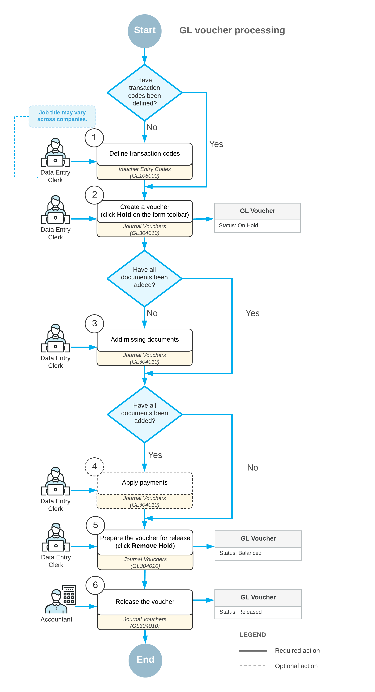

# Voucher Processing Workflow {#_07f39cfe-a809-482e-a1bc-d23aa1c7dcf0 .concept}

In Acumatica ERP, you can quickly enter multiple documents of different types and then process them in the respective subledger.

In this topic, you will read about the process of entering documents. The topic also describes transaction codes and the release of documents.

## Processing a Batch of Documents {#section_jcj_mjv_vxb .section}

The processing of a batch of documents consists of the following steps:

1.  Defining transaction codes: To quickly enter each document that may be in a batch, you have to specify a transaction code for each document. As such, transaction codes must be entered beforehand for the document and transactions that may be included in document batches in your company. If these transaction codes have not yet been defined in the system, you need to create or upload the necessary codes on the [Voucher Entry Codes](GL_10_60_00.md) \(GL106000\) form.
2.  Entering a batch: You create a batch and add documents to it on the [Journal Vouchers](GL_30_40_00.md) \(GL304000\) form. For details, see [Journal Voucher Entry](GL__CON_Document_Batch_Entry.md).
3.  Adding documents: If some necessary documents have not been added to the created batch, you add the missed documents on the [Journal Vouchers](GL_30_40_00.md) form.
4.  Applying payments to documents: If payments need to be applied to the documents of the batch, you can apply them on the [Journal Vouchers](GL_30_40_00.md) form.
5.  Preparing the batch for release: You review the details of the batch, modify the batch if necessary, and on the toolbar of the [Journal Vouchers](GL_30_40_00.md) form, click **Remove Hold** for the batch. The batch gets the *Balanced* status and is ready for release.
6.  Releasing the batch: You release the batch by clicking the **Release** button on the [Journal Vouchers](GL_30_40_00.md) form. The batch gets the *Released* status.

The voucher processing workflow is illustrated in the following screenshot.

## Statuses of Document Batches {#section_mcj_mjv_vxb .section}

A document batch can have one of the following statuses:

-   *On Hold*: The batch is a draft, and new documents can be added. You can take the batch off hold only if all added documents have all the required information.
-   *Balanced*: All the documents of the batch have complete information, and the batch can be released. You can add only documents with all required information to a batch with this status.
-   *Released*: All the included documents have been generated and released successfully.

## Defining Transaction Codes {#section_ocj_mjv_vxb .section}

A transaction code identifies a document type in a particular subledger. You can manually specify transaction codes in the table on the [Voucher Entry Codes](GL_10_60_00.md) \(GL106000\) form for the types of transactions or documents that are used in your system, or you can import a list of codes provided by Acumatica ERP. This list is available here: [Voucher Entry Codes](Files/Document_Quick_Entry_via_Document_Batches_L_Transaction_Codes_20120510.xlsx). In this list, you can find all the document types from the general ledger and the accounts payable, accounts receivable, and cash management subledgers that can be processed through document batches.

**Attention:** Only codes with the **Active** check box selected on this form can be used for adding documents to a document batch.

## Releasing a Document Batch {#section_rcj_mjv_vxb .section}

You can release a particular batch with the *Balanced* status on the [Journal Vouchers](GL_30_40_00.md) \(GL304000\) form. To do this, select the batch on the form and click **Release** on the form toolbar. Releasing the batch can take some time.

On the **GL Transactions** tab of the form, you can view GL transactions that have been created.

After release, all the documents are generated automatically in the respective subledgers. The statuses of these documents depend on the type of the document and the subledger preference settings.

**Tip:** If approval of AP bills has been configured, the system will display an error message when you try to release AP bills included in a batch on the [Journal Vouchers](GL_30_40_00.md) form. To process AP bills, you should use the [Bills and Adjustments](AP_30_10_00.md) \(AP303000\) form.

**Parent topic:**[Processing Vouchers](../UserGuide/GL__MNG_Document_Batches.md)

