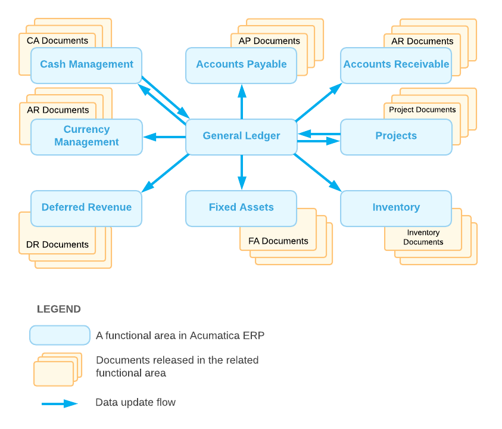

# Overview of General Ledger Processes {#_ec8312bf-dfd4-4d21-9e86-0856748b5634 .concept}

The general ledger is the central functional area of Acumatica ERP, offering integration with other subledgers and functional areas and giving instant access to mission-critical financial data. You use the general ledger and its forms to perform a variety of procedures related to processing financial transactions, which are briefly described in the following sections of this topic.

## Integration of the General Ledger with Other Subledgers {#section_xf2_mjv_vxb .section}

By using the general ledger, you can monitor all transactions that are entered in the general ledger or automatically generated by other subledgers. Each time a transaction is released in another subledger, the transaction is created in the general ledger. Transactions that involve cash accounts and are created in the general ledger, can also be tracked in the cash management subledger. Transactions that are associated with projects create project transactions in the project subledger. For the illustration of integration of the general ledger with other subledgers, see the following figure.

## Managing Ledgers {#section_zf2_mjv_vxb .section}

Acumatica ERP supports multiple types of ledgers: *Actual*, *Budget*, *Reporting*, and *Statistical*. Thus, you can record actual financial information and store budgets, forecasts, and statistical and reporting information for all branches of your organization. If your company has multiple branches, each branch may have one actual ledger and an unlimited number of ledgers of other types. For details, see [Managing Ledgers](GL__MNG_Managing_Ledgers.md).

## Managing the Chart of Accounts {#section_bg2_mjv_vxb .section}

You can establish the set of accounts that best supports your company's operations. You can define accounts of the following types: asset, liability \(balance sheet accounts\), income, and expense \(income statement accounts\). For convenient grouping, sorting, and filtering of the financial information associated with general ledger accounts in reports and inquiries, Acumatica ERP provides predefined account classes.

Acumatica ERP also gives you the ability to configure and use two system-maintained accounts: *YTD Net Income* and *Retained Earnings*. For details, see [Managing the Chart of Accounts](GL__MNG_Managing_Accounts_and_Subaccounts.md).

## Managing the List of Subaccounts {#section_eg2_mjv_vxb .section}

In Acumatica ERP, you can use subaccounts with your accounts. By using subaccounts, your organization can virtually break down an account into multiple accounts that are smaller and more specific, for better tracking of company revenue and expenses for reporting. Your site can define subaccounts to reflect your operational needs, support reporting and analytical needs, and keep the number of your accounts manageable. For details, see [Subaccounts](../ImplementationGuide/config_Subaccounts_Mapref.md).

**Note:** For your organization to use subaccounts, the *Subaccounts* feature must be enabled on the [Enable/Disable Features](CS_10_00_00.md) \(CS100000\) form.

## Managing the Financial Year, Master and Company Calendars, and Periods {#section_hg2_mjv_vxb .section}

For a financial year, you can specify the start date and the type of financial periods that make up the year. You can define any number of accounting periods within the financial year, and you can add an adjustment period and post adjustment transactions to it. For details, see [Setting Up the Financial Year](GL__MNG_Setting_Up_Financial_Year.md).

Once you have defined the structure of the financial year, you can generate the financial periods for the financial years. In Acumatica ERP, you generate the *master calendar*—a set of financial periods that is generated for multiple years based on the financial year template specified for the tenant. For details, see [Generating Financial Calendars](GL__MNG_Financial_Calendars.md).

Depending on the state of the *Centralized Period Management* feature \(that is, whether it is enabled or disabled\) on the [Enable/Disable Features](CS_10_00_00.md) \(CS100000\) form, you can manage the period statuses of the master calendar or of each particular company calendar, including period closing and year-end closing. For details on period-closing procedures, see [Closing Financial Periods in Subledgers and GL](Finance_ClosingPeriods_Mapref.md) and [Year-End Closing](GL__CON_Period_Closing_Prerequisites.md).

## Processing Transactions {#section_lg2_mjv_vxb .section}

In Acumatica ERP, GL transactions are organized in batches. Transactions posted to the general ledger can be manually entered or system-generated, posted from other subledgers. For details, see [Processing Transactions](Finance_Processing_Batch_Mapref.md).

## Scheduling Transactions {#section_ng2_mjv_vxb .section}

Transactions that are repeated periodically can be assigned to schedules. A schedule defines how many times and how often specific general ledger transactions should be created. After you run the schedule, the system periodically creates GL batches. For details, see [Processing Recurring Transactions](Finance_Recurring_Transactions_Mapref.md).

## Reclassifying Journal Entries {#section_pg2_mjv_vxb .section}

In Acumatica ERP, if an amount has been mistakenly posted to the wrong general ledger account, subaccount, or branch, you can create a correcting transaction to move an amount from one general ledger account to another general ledger account, from one subaccount to another subaccount, or from one company branch to another one; that is, you can reclassify a transaction.

As a result of the reclassification process, the system generates a new transaction of the *Reclassification* type based on the original general ledger transaction. For details, see [Reclassifying Transactions](Finance_Reclassifying_Transactions_Mapref.md).

## Managing Budgets {#section_sg2_mjv_vxb .section}

By using Acumatica ERP, you can prepare annual budgets in the system. You can create two types of budgets in the system: single-level budgets and hierarchical budgets. A single-level budget is a simple list of planned or forecasted revenues and expenses. A hierarchical budget contains a budget structure that consists of multiple levels of articles and subarticles. This structure makes it easier to analyze the budget. For hierarchical budgets, you configure the budget tree and create a budget ledger.

You can create a virtually unlimited number of budgets, and you can compare budgets to other budgets or to actual data. You can manage access to budget articles by using restriction groups.

You can compare the budget being prepared to any of the following: the actual data of the previous year, the year-to-date amounts of the current year, or other budgets.

## Configuring and Processing Allocations {#section_wg2_mjv_vxb .section}

With Acumatica ERP, you can use allocation templates to automate the distribution of amounts accumulated on one account or multiple accounts between another accounts based on the specified rule. If subaccounts are used in your system, you can also use subaccounts to compose allocation rules.

## Managing Consolidations {#section_yg2_mjv_vxb .section}

In Acumatica ERP, you can upload account balances from consolidation units to a parent company. If your organization is a consolidation unit, you can configure mapping of the accounts and subaccounts to the parent company accounts and subaccounts, as well as specify which ledgers contain consolidation data.

For details, see [Configuring GL Consolidation](Finance_GL_Consolidation_Configuration_Mapref.md) and [Performing GL Consolidation](Finance_GL_Consolidation_Mapref.md).

## Reviewing Account Balances {#section_bh2_mjv_vxb .section}

Acumatica ERP provides a set of inquiry forms that you can use to review account balances in various ways, depending on your current needs. On inquiries, you can find the following information:

-   Beginning and ending balances, along with total debits and total credits for a particular period
-   Account balances split by subaccounts
-   Account balances by financial periods for a particular year
-   A list of transactions posted to a particular account in the selected period range

For details, see [Managing the Chart of Accounts](GL__MNG_Managing_Accounts_and_Subaccounts.md).

## Other Processes {#section_eh2_mjv_vxb .section}

-   Importing financial data, as described in [Importing Financial Data](GL__GL_Importing_Data.md)
-   Configuration intercompany and interbranch transactions, as described in [Interbranch Account Mapping](../ImplementationGuide/config_InterBranch_Mapping_Rules_Mapref.md)
-   Managing journal vouchers, as described in [Processing Vouchers](GL__MNG_Document_Batches.md)

