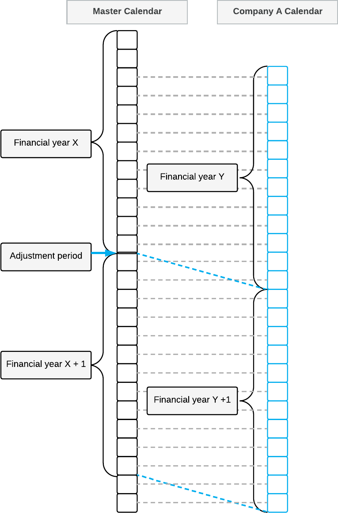

# Multiple Calendar Support {#_8b5e547a-7940-4e11-b986-744cf4676cb0 .concept}

In Acumatica ERP, you can implement multiple legal entities within the same tenant, and the entities can have different fiscal year-end dates. With the *Multiple Calendar Support* feature enabled on the [Enable/Disable Features](CS_10_00_00.md) \(CS100000\) form, you can configure multiple companies with different fiscal year-end dates within one tenant.

The following diagram illustrates the relations between the master calendar and a company calendar with financial periods that differ from those in the master calendar. The financial calendar of Company A starts two months later than that of the master calendar \(for example, if the financial year of the master calendar starts in January and ends in December, the financial year of Company A starts in March and ends in February\).

To create a new company with financial year start and end dates that are different from those of the master calendar, you perform the following steps:

1.  You configure the new company on the [Companies](CS_10_15_00.md) \(CS101500\) form.
2.  You generate a year in the master calendar that corresponds to the first financial year you want to use for the company, if this year has not been generated in the master calendar already.
3.  You create a company financial calendar for the new company on the [Company Financial Calendar](GL_20_11_00.md) \(GL201100\) form, specifying the needed start date of a financial year. For details, see [To Create the First Year of the Company Calendar](GL__how_Configure_Company_Calendar.md).

**Attention:** If the first financial year exists for the company and you add a year earlier than this one, the system will copy the period status of the first period to all the periods of the created year. For example, year 2026 exists in the system with the start date on 01/11/2026 and the 11-2026 period with the *Open* status. If you add year 2025 on the [Company Financial Calendar](GL_20_11_00.md) form, the system will create year 2025 with all the periods having the *Open* status.

**Parent topic:**[Generating Financial Calendars](../UserGuide/GL__MNG_Financial_Calendars.md)

