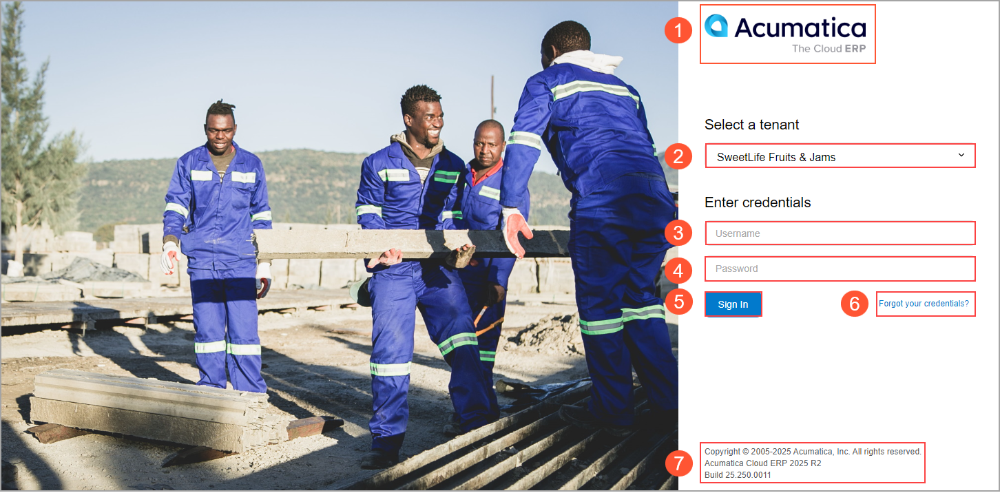

# Acumatica ERP Access: General Information {#_e468eb8e-5a07-4a8f-b128-fe5e5a7847cb .concept}

The first thing to do when you want to work with Acumatica ERP is sign in to the system. In the following sections, you’ll find information about doing this.

## Learning Objectives { .section}

In this chapter, you’ll learn how to do the following:

-   Sign in to Acumatica ERP
-   Switch between the available companies and branches
-   Sign out of Acumatica ERP

## Applicable Scenarios { .section}

You need to learn about signing in to Acumatica ERP if you haven't done so previously.

## Access to Acumatica ERP { .section}

Acumatica ERP is a web-based application. To begin the sign-in process, you open a web browser and type the URL of the Acumatica ERP instance.

For working with Acumatica ERP, we recommend that you use one of the following web browsers:

-   Google Chrome
-   Mozilla Firefox
-   Microsoft Edge
-   Apple Safari

You can also open the Acumatica ERP instance by finding it through the Start menu and clicking it or by using the Acumatica ERP Configuration wizard. For details, see [Instance Deployment: Accessing an Instance for the First Time](INST_Deploying_Instances_First_Sign_In.md).

Acumatica ERP is a role-based system. The system administrator assigns one or more roles \(such as *Accountant* or *Marketing Manager*\) to your user account. Based on your assigned roles, you can view and work with specific companies, branches, workspaces, and menu items within the workspaces.

To use the system, you can use an account of any of the following types:

-   An Acumatica ERP account: You use the username and password that the system administrator has created for you in Acumatica ERP to sign in to the system.
-   A domain account: If the system administrator has integrated Acumatica ERP with Microsoft Active Directory, you use your domain login and password \(the credentials that you use to sign in to your computer\).
-   An account of an external identity provider: If the system administrator has configured single sign-on with an external identity provider, such as Google or Microsoft account, you use the credentials of this provider to sign in to Acumatica ERP.

When you have finished working with Acumatica ERP, be sure to save the results of your work and sign out to prevent unauthorized access to the system.

## Basic Elements of the Acumatica ERP Sign-In Page {#_a1fcd56a-aacb-4c93-908c-cdefcdffa8e4 .section}

You use the Acumatica ERP Sign-In page to sign in to the system, submit a request to your system administrator to recover your password \(if the security policy of your company allows this\), and go to the Acumatica ERP official website. The Sign-In page also includes information about the system version and any applied customization projects; these details may be useful to some users under some circumstances, such as during troubleshooting.

Below you can see the basic elements of the Acumatica ERP Sign-In page.

The following elements may be visible on the Acumatica ERP Sign-In page:

1.  The button with the Acumatica ERP logo. You can click this button to open the Acumatica corporate website in a new browser tab.
2.  The Tenant box. This box is available only if you have access to multiple tenants.
3.  The **Username** box.
4.  The **Password** box.
5.  The **Sign In** button.
6.  The **Forgot your credentials?** link.
7.  The information about the Acumatica ERP version and any applied customization projects.

## Tenants in Acumatica ERP { .section}

A tenant is a unit that is used for sharing the Acumatica ERP application with other tenants, with each tenant’s data isolated from and invisible to the other tenants.

If multiple tenants are configured in your Acumatica ERP instance and you have access to more than one tenant, you can do the following:

-   Select a tenant when you sign in to the system
-   Switch between tenants when you are working with the system

## Companies and Branches in Acumatica ERP { .section}

For an organization that has a hierarchical structure of subsidiaries or branches, Acumatica ERP supports multicompany and multibranch functionality.

When you are working with the system, you can switch between the companies and branches to which you have access if multiple companies and branches are configured in your Acumatica ERP instance. To do this, you use the Company and Branch Selection menu, which is described in [The Acumatica ERP UI: Top Pane](GS_Learning_UI_Top_Pane.md).

**Parent topic:**[Accessing Acumatica ERP](../UserGuide/GS_Accessing_Acumatica_ERP_Mapref.md)

