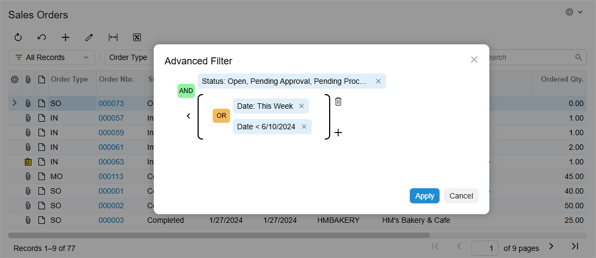
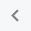
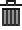

# Filtering and Sorting Capabilities: Advanced and Ad Hoc Filters {#_96d634a5-8698-4d0a-bf35-8d6c023b270c .concept}

In the following sections, you’ll find information about advanced and ad hoc filters in Acumatica ERP.

## Advanced Filters { .section}

An advanced filter is a flexible filtering tool that you can use to build complex filter conditions by using multiple data fields, logical operators, and grouping. You can use it to narrow down data more precisely than with a simple or quick filter.

To create an advanced filter, you need to open the **Advanced Filter** dialog box in either of the following ways:

-   Click the More \(\) button in the filtering area and then click **Open Advanced Filter**.
-   Click the **Add Quick Filter** button and select **Advanced** in the dialog box that opens.

Below you can see the **Advanced Filter** dialog box.

In the dialog box, you can do the following:

-   To define filter criteria, click the name of the data field corresponding to the column, specify the conditions and the applicable values \(if needed\), and then click **Apply**. The list of available conditions and values varies depending on the data field type. For details, see [Filtering and Sorting Capabilities: To Create an Advanced Filter](GS_ModernUI_Filter_Advanced_Activity.md).
-   To clear filter criteria, click the name of the applicable data field and then click **Clear Filter**.
-   To delete filter criteria, either click the  icon or click the name of the applicable data field and then click **Remove Filter**.
-   To add another data field, click the Plus icon next to the existing data field and select the name of the needed data field in the dialog box that opens.
-   To change the logical operator, click the operator name. Possible operators are *AND* and *OR*.
-   To group multiple filter criteria, hover over the logical operator and click the  icon. Groups define the order of logical operations. Grouped criteria are denoted with parentheses.
-   To cancel the grouping, hover over the parentheses and click the  icon.
-   To delete a group, hover over the parentheses and click the  icon.
-   To apply the current filter to the table and close the dialog box, click **Apply**.
-   To close the dialog box without applying the filter, click **Cancel**.

Once the advanced filter has been applied to a table, it is displayed as a filter button in the filtering area.

You can save an advanced filters for later use by clicking the **Save Filter** button. When you save the filter, the system adds it to the Filter List menu.

Also, if you are a system administrator, you can create an advanced filter on the [Filters](CS_20_90_10.md) \(CS209010\) form for a mass processing or inquiry form. You can configure complex conditions for the advanced filter and apply the filter by default for all users. If an advanced filter has been defined for a form, you can apply it anytime. For details, see [Managing Advanced Filters](GI_Reusable_Filters_Mapref.md).

## Ad Hoc Filters { .section}

You configure *ad hoc filters* on the **Sorting &amp; Filtering** tab \(**Filtering** section\) of report forms, shown below, to fine-tune the basic report parameters. You can’t save these filters directly and reuse them later. However, you can set up and save report templates that contain the filtering and sorting settings you use for an ad hoc filter.

**Parent topic:**[Filtering and Sorting in Acumatica ERP](../UserGuide/GS_Filtering_and_Sorting_Mapref.md)

