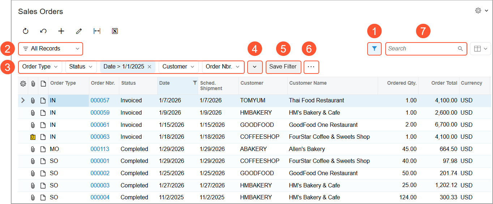
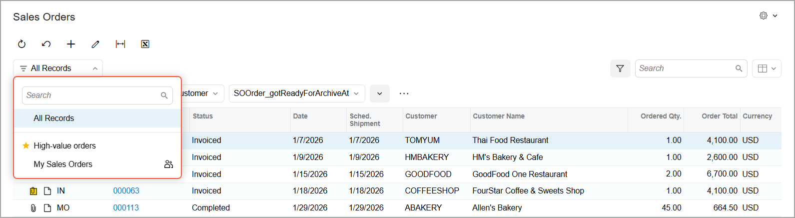
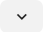
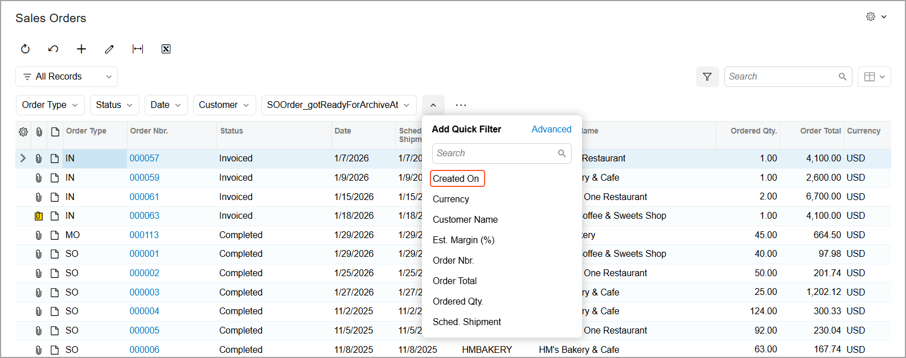
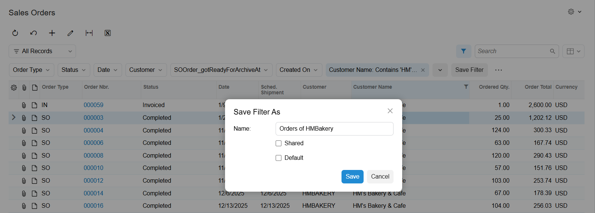
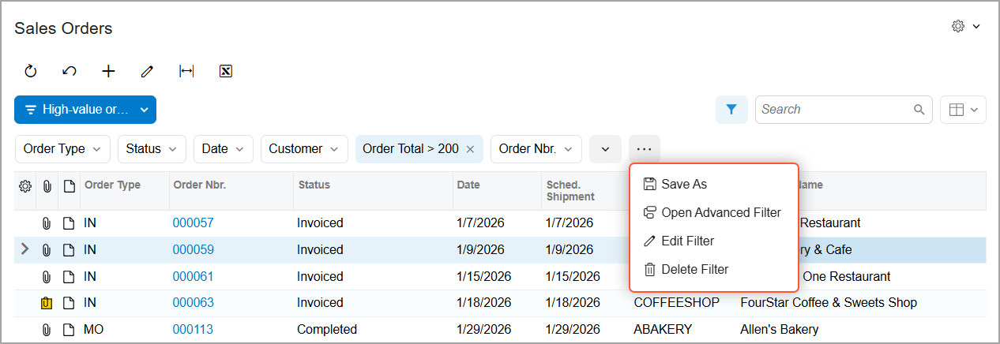
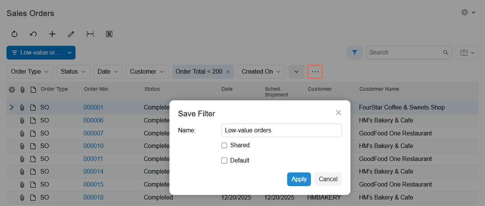

# Filtering and Sorting Capabilities: General Information {#_a8754166-5b02-460b-a175-6f15e557811c .concept}

In the following sections, you’ll find information about filtering and sorting of data in Acumatica ERP.

## Learning Objectives { .section}

In this chapter, you’ll learn how to do the following:

-   Recognize the types of filters
-   Identify the basic elements of the filtering area
-   Create a simple filter
-   Create and manage a quick filter
-   Create an advanced filter
-   Create ad hoc filter

## Applicable Scenarios { .section}

You use filters in either of the following cases:

-   You need to quickly select data according to particular criteria.
-   You regularly need to work with data that is selected according to particular criteria.

## Filters in Acumatica ERP { .section}

When you work with large amounts of data, filtering is a crucial capability of the system that you can use to view and process the data. In Acumatica ERP, you can create and save filters that meet your needs.

You can set up filters for various forms and reports. For details on using filters in reports, see [Working with Reports](GS_Working_With_Reports_Mapref.md). All Acumatica ERP filters are form-specific, which means that if a filter is set up for one form, you cannot apply it to another form.

You can apply filters to data in the table on an Acumatica ERP form of any of the following types \(which are described in [Record Entry: Basics of Acumatica ERP Forms](GS_Working_with_Data_Entry_Form_Types_and_Parts_of_Form.md)\):

-   A generic inquiry form \(such as a list of records\)
-   An inquiry form
-   A mass processing form
-   A data entry form \(for tabs that support filter functionality\)

Acumatica ERP provides the following types of filters:

-   Simple filter. A temporary filter applied to table data; this filter remains active while you stay on the form. For details, see [Filtering and Sorting Capabilities: Simple Filters](GS_Filtering_and_Sorting_Simple_Filter.md).
-   Quick filter. A reusable filter that can be applied to table data throughout the current session. The filter can be saved for future use. For details, see [Filtering and Sorting Capabilities: Quick Filters](GS_Filtering_and_Sorting_Quick_Filter.md).
-   Advanced filter. A reusable filter with complex conditions. This filter can be applied to table data throughout the current session and can be saved for future use. For details, see [Filtering and Sorting Capabilities: Advanced and Ad Hoc Filters](GS_Filtering_and_Sorting_Advances_and_Ad_Hoc_Filters.md).
-   Ad hoc filter. A temporary filter applied to reports; the filter remains active while you stay on the report form. For details, see [Filtering and Sorting Capabilities: Advanced and Ad Hoc Filters](GS_Filtering_and_Sorting_Advances_and_Ad_Hoc_Filters.md).

A shared filter is one that is available to all users of the system. If you have access to the [Filters](CS_20_90_10.md) \(CS209010\) form, you can make an advanced filter and define it to be shared with other users.

## Basic Elements of the Filtering Area { .section}

The filtering area of an Acumatica ERP form has a group of UI elements that you can use to set up and apply filters.

The basic elements of the filtering area are shown below.

1.  Filter Settings button
2.  Filter List button
3.  Quick Filter buttons
4.  **Add Quick Filter** button
5.  **Save Filter** button
6.  More \(\) button
7.  Search box

## Filter Settings Button { .section}

You click the Filter Settings button to open and close the filtering area with the **Add Quick Filter**, **Save Filter**, More, and predefined quick filter buttons.

## Filter List Button { .section}

You click the Filter List button to see the saved personal and shared filters. The filters are shown in the Filter List menu \(see below\).

In the Filter List menu, you can perform the following basic actions:

-   Apply a filter by clicking its name in the list.
-   Search for a filter by typing its name in the Search box.
-   Mark a filter as a favorite by hovering over its name and clicking the star icon. Favorite filters are displayed at the top of the list.
-   Review filters shared with all users of Acumatica ERP, which are denoted by the  icon.

## Quick Filter Buttons { .section}

You can see predefined quick filter buttons in the filtering area of some Acumatica ERP forms. These quick filters can help you quickly filter frequently used data.

To apply a predefined quick filter, you click the quick filter button and select the filter conditions in the Quick Filter menu. When you specify a filter condition, it’s included in the name of the quick button in the following format: *Column Name = 'Filter Condition'*.

You can rearrange the order of Quick Filter buttons in the filtering area by dragging any button to the needed position. If you don’t need a quick filter button, you can remove it by clicking the quick filter button and then selecting **Remove Filter** in the Quick Filter menu.

You can create, edit or remove any quick filter, including predefined ones. For more details about quick filters, see [Filtering and Sorting Capabilities: Quick Filters](GS_Filtering_and_Sorting_Quick_Filter.md).

## Add Quick Filter Button { .section}

You can create additional quick filter buttons for data fields by clicking the **Add Quick Filter** button \(\) in the filtering area. In the **Add Quick Filter** dialog box, which opens, you select the data field \(as shown below\) for which you want to add a quick filter button.

Once you select the data field, the quick filter button for it appears in the filtering area. For details, see [Filtering and Sorting Capabilities: Quick Filters](GS_Filtering_and_Sorting_Quick_Filter.md).

If you need to create an advanced filter, you click the **Add Quick Filter** button and then click **Advanced** in the upper-right corner of the dialog box that opens. The system opens the Advanced Filter editor, where you can specify the conditions for the advanced filter. For details about advanced filters, see [Filtering and Sorting Capabilities: Advanced and Ad Hoc Filters](GS_Filtering_and_Sorting_Advances_and_Ad_Hoc_Filters.md).

## Save Filter Button { .section}

To keep the filter criteria for future usage, make the filter applied by default, or share the filter with other users, you can click the **Save Filter** button. This button is visible only when the changes in the current filter have not been saved.

In the **Save Filter As** dialog box \(shown below\), which opens, you specify the name of the filter and click **Save**. Additionally, you can make the system apply this filter each time you open the form. To do this, select the **Default** check box before you click **Save**.

Also, if you have access to the [Filters](CS_20_90_10.md) \(CS209010\) form, you can make the filter available to other users by selecting the **Shared** check box before you click **Save**.

Saved personal and shared filters are listed in the Filter List menu.

## More Button { .section}

You can click the More \(\) button to execute the following menu commands for managing filters \(see below\).

-   **Save As**: You can save the filter and specify its settings, as described in the previous section.
-   **Open Advanced Filter**: You can open the Advanced Filter Editor to create a new advanced filter or edit the selected advanced filter.
-   **Edit Filter**: You can modify the settings of the selected filter in the **Save Filter** dialog box \(shown below\).

    

-   **Delete Filter**: You can delete the selected filter.

## Search Box { .section}

You can use the Search box to enter a string to highlight cell values that include the search term. By default, the maximum length for the search string is 100 characters, and the system uses the *Contains* condition to perform the search.

**Tip:** For the Search box, a user with administrative access rights can specify the following on the [Site Preferences](SM_20_05_05.md) \(SM200505\) form:

-   The condition the system uses by default in the search query
-   The maximum length of the search string

**Parent topic:**[Filtering and Sorting in Acumatica ERP](../UserGuide/GS_Filtering_and_Sorting_Mapref.md)

