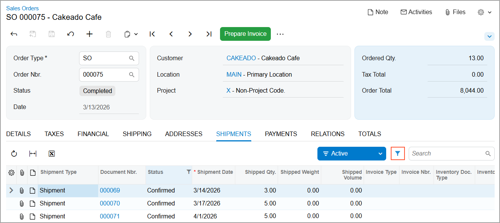

# Filtering and Sorting Capabilities: Quick Filters {#_629f573a-9bf7-4e6c-b5c7-124e0933a7f5 .concept}

In Acumatica ERP, a quick filter is a reusable filter that you can easily apply to table data. It is saved for the duration of the session, so you do not need to recreate it each time you return to this form after going to a different one.

To create a quick filter for a table column, do the following:

1.  Create a quick filter button in either of the following ways:

    -   Drag the column header to the filter area.
    -   Click the **Add Quick Filter** button; in the dialog box that opens, select the data field corresponding to the column.
    On the table toolbar, you’ll see the quick filter button with the column name.

2.  Click the quick filter button.
3.  On the Quick Filter menu, which opens, specify the filter conditions and values, and click **Apply**.

For details about creating and managing quick filters, see [Filtering and Sorting Capabilities: To Create and Manage Quick Filters](GS_ModernUI_Filter_Quick_Activity.md).

You can create a quick filter for table data on a tab of some data entry forms if the tab has the **Filter Settings** button; you can see this button on the [Sales Orders](SO_30_10_00.md) \(SO301000\) form below. You click this button to open the filtering area. In this area, you can create a quick filter as described above. For details, see [Filtering and Sorting Capabilities: To Review and Create Quick Filters](GS_ModernUI_Filter_on_Tab_Activity.md).

You can apply any number of quick filters to the table data.

Quick filters are session-based—that is, not automatically retained after you sign out. To save a quick filter for future use, you click **Save Filter** in the filtering area and enter its name in the **Save Filter As** dialog box. Once you save a filter, the system adds it to the Filter List menu, and the quick filter button displays its name. You can save quick filters for personal use or share them with other users if your user role has access to the [Filters](../Shared/../UserGuide/CS_20_90_10.md) \(CS209010\) form. Additionally, to have the system apply this filter automatically each time you open the form, you select the **Default** check box in the **Save Filter As** dialog box.

## Quick Filter Menu Operations { .section}

By using the Quick Filter menu, you can:

-   Sort table rows by selecting **Sort Ascending** or **Sort Descending** for the selected data field \(column\).
-   Apply filter criteria by selecting a condition, entering values \(if applicable\), and clicking **Apply**. The available conditions and value types depend on the selected data field.
-   Clear a filter by clicking **Clear Filter** to remove filtering for the corresponding data field.

**Parent topic:**[Filtering and Sorting in Acumatica ERP](../UserGuide/GS_Filtering_and_Sorting_Mapref.md)

