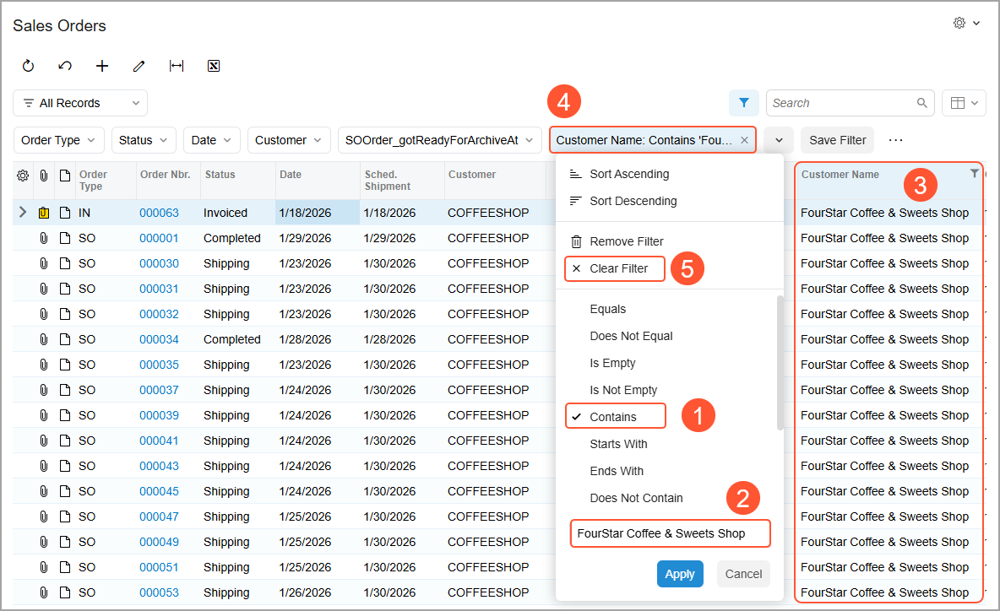
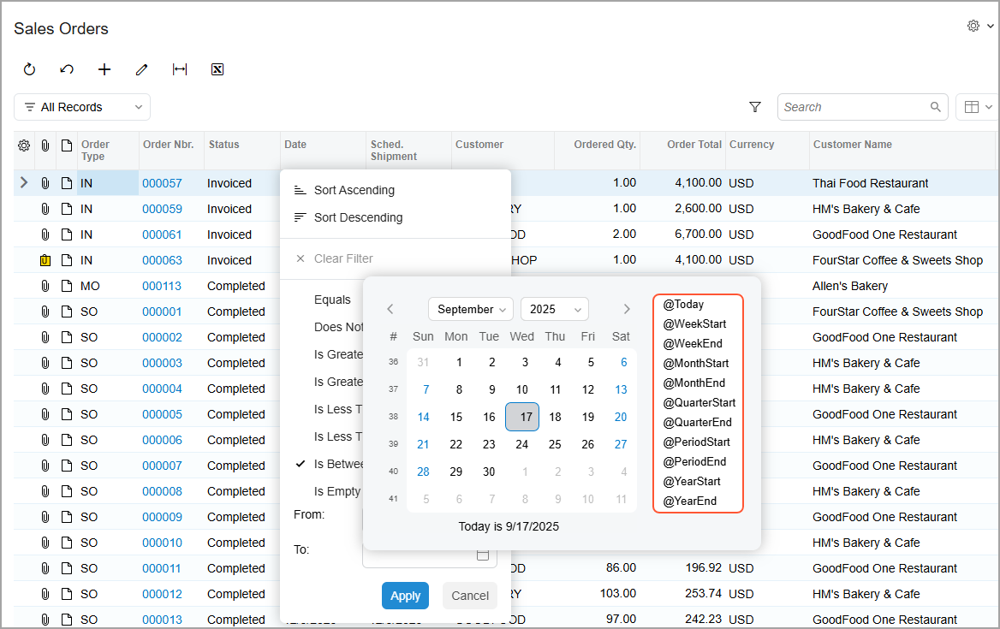

# Filtering and Sorting Capabilities: Simple Filters {#_374d1d50-1e5b-435a-a2f7-7c9b2533776b .concept}

In Acumatica ERP, a simple filter is a basic filter condition that you can quickly apply to table data to reduce the number of listed rows. The filter remains active as long as you are on the form.

To create a simple filter, you click the header of a table column to open the Quick Filter menu. You then select the filter condition \(Item 1 below\). In the untitled box at the bottom of the menu, you specify the value \(Item 2\), if one must be specified for the condition. When you click **Apply**, the table displays only the rows \(Item 3\) that meet the specified condition. Additionally, you’ll see a quick filter button with the condition to the table toolbar \(Item 4\).

To clear a simple filter, click **Clear Filter** \(Item 5 above\) in the Quick Filter menu.

**Tip:** You can also quickly filter data in a column by selecting a value in any row and pressing Shift+F. To clear this filter, you press Shift+F again.

You can save a simple filter by clicking the **Save Filter** button and entering its name. The filter will be added to the Filter List menu and can be reused in future sessions of your user account. For details, see the [Filtering and Sorting Capabilities: General Information](GS_Filtering_and_Sorting_GeneralInfo.md) and [Filtering and Sorting Capabilities: Quick Filters](GS_Filtering_and_Sorting_Quick_Filter.md).

Additionally, you can sort data in a table column and toggle sorting on and off by using the Quick Filter menu. For details, see [Filtering and Sorting Capabilities: To Create a Simple Filter](GS_Filtering_and_Sorting_Process_Activity.md).

In the following sections, you’ll find information about the basic filter conditions and parameters that you can apply to data by using a filter.

## Basic Filter Conditions {#_16c8ba86-8dcf-42ee-86d9-13c29b50e16e .section}

To narrow down the data in a table, you can specify a basic filter condition for a column. The conditions listed in the Quick Filter menu depend on the data type of the column and may include the following:

-   **Equals**: Displays only records for which the value in this column is equal to the value you enter in the untitled box.
-   **Does Not Equal**: Displays only records for which the value in this column is not equal to the value you enter in the untitled box.
-   **Is Empty**: Displays only records for which this column is empty.
-   **Is Not Empty**: Displays only records for which this column is filled in \(that is, not empty\).
-   **Contains**: Displays only records for which this column contains the text you enter in the untitled box.
-   **Starts With**: Displays only records for which the value in this column starts with the text you enter in the untitled box.
-   **Ends With**: Displays only records for which the value in this column ends with the text you enter in the untitled box.
-   **Does Not Contain**: Displays only records for which the value in this column doesn’t contain the text you enter in the untitled box.
-   **Is Greater Than**: Displays only records for which the value in this column is greater than the value you enter in the untitled box.
-   **Is Greater Than or Equal To**: Displays only records for which the value in this column is greater than or equal to the value you enter in the untitled box.
-   **Is Less Than**: Displays only records for which the value in this column is less than the value you enter in the value box.
-   **Is Less Than or Equal To**: Displays only records for which the value in this column is less than or equal to the value in the untitled box.
-   **Is Between**: Displays records for which the value in this column is between the values in the **From** and **To** boxes, which appear when you select this condition.
-   **Today** \(for values of the *date* type\): Displays records with the current business date in this column.
-   **Overdue** \(for values of the *date* type\): Displays records with dates in this column that are earlier than the current business date \(and thus overdue\).
-   **Today+Overdue** \(for values of the date type\): Displays records with dates in this column that are either the same as the business date or earlier than the current date \(past due relative to it\).
-   **Tomorrow** \(for values of the date type\): Displays records with the next business date in this column.
-   **This Week** \(for values of the date type\): Displays records with dates in this column that fall within the current week \(the week containing the business date\).

    **Tip:** The start and end of the week are determined based on the default system locale or the locale that you selected when you signed in to Acumatica ERP. The system locales are specified and configured on the [System Locales](../Shared/../UserGuide/SM_20_05_50.md) \(SM200550\) form.

-   **Next Week** \(for values of the date type\): Displays records with dates in this column that fall within the week after the current week \(the week after the one containing the business date\).
-   **This Month** \(for values of the *date* type\): Displays records with dates in this column that fall within the current month \(the month containing the business date\).
-   **Next Month** \(for values of the date type\): Displays records with dates in this column that fall within the month following the current month \(the month after the one containing the business date\).
-   **True**: Shows only records in which the check box in this column is selected.
-   **False**: Shows only records in which the check box in this column is cleared.

If you specify a date in the **From** or **To** box or in the untitled box but do not specify a time, the system uses `00:00:00` or `23:59:99` as the time, depending on the condition.

If you specify date-relative parameters, such as *@Today*, in those boxes, the system also uses `00:00:00` or `23:59:99` as the time, depending on the condition.

## Date-Related Filter Parameters { .section}

To make date conditions more flexible, you can use date-relative parameters—parameters that are relative to the business date—in the **From** and **To** boxes of the Quick Filter menu. You can use the following date-relative parameters:

-   `@Today`: The business date. You can modify this parameter by adding or subtracting days.

    **Attention:** If the data field contains a value that consists of a date and time, only records for which all of the following conditions are met match this parameter:

    -   the date is the same as the business date
    -   the time is *00:00:00*
-   `@WeekStart`: The date of the start of the current week. You can modify this parameter by adding or subtracting weeks.

    **Tip:** The start and end of the week are determined based on the default system locale or the locale that you selected when you signed in to Acumatica ERP. The system locales are specified and configured on the [System Locales](../Shared/../UserGuide/SM_20_05_50.md) \(SM200550\) form.

-   `@WeekEnd`: The date of the end of the current week. You can modify this parameter by adding or subtracting weeks.
-   `@MonthStart`: The date representing the start of the current month.
-   `@MonthEnd`: The date that’s the end of the current month.
-   `@QuarterStart`: The date that’s the start of the current quarter.
-   `@QuarterEnd`: The date of the end of the current quarter.
-   `@PeriodStart`: The date representing the start of the current financial period.
-   `@PeriodEnd`: The date marking the end of the current financial period; the financial periods in your system are defined on the [Financial Year](../Shared/../UserGuide/GL_10_10_00.md) \(GL101000\) form.
-   `@YearStart`: The start date of the current calendar year.
-   `@YearEnd`: The end date of the current calendar year.

To add a filter condition with a date-relative parameter, you select the parameter from the list in the built-in calendar \(see below\).

**Parent topic:**[Filtering and Sorting in Acumatica ERP](../UserGuide/GS_Filtering_and_Sorting_Mapref.md)

