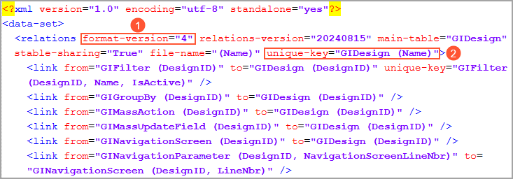
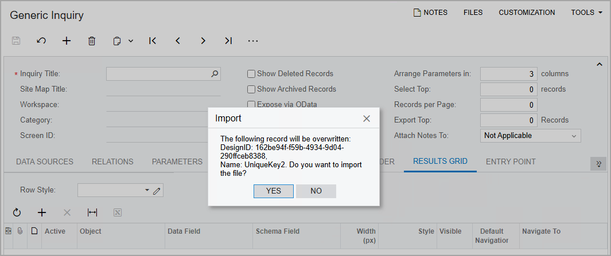
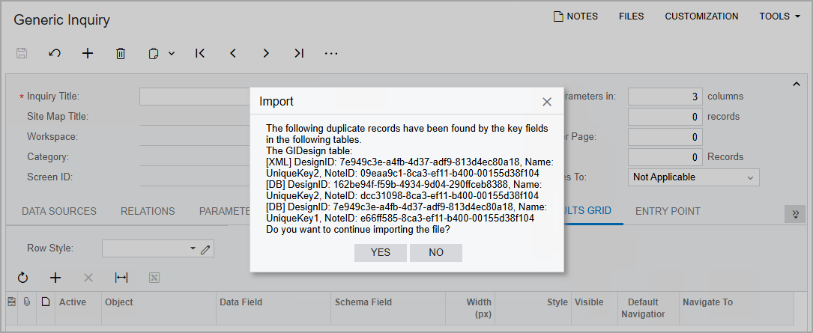

# XML Import and Export {#_21616cc7-ef15-4ba5-a013-3e77fb218d69 .concept}

In Acumatica ERP, some record types, such as generic inquiries and Analytical Report Manager \(ARM\) reports, have a complex structure. You may need to export data from these forms—for example, to transfer a generic inquiry to another instance. Then in the other instance, you need to import this generic inquiry. You can import and export these records in XML format.

If a form has XML import and export functionality, the **Export as XML** and **Import from XML** menu commands are available when you click **Clipboard** on the form toolbar after you open a record. For example, this command is available for a generic inquiry selected on the [Generic Inquiry](SM_20_80_00.md) \(SM208000\) form.

## Structure of the Export Template { .section}

For certain records in Acumatica ERP, the primary keys on the database level differ from the primary keys on the application level. For example, a dashboard record has the Name primary key in the data access class \(DAC\) and the DashboardID primary key in the database table.

When you use the XML import and export functionality to import records that have the same key fields as the existing records, the export template prevents the duplication of records during import. Version 4 \(the `format-version="4"` attribute; see Item 1 in the following screenshot\) of the XML schema provided with Acumatica ERP supports the `unique-key` attribute \(Item 2\). The system uses this attribute to check for duplicate records. The attribute can be specified for parent and child tables.

**Tip:** A unique key can contain multiple fields if it is a composite key.

For details on unique keys, see topics in the [Designing the Database Structure and DACs](../StudioDeveloperGuide/DA__mng_Designing_Database_Structure.md) chapter. For details on XML format, see [Implementing the XML Import and Export Functionality in a Custom Form](../CustomizationPlatform/CG_GL_BL_ExampleXMLImportExportCustomForm.md).

## Verification of Unique Keys During XML Import { .section}

When you import an XML file, the system verifies whether this file contains any of the unique keys of the database tables from the export template. The system then checks whether a record with the same unique key exists in the system. The system searches for these records by using the primary key and the unique index from the database, as well as the unique key from the export template.

If only one record is found in a parent table, the system displays a warning that this record will be overwritten \(see the following screenshot\). If you confirm the operation, the system replaces the unique key of the existing record with the unique key of the imported record.

If multiple duplicate records are found, the system displays a warning about these records \(see the following screenshot\). If you click **Yes** in the **Import** dialog box, the system then processes the duplicate records based on the link type and attributes specified for the parent and child tables in the XML schema.

For details on how to import and export data, see [To Import Data from XML](IS__how_XML_import.md) and [To Export Data to XML](IS__how_XML_export.md).

**Parent topic:**[Importing and Exporting Data to Excel and XML](../UserGuide/GS_Importing_Exporting_to_Excel_XML.md)

