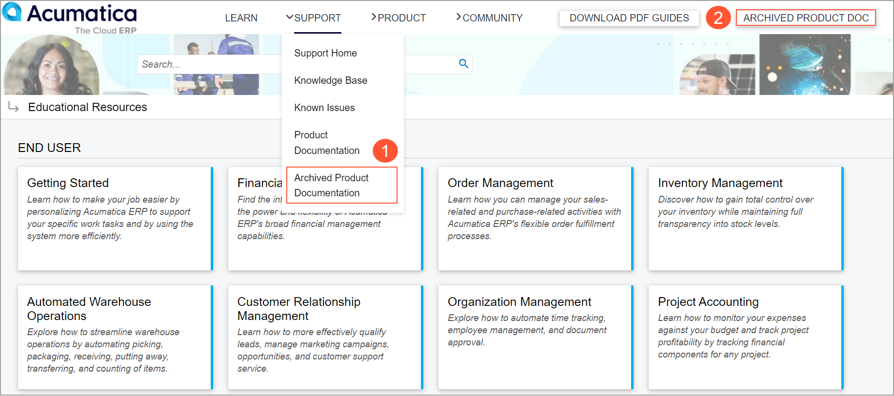
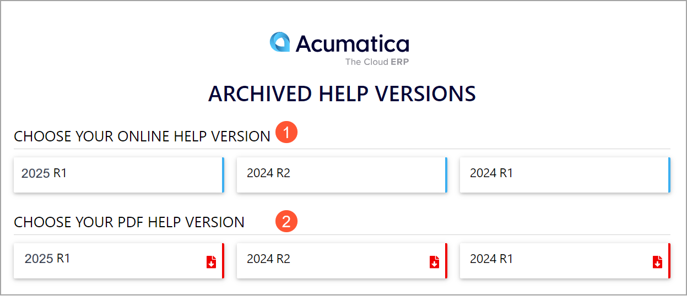

# Acumatica Educational Resources: General Information {#_99d7539c-7850-4368-b251-15bb9d41457e .concept}

In the following sections, you’ll find information about using the Acumatica educational resources.

## Learning Objectives { .section}

In this chapter, you’ll learn how to do the following:

-   Use the Acumatica Community resources
-   Use the Acumatica Portal
-   Use the Acumatica Help portal
-   Access the Acumatica Open University resources
-   Access the Acumatica resources for developers

## Applicable Scenarios { .section}

You may want to learn about the Acumatica educational resources in either of the following cases:

-   You are new to Acumatica ERP and need to explore its Help system, tools, and services, as well as the ways to access these resources.
-   You are a more experienced user of Acumatica ERP, and you want to make sure that you have explored all of the available resources.

## Acumatica Educational Resources { .section}

The Acumatica educational resources are located on different websites. The website you use depends on your role in your company—such as a developer or an end user—and your purpose in obtaining information.

You will find further information on the educational resources in the following sections of this topic.

## Acumatica Community { .section}

The Acumatica Community website \([community.acumatica.com](https://community.acumatica.com/)\) provides an official Acumatica user collaboration tool and access to all the Acumatica resources in one easy-to-use platform. To get access to all the areas of the Community, you need to sign in by using your Acumatica Portal credentials.

Acumatica Community includes the following resources:

-   Acumatica news and announcements
-   A list of upcoming events
-   Product download pages
-   Acumatica ERP release notes
-   Acumatica ERP documentation
-   The Knowledge Base
-   Known product issues
-   Acumatica ERP add-ons and integration
-   Discussion forums
-   Product ideas
-   Terms
-   Acumatica User Groups

By using the site menu of the Community website, you can easily go to the Acumatica Portal, the Acumatica Help portal, and Acumatica Open University.

## Acumatica Portal { .section}

By using the Acumatica Portal \([portal.acumatica.com](https://portal.acumatica.com/)\), you can do the following, depending on your role in your company:

-   View and modify your company's profile
-   View your company's documents, including contracts and invoices
-   Manage your company's opportunities and customer contracts
-   Manage the list of your company's contacts, including creation, modification, and deletion
-   Open a support case and keep track of your existing support cases
-   View the learning progress of your company and each company employee in the inquiries and on the dashboards
-   View supporting learning information
-   View training event recordings
-   Visit the Acumatica Marketplace
-   Become familiar with marketing, presales, and sales information
-   Find information about known product issues

## Help Portal { .section}

You can find Help information for the most recent product version on the Acumatica Help portal by going directly to [help.acumatica.com](https://help.acumatica.com/). The Help portal is a collection of Help topics describing Acumatica ERP. By using the Help portal, you can learn how particular functionality works and find guides for end users, implementation consultants, administrators, and developers.

You can also download the guides and diagram album from the Help portal. To do this, you need to open the home page of the Acumatica Help portal, and click **Download PDF Guides** on the menu bar. This opens a pop-up window that has a list of the guides available for download. You click the link to a PDF guide to download it.

If you need to read the documentation of supported versions of Acumatica ERP, you can access it by opening the Archived Help Versions webpage in one of the following ways:

-   On the menu bar, hover over **Support** to open the Support menu, and then click **Archived Product Documentation** \(see Item 1 below\).
-   On the menu bar, click the **Archived Product Doc** button \(Item 2\).

The Help topics for each product version are located on a separate website. In the **Choose Your Online Help Version** section \(Item 1 below\), you click the tile of the needed product version. The Acumatica Educational Resources webpage opens, and you can click a tile to open a guide of an archived version from this page.

On the Archived Help Versions page, you can also download the guides of the needed version in PDF format by clicking the tile of the product version in the **Choose Your PDF Help Version** section \(Item 2 above\).

## Acumatica Open University { .section}

Open University \([openuni.acumatica.com](https://openuni.acumatica.com/)\) is an internet portal with Acumatica educational resources for everyone who is interested in the Acumatica product offerings and technology.

Open University provides the following types of free and readily available training courses for Acumatica ERP users:

-   End-user training courses, which are published only on the Open University website.
-   Partner training courses. You can take these training courses to obtain more extensive knowledge of a particular functional area.
-   Developer training courses.

You'll also find job aids, which contain instructions you can follow to practice daily tasks essential to your position in the company.

When you sign in to the Open University site by using the credentials of your Acumatica Portal account, you can access the training courses and files for training.

Each training course contains a description and resources—including guides and files for training, such as Excel spreadsheets, PowerPoint presentations, and visual aids. Certain courses also include webinar recordings that can be useful for self-studying. You can pass training courses in any order or select a recommended learning path.

A learning path is a set of courses that helps you easily browse the course catalog. Acumatica Open University provides different learning paths that are recommended based on your specific role. By clicking any of the offered learning paths, you’ll see the list of the courses that match your needs. After you complete all the courses in the learning path, you can update your social network profiles by listing specific skills to spotlight them.

Some of the end-user and developer courses may also contain quizzes. Quizzes help to ensure that you understand how to use your new knowledge. If you have completed the quiz successfully, you can download a certificate of quiz completion. See [Quizzes](https://openuni.acumatica.com/faq/#quizzes) for more information.

## Acumatica Resources for Developers { .section}

You can find comprehensive developer resources on the [Acumatica Developer Landing Page](https://www.acumatica.com/developers/), [Acumatica Community](https://community.acumatica.com/), [openuni.acumatica.com](https://openuni.acumatica.com/), and [help.acumatica.com](https://help.acumatica.com/) websites.

By using these websites, depending on the role you are assigned to, you can do the following:

-   Read [developer-focused blogs](https://www.acumatica.com/blog/category/developers/) and the [Acumatica Developers blog](http://asiablog.acumatica.com/)
-   View [onboarding materials and guidance](https://www.acumatica.com/developers/onboarding-new-acumatica-developers/) for new developers
-   Watch archived [developer webinar series](https://www.acumatica.com/developer-webinar-series/) recordings
-   Learn about the [Acumatica Developer Training Courses](https://www.acumatica.com/acumatica-developer-training/)
-   Join [Acumatica Developer Network](https://www.acumatica.com/why-join-adn/)
-   Get an overview of the [Acumatica xRP developer platform](https://www.acumatica.com/acumatica-cloud-xrp-platform/)
-   Ask questions in discussion forums: [Acumatica Developer Customizations](https://community.acumatica.com/develop-customizations-288), [Develop Integrations with Web Services/API](https://community.acumatica.com/develop-integrations-with-web-services-apis-289), [Other Developer Topics](https://community.acumatica.com/other-developer-topics-290), [Low Code/No Code Customizations or Integrations](https://community.acumatica.com/other-developer-topics-291), and [GitHub Acumatica](https://github.com/acumatica)
-   Download [Acumatica Software](https://community.acumatica.com/product-downloads-59) to evaluate and start development, as well as get access to beta versions

**Parent topic:**[Learning About Acumatica Educational Resources](../UserGuide/GS_Learning_Acu_Edu_Resources_Mapref.md)

