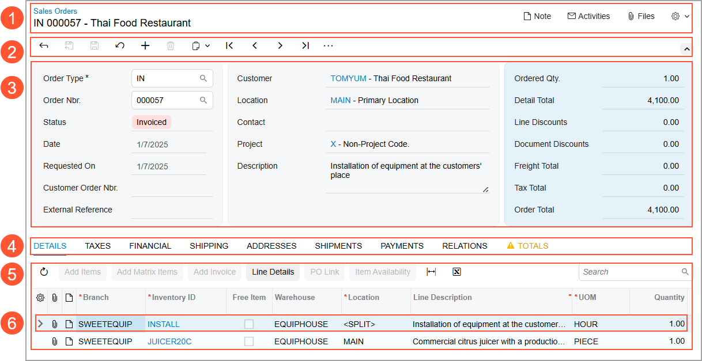
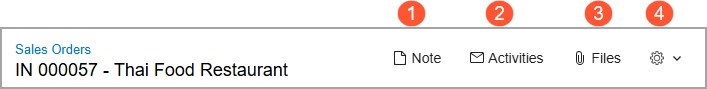
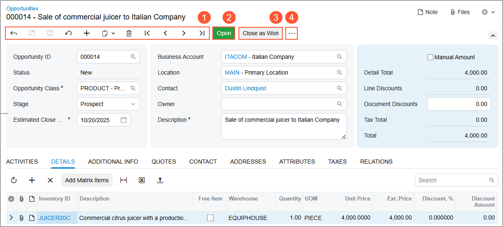
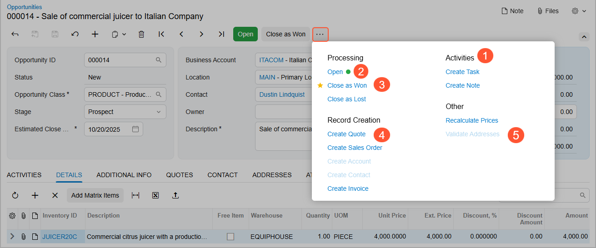
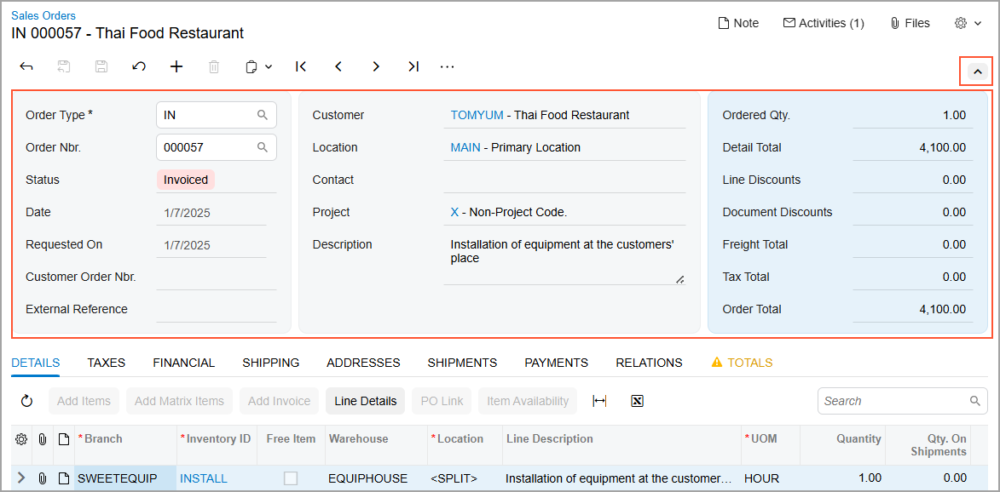

# The Acumatica ERP UI: Basic Parts of an Acumatica ERP Form {#_a751712d-8a29-433f-8e35-7d12829b9dd1 .concept}

An Acumatica ERP form has basic parts that help you enter data into the system, search for needed information, and share information with other users. The availability of a particular part may vary by form or based on the access rights of your user account.

Below you can see the basic parts of a form \(in this example, a data entry form\), which are described in the next several sections.

1.  Form title bar
2.  Form toolbar with the More menu
3.  Summary area
4.  Tabs
5.  Details area
6.  Row \(line or detail\)

## Form Title Bar { .section}

The form title bar, located at the top of the form, displays:

-   The title of the form.
-   The title of the record \(for data entry forms\).
-   Buttons and menu commands, some of which you can use to manage information related to the record or the form. Depending on the form and your user account’s access rights, the available buttons and menu commands may include those shown below.

1.  **Notes**: Use this button to create and attach a note to the selected record. For details, see the *Note Attachments* section in [Attachments: General Information](GS_Working_With_Attachments_GeneralInfo.md).
2.  **Activities**: Use this button to create and manage form-related activities—such as tasks, events, emails, and other actions—on forms that don’t have an **Activities** tab. When you click the button, in the **Tasks &amp; Activities** dialog box, which opens, you select the type of activity you want to create. The selected activity opens in its data entry form in a new browser tab.
3.  **Files**: Use this button to attach a file to the record. For details, see the *File Attachments* section in [Attachments: General Information](GS_Working_With_Attachments_GeneralInfo.md).
4.  **Settings**: Use this button to get access to form-related information and to customize the Acumatica ERP instance.

## The Form Toolbar and the More Menu { .section}

The form toolbar of a form contains standard buttons that you can use to save or cancel changes you have made to the record, or to add or delete a record. For the list of standard buttons, see [Form Toolbar and More Menu](../InterfaceGuide/Form_Toolbar.md).

Depending on the form, the form toolbar may contain buttons to go to different records created on the form.

The form toolbar may also include form-specific buttons \(for example, processing buttons\) and commands. The form-specific commands can be shown as buttons on the form toolbar, as commands on the More menu, or in both places. Below you can see the basic elements of the form toolbar on the [Opportunities](CR_30_40_00.md) \(CR304000\) form.

1.  The standard form toolbar buttons, all or some of which appear on most of the forms in Acumatica ERP.
2.  A highlighted button that represents the next logical step to be performed on the record selected on the form.
3.  Another button for a command that a user can perform on the form.
4.  The More button, which you click to open the More menu.

The More menu on the form toolbar contains categories and menu commands on it, as shown below.

1.  The title of a category, which is used to organize commands.
2.  The command that has the green dot, which represents the next logical step to be performed on the record \(that is, the expected next command\).This command is also displayed on the form toolbar as a highlighted button.
3.  The star icon, which is used to mark your favorite menu commands on the form if you use some commands more often than others. For more details, see [The Acumatica ERP UI: Favorites](GS_Learning_UI_Favorites.md).
4.  An available command. It may also be displayed as a button on the form toolbar if it is a common command that a user can perform on the form.
5.  An unavailable command. By default, on the More menu, the system displays all commands that could be available for the form. Some of these commands may be unavailable \(that is, they cannot be clicked\). These are the commands that are not applicable to the record based on its current status.

The form toolbar has a responsive layout, meaning that it dynamically adjusts to different screen sizes. When there is enough space, buttons for highlighted and favorite commands are displayed on the form toolbar. When the screen size decreases, the system moves the commands off the form toolbar one by one, but keeps them on the More menu.

If there are multiple categories on the More menu, the categories and menu commands may be displayed in multiple columns on the More menu, depending on the screen size and the number of categories. When the screen size decreases, the system moves some categories and menu commands to the left to decrease the number of columns, and in the screens of the smallest size, all categories are displayed in one column.

## Summary or Selection Area { .section}

The Summary area of a data entry form displays general information related to the record, such as the date, identifier or reference number, status, customer, and description. The elements shown in the Summary area may vary depending on the form and the access rights of your user account.

If the Summary area contains many UI elements, you can collapse it by clicking the arrow in the upper-right corner of the area \(see below\). This hides less essential elements and displays only the most important ones. You can expand the Summary area again when you need to view all available information.

Inquiry and processing forms have a Selection area instead of a Summary area. In this area, you can specify selection criteria to narrow down the range of records shown in the Details area of the form.

Preferences forms contain an area with sections that include general settings related to the functional area of the product.

On most forms, related UI elements are visually grouped into sections with color blocks in the Summary or Selection areas, making the layout clear and well organized. You can personalize the set of UI elements that are visible in the Summary or Selection area's sections for your user account. If you're an administrator, you can change the set of elements system-wide. For details, see [Adjustment of the Acumatica ERP UI: General Information](GS_Personalization_UI_GeneralInfo.md).

## Tabs { .section}

The tabs of a form are used for organizing information and providing easier navigation to needed information. Most data entry forms in Acumatica ERP have more than one tab.

On a tab, the related UI elements are visually grouped into sections. You can personalize the set of tabs for your user account. If you're an administrator, you can change the set of tabs system-wide. For details, see [Adjustment of the Acumatica ERP UI: General Information](GS_Personalization_UI_GeneralInfo.md).

## Details Area { .section}

The Details area of a form, which may consist of tabs, displays the details or other essential data of the record you are viewing. Depending on the form and the tab of the form \(if applicable\), the Details area may contain one of the following:

-   A table with the rows \(sometimes referred to as *lines* or *details*\) of the selected record, as on the **Details** tab of the [Sales Orders](SO_30_10_00.md) \(SO301000\) form
-   A number of UI elements with their settings, as on the **General** tab of the [Customers](AR_30_30_00.md) \(AR303000\) form
-   A rich text editor that includes a text area and formatting toolbar, as on the **Details** tab of the [Cases](CR_30_60_00.md) \(CR306000\) form

## Row {#section_bhh_d23_flb .section}

The Details area of a form may consist of a table or multiple tabs, some of which contain tables. For example, on the [Sales Orders](SO_30_10_00.md) \(SO301000\) form:

-   The **Details** tab contains rows that correspond to each line of the sales order.
-   The **Taxes** tab contains rows for each of the individual taxes applied to the sales order lines.

Each row of a table in the Details area is a detail of the selected record, or a detail related to the record in some regard.

You can personalize the set of table columns for any form with a table. For details, see [Adjustment of the Acumatica ERP UI: General Information](GS_Personalization_UI_GeneralInfo.md).

**Parent topic:**[Learning About the Acumatica ERP UI](../UserGuide/GS_Learning_UI_Mapref.md)

