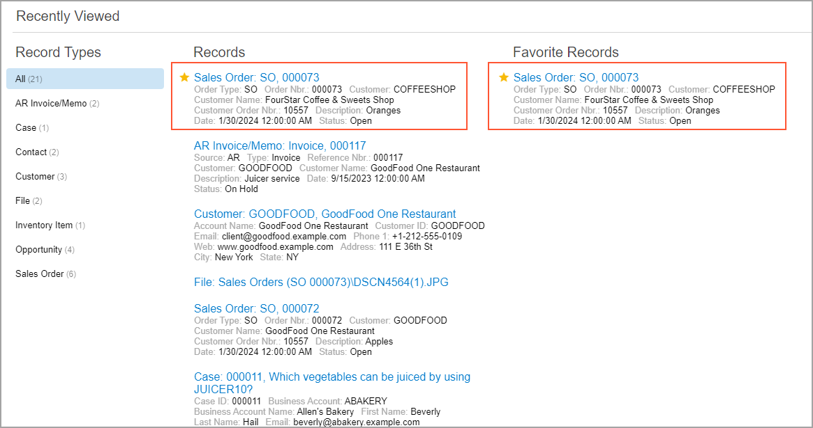
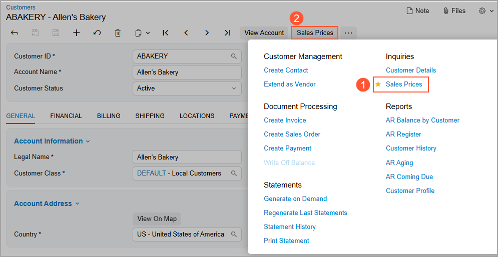

# The Acumatica ERP UI: Favorites {#_033442fa-2183-4d81-9776-2046932d13f2 .concept}

In the following sections, you’ll find information about managing your favorites in Acumatica ERP.

## Favorites { .section}

Acumatica ERP provides you with easy access to the forms, reports, and dashboards that you use commonly in your everyday work. You can add to the **Favorites** workspace a link to any workspace item \(form, report, or dashboard\) that is available to you. By default, this workspace is empty. You can add an item to your favorites:

-   From a workspace by clicking the star icon, which appears left of the link when you point at this item in the workspace
-   From an opened form, report, or dashboard by clicking the star icon right of the form title when you point at it

When you add a link to an item to your **Favorites** workspace, the link and its category are displayed in the workspace. If you no longer need a link in your favorites, you can remove it from your **Favorites** workspace.

Favorites are personal: The links to the items that you see in the **Favorites** workspace are the favorites you have created.

In any other workspace, you can identify your favorite links because they’re preceded by a star icon. You must point at a favorite tile in a workspace to see that it is a favorite. In this case, the system shows a *shaded* gray star in the tile. When you open a favorite form, report, or dashboard, you can see the yellow star icon \(\) right of the title of the form, report, or dashboard. You can click the icon to remove the item from your favorites.

## Favorite Records in the Recently Viewed Workspace { .section}

When you work with specific records—such as sales orders, invoices, or contacts—frequently, you can add them to **Favorite Records** in the **Recently Viewed** workspace. The record will then be listed under both **Records** and **Favorite Records**, as shown below.

To add a record to the list of favorite records, in the **Records** list, point at the needed record, and when the star icon appears, click it. The yellow color of the star indicates that the record has been added to your list of favorites.

**Attention:** You need to reopen the workspace to see these changes.

For more details on the **Recently Viewed** workspace, see [The Acumatica ERP UI: Top Pane](GS_Learning_UI_Top_Pane.md).

## Favorite Commands on the More Menu { .section}

On a form, you may use some commands more often than others. On the More menu, you can designate these commands as favorites. This will cause the system to duplicate the commands as form toolbar buttons, easing access to them.

To designate a command as a favorite, you open the More menu, point at the needed command, and click the star icon that appears left of the command. The star becomes yellow, indicating that the command has been added to your favorites. If the command is available, a button for the command appears on the form toolbar. The following example shows a command \(Item 1 below\) that has been added to the user's favorites on the [Customers](AR_30_30_00.md) \(AR303000\) form and thus added as a button on the form toolbar \(Item 2\).

Favorite commands are individual to each user account, specific to a particular form, and preserved across user sessions.

**Parent topic:**[Learning About the Acumatica ERP UI](../UserGuide/GS_Learning_UI_Mapref.md)

