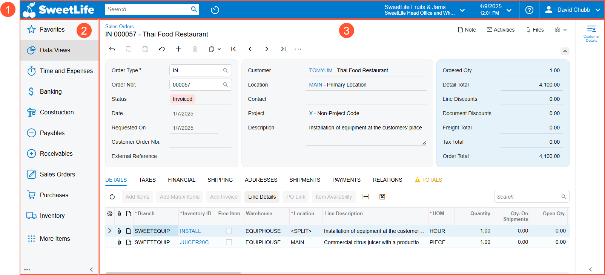

# The Acumatica ERP UI: General Information {#_9d9ba543-2a2c-4561-9211-448c683eeb13 .concept}

In the following sections, you’ll find information about the user interface and the ways you can browse the Acumatica ERP website.

## Learning Objectives { .section}

In this chapter, you’ll learn how to do the following:

-   Identify and describe the basic elements of the Acumatica ERP UI
-   Recognize about the basic elements of an Acumatica ERP form
-   Explore the Acumatica ERP online Help

## Applicable Scenarios { .section}

You need to learn about the Acumatica ERP UI if you are new to Acumatica ERP and need to become familiar with the UI.

## Basic Elements of the Acumatica ERP User Interface { .section}

Every screen of Acumatica ERP has basic UI elements that help users browse the system, enter data, and view, modify, and save information. The basic UI elements of the system are shown below.

1.  Top pane. Here, you’ll find UI elements that help you easily perform searches, manage your session and user settings, and go to the home page and recently viewed items. For details, see [The Acumatica ERP UI: Top Pane](GS_Learning_UI_Top_Pane.md).
2.  Main menu. You can use the elements on the menu to go to workspaces and open favorite forms, reports, and dashboards. You can also configure this menu. For details, see [The Acumatica ERP UI: Main Menu](GS_Learning_Ui_Main_Menu.md) and [The Acumatica ERP UI: Workspaces](GS_Learning_UI_Workspaces.md).
3.  Working area. This area displays the form, report, or dashboard you’ve opened. If the form has a side panel, you can open it and view it here too. The area can also contain the Help menu or an infotip pane. For details, see [The Acumatica ERP UI: Working Area](GS_Learning_UI_Working_Area.md) and [The Acumatica ERP UI: The Help System](GS_Learning_UI_Help.md).

**Parent topic:**[Learning About the Acumatica ERP UI](../UserGuide/GS_Learning_UI_Mapref.md)

