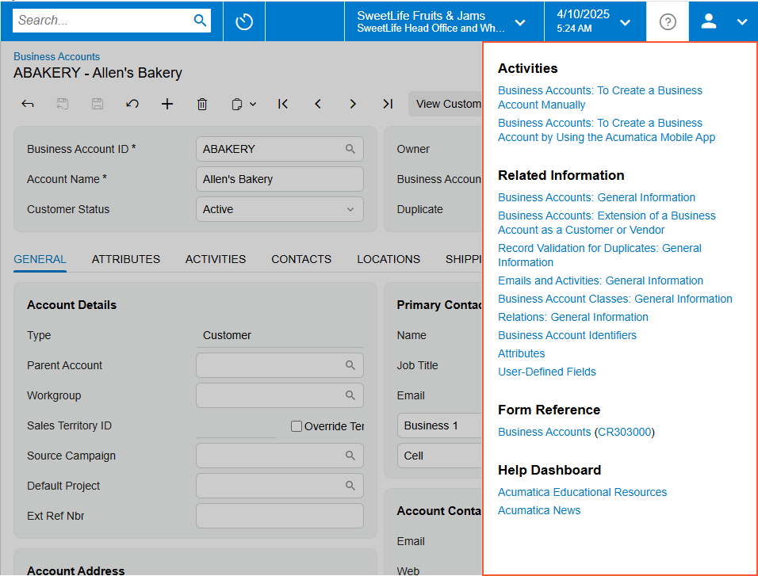
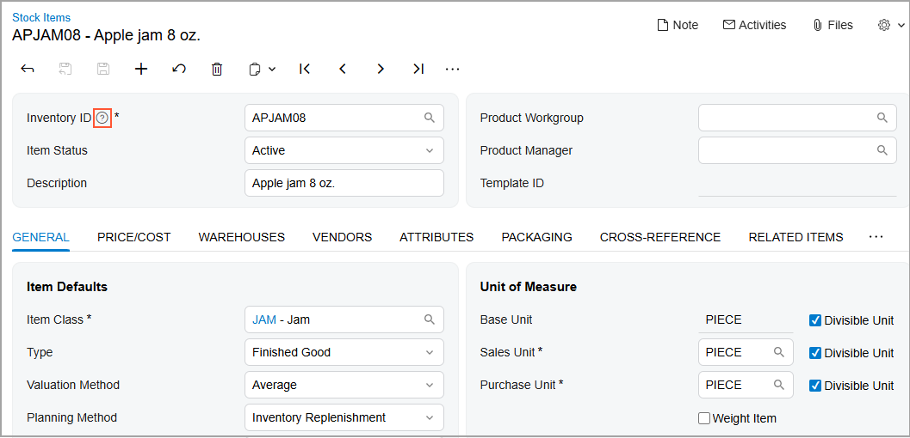
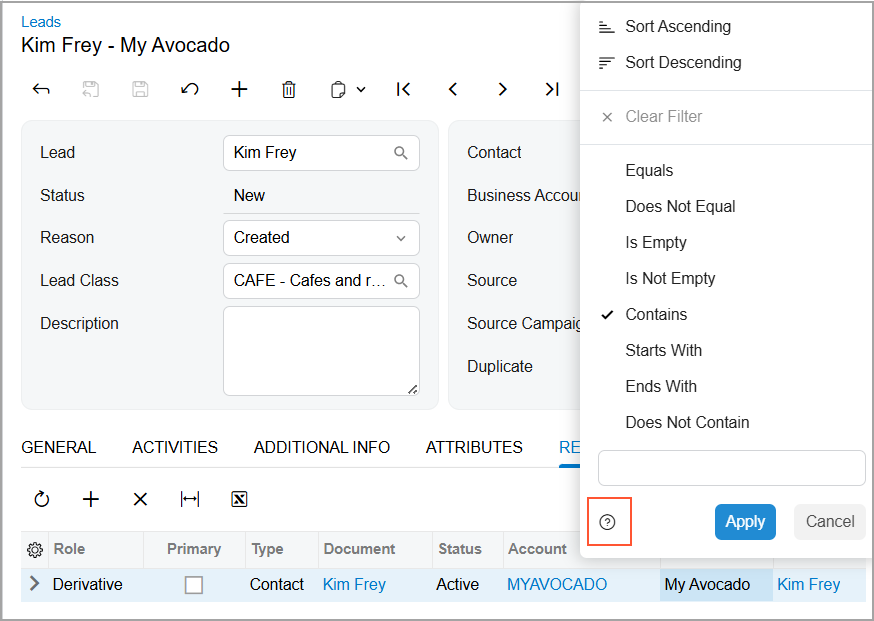
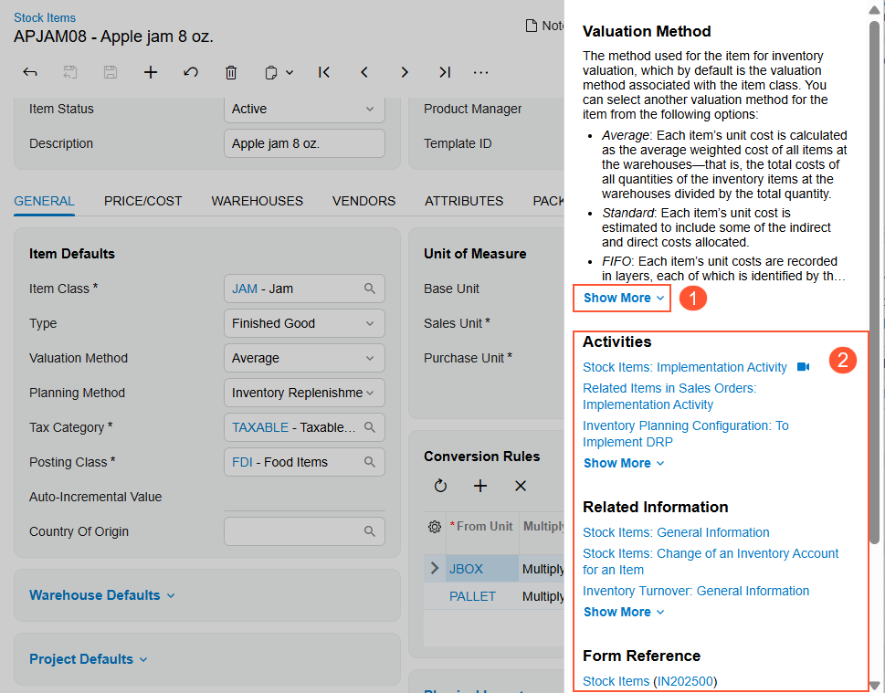

# The Acumatica ERP UI: The Help System {#_7a05a449-e7e5-4974-819e-683fda823a7c .concept}

In the following sections, you’ll find information about the built-in Help system in Acumatica ERP and the ways you can use it in your routine work.

## Built-In Help System { .section}

The Help system is a collection of guides on particular subjects or parts of the system, as well as collections of reference topics. These guides contain topics that provide conceptual information, training activities, and implementation checklists, as well as other resources to help you use Acumatica ERP more effectively and productively.

You can quickly open Help topics that are relevant to the content you are currently viewing in the working area by clicking **Open Help** in the top pane of the Acumatica ERP screen.

When you click **Open Help**, one of the following occurs:

-   For most forms, reports, and dashboards that are provided with Acumatica ERP, the Help menu opens, offering a collection of relevant links grouped into sections, as shown below.
-   If you are viewing a form, report, or dashboard that has been developed specifically for your company, the **Educational Resources** Help dashboard opens in a new browser tab.
-   In some cases, a reference Help topic related to the form opens in a new browser tab.

In the **Help Dashboard** section of the Help menu, you can click *Acumatica Educational Resources* to open the *Educational Resources* dashboard \(the Help portal\).

**Tip:** If you are viewing a Help menu and you want to open the Help portal in the working area, press Ctrl and click the link to the *Educational Resources* dashboard.

By using the Help portal, you can use the Help system of your Acumatica ERP version and view a complete list of the available guides and reference collections. You can browse these guides and the included topics to find more information on a particular subject or just to learn more about Acumatica ERP.

## Built-In Infotips { .section}

In Acumatica ERP, an infotip is a pane with a description of a UI element, along with links to additional sources of information related to the UI element. Infotips are intended to provide information while you are viewing a form, reducing the need to leave the current form and search for information separately.

You open the infotip for a box, check box, or option button by hovering over its label and clicking the question mark that appears \(see below\).

For a table column, you open the infotip slightly differently. You first click the column header, and the Quick Filter menu opens. You then click the question mark icon in the bottom left corner of the dialog box \(as shown below\).

Once you click the question mark for an element, the system opens the infotip: a pane that partially overlaps the working area of the screen. In the beginning of the pane, the element's description is shown. If an element's description is long, the *Show More* link is displayed \(Item 1 below\). When you click *Show More*, the full text of the description is shown.

After the description, the following sections \(Item 2\) are displayed:

-   **Activities**: A list of how-to Help topics with configuration or process activities that may be performed on the current form
-   **Related Information**: A list of Help topics that contain conceptual information related to the functionality of the current form
-   **Form Reference**: A link to the Help topic that has descriptions of the current form's UI elements
-   **Help Dashboard**: Links to the Acumatica news and announcements page
-   **DAC Details**: A link to the corresponding DAC in the DAC Schema Browser

    **Tip:** This section is available only for users with at least one of the following user roles: *Administrator*, *Report Designer*, and *Customizer*.

If in any of the sections below the description has more than three links, the section shows the first three links, followed by the *Show More* link. When you click **Show More**, the list is expanded.

To close the pane, you click anywhere on the form.

Infotips are not supported for inquiry forms, generic inquiry forms, report forms, or ARM reports. Also, infotips are not shown for the following elements:

-   The names of tabs on a form
-   Elements on the form title bar, form toolbar, and table toolbar
-   Form-specific commands displayed on the More menu
-   Dialog boxes or elements within them

**Parent topic:**[Learning About the Acumatica ERP UI](../UserGuide/GS_Learning_UI_Mapref.md)

