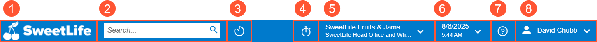
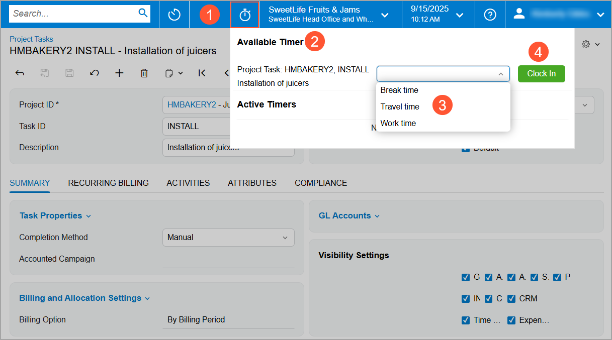
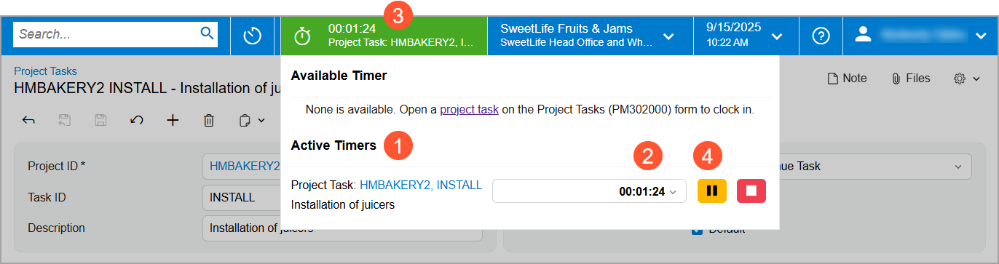
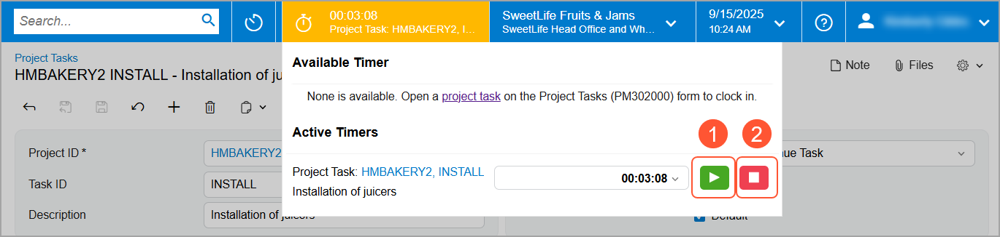
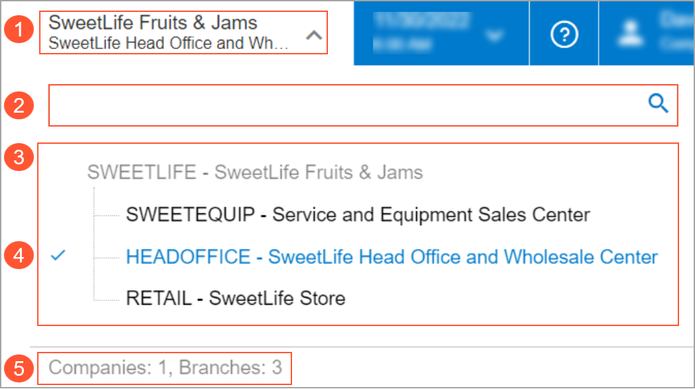
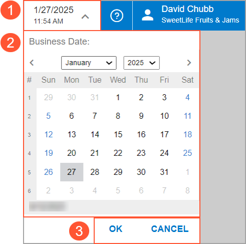
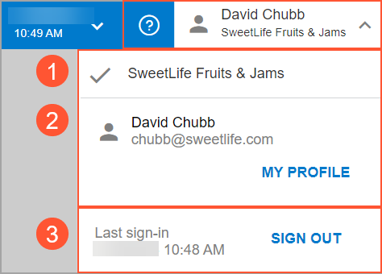

# The Acumatica ERP UI: Top Pane {#_f63c8aa6-443d-44f0-bf86-dc4d6a41f03c .concept}

You use the UI elements on the top pane of the Acumatica ERP screen \(shown below\) to:

-   Change some session or user settings
-   Search for information,
-   Quickly go to the home page and recently viewed forms, reports, and dashboards
-   Use the project task timer

1.  Home button
2.  Search box
3.  Recently Viewed button
4.  Timer
5.  Company and Branch Selection menu button
6.  Business Date menu button
7.  **Open Help** button
8.  User menu button

The following sections describe these UI elements.

## Home Button { .section}

You can find the Home button in the upper-left corner of the Acumatica ERP top pane; you’ll see your company’s logo on it. Click it to go to your Acumatica ERP home page.

The default home page for all users is specified by a system administrator on the [Site Preferences](SM_20_05_05.md) \(SM200505\) form. You can specify a personal home page on the [User Profile](SM_20_30_10.md) \(SM203010\) form. For details, see [Your Working Environment: Process Activity](GS_Managing_User_Profile_Process_Activity.md).

## Search Box { .section}

You can find the Search box in the top pane, to the right of the Home button. To quickly find information within the system, enter keywords or phrases. For details, see [Search Capabilities: General Information](GS_Searching_in_Acumatica_ERP_GeneralInfo.md).

## Recently Viewed Button {#_5ac9ff62-bf19-43aa-acd3-852ac0f22cad .section}

You click the Recently Viewed button, which is to the right of the Search box, to open the **Recently Viewed** workspace over the working area. This workspace shows your most recently created and opened records from data entry and maintenance forms, along with key details, such as reference numbers or identifiers. The system updates this data when you open this workspace. For details about the **Recently Viewed** workspace, see [The Acumatica ERP UI: Workspaces](GS_Learning_UI_Workspaces.md).

## Timer Button { .section}

You can see the Timer button in the top pane; you may also see the timer area. The button is available in the Modern UI if:

-   The *Clock In and Clock Out* feature in the *Experimental* group of features is enabled on the [Enable/Disable Features](CS_10_00_00.md) \(CS100000\) form.
-   On the [Users](SM_20_10_10.md) \(SM201010\) form, your user account is linked to an employee record.

You click the Timer button on the [Project Tasks](PM_30_20_00.md) \(PM302000\) form to track the time spent on the project task selected on the form. \(You can click this button to start a timer on only this form, but the button appears on the top pane of all forms.\) The timer panel opens with the current project task selected in the **Available Timers** section \(see below\).

1.  Timer button: The button to expand the timer panel.
2.  **Available Timers** section: The section shows the current project task for which the timer has not been started yet.
3.  Type of time: The available types of time are defined on the [Time Log Types](EP_20_90_00.md) \(EP209000\) form. If the default type of time has been specified on the [Time and Expenses Preferences](EP_10_10_00.md) \(EP101000\) form, you can change it in the timer at any time.
4.  **Clock In** button: The button you click to start tracking time for the project task.

Once you’re clocked in, this timer becomes active, that is, it moves to the **Active Timers** section of the timer panel \(Item 1 below\), and starts counting the working time \(Item 2\).

**Tip:** The timer continues running if you:

-   Sign out from the system
-   Lose the internet connection

In the top pane, you’ll see the timer area \(Item 3\), which shows the Timer button, the timer, and the project task’s name in the timer area. The timer area is shaded in green while the timer is running.

You can collapse the panel by clicking anywhere outside of it. The top pane will still show the timer area \(with the basic information\). You can click the timer icon to expand the panel. Although you can start a timer only on the [Project Tasks](PM_30_20_00.md) form, you’ll see the timer area on any form, and you can open the collapsed time panel to pause the timer or clock out.

To temporarily stop the timer for a project task, click Pause \(Item 4 above\) in the timer panel. The timer stops, and the timer area is shaded in yellow to indicate that time tracking is paused. When you're ready to continue, click Resume \(Item 1 below\) in the timer panel.

You can start a timer for another project task while still working on the current one. In this case, the system pauses the current task and starts tracking time for the new one. You can switch between multiple timers and track time for various tasks. For details, see [Project Tasks: Tracking Time with the Timer](Project_Tasks_Tracking_Time_with_Timer.md).

You can have multiple timers in the **Active Timers** section at once. When you click Clock Out \(Item 2 above\), the system removes the timer from the timer panel.

## Company and Branch Selection Menu Button { .section}

On the right side of the top pane of the Acumatica ERP screen, you can find the Company and Branch Selection menu button It shows the name of the company or company–branch combination \(for a company with branches\) you’re signed in to. Click the button to view the Company and Branch Selection menu \(shown below\).

1.  The current company or company–branch combination \(if the company has branches\).
2.  The Search box. You use the box to find a company or branch by its name or identifier.
3.  The hierarchical list of companies or branches \(or both\). It shows the ID and name of each company or branch, listed alphabetically by their IDs. The list shows a company or branch only if it’s active and your user account has access to it.
4.  The current branch, indicated by a check mark. This branch is inserted by default into any records you create while you’re signed in.

    **Tip:** If you’re signed in to a company with no branches, you’ll see the check mark before the current company. The system inserts this branch by default into any records you create.

5.  The total numbers of active companies and branches that you have access to.

## Business Date Menu Button { .section}

The Business Date menu button, also in the top pane, shows the current business date and time \(in the time zone defined for your user account\). Clicking the button causes the system to open a calendar so that a new date can be selected. The elements of the Business Date menu are shown below.

1.  Business Date menu button
2.  Calendar
3.  Action buttons

The business date is automatically inserted in the records, such as sales orders and invoices, that you create.

You can select a different business date in the calendar of the Business Date menu if the *Secure Business Date* feature is disabled on the [Enable/Disable Features](CS_10_00_00.md) \(CS100000\) form. Otherwise, only users who have been assigned the *BusinessDateOverride* role can change the business date.

## Open Help Button { .section}

The **Open Help** button is located in the top pane, to the right of the Business Date menu button. You can click **Open Help** to open the Help menu, which provides links to Help topics that are relevant to the content you’re viewing in the working area. For details about using the built-in Help system, see [The Acumatica ERP UI: The Help System](GS_Learning_UI_Help.md).

## User Menu Button { .section}

The User menu button is located in the upper-right corner of the top pane. You click the button to view the User menu. Below you can see the elements of the User menu.

1.  Tenants section. In this section, you can view the tenant you’re signed in to, indicated by a check mark.
2.  My Profile section. This section shows your username and your email address. You click **My Profile** to view the [User Profile](SM_20_30_10.md) \(SM203010\) form, where you can change the settings of your user account.
3.  Sign-In section. In this section, you can view the date and time of your last sign-in, and click **Sign Out** if you’re ready to sign out of the system.

**Parent topic:**[Learning About the Acumatica ERP UI](../UserGuide/GS_Learning_UI_Mapref.md)

