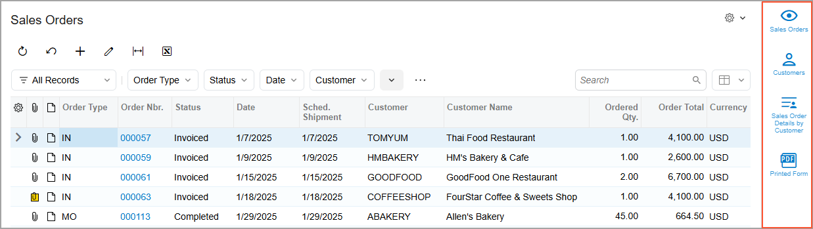
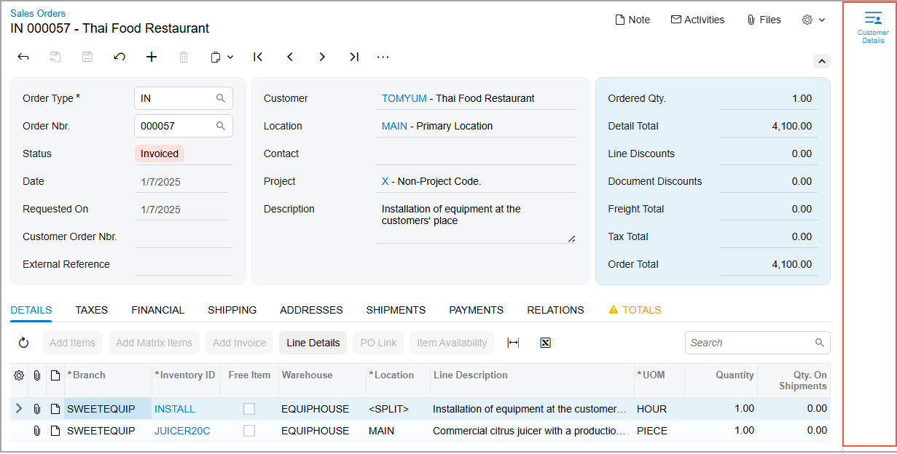

# The Acumatica ERP UI: Working Area {#_513badce-5b57-4d9c-ae6e-f4177c525ead .concept}

In the following sections, you’ll find information about the working area in Acumatica ERP and its parts.

## Working Area { .section}

The working area is the main area of the Acumatica ERP screen. Depending on what you’re doing in the system, the working area may display any of the following:

-   A form: Acumatica ERP has forms of multiple types. For details, see [Record Entry: Basics of Acumatica ERP Forms](GS_Working_with_Data_Entry_Form_Types_and_Parts_of_Form.md) and [Forms](../InterfaceGuide/Forms.md).
-   A report: A report is a type of a form with data organized in a ready-to-print format. For details, see [Record Entry: Basics of Acumatica ERP Forms](GS_Working_with_Data_Entry_Form_Types_and_Parts_of_Form.md) and [Reports](../InterfaceGuide/Report_Processing_Options.md).
-   A dashboard: A dashboard is a collection of widgets, displayed on a single page, that provide at-a-glance information on your business-specific processes. For details, see [Designing Dashboard Contents](RPT_Designing_Dashboard_Contents_Mapref.md).
-   A Help topic. For details, see [The Acumatica ERP UI: The Help System](GS_Learning_UI_Help.md)

## Side Panel { .section}

A side panel is a panel on the right side of the form that you can use to see details about any record you select from a list of records. Some data entry forms also provide a side panel that you can use to view additional information about the selected record.

A side panel may have only one tab with a form related to the selected record, or it may have multiple tabs, each showing a different type of information related to the record. You can view a tab in the side panel by clicking its icon. The set of icons on the side panel of a list of records can be different from the set of icons shown on the data entry form \(see the screenshots below\). Thus, you can view additional information related to a record at various points in your work with the record.

You can close the tab by clicking  in the upper-right corner of the side panel. For details about side panels, see [Side Panels on Forms](../InterfaceGuide/UIG__con_New_UI_Side_Panels.md).

**Parent topic:**[Learning About the Acumatica ERP UI](../UserGuide/GS_Learning_UI_Mapref.md)

