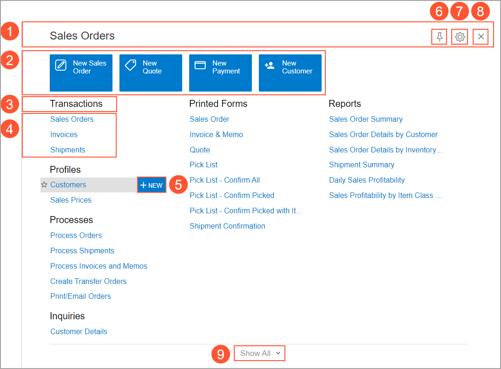
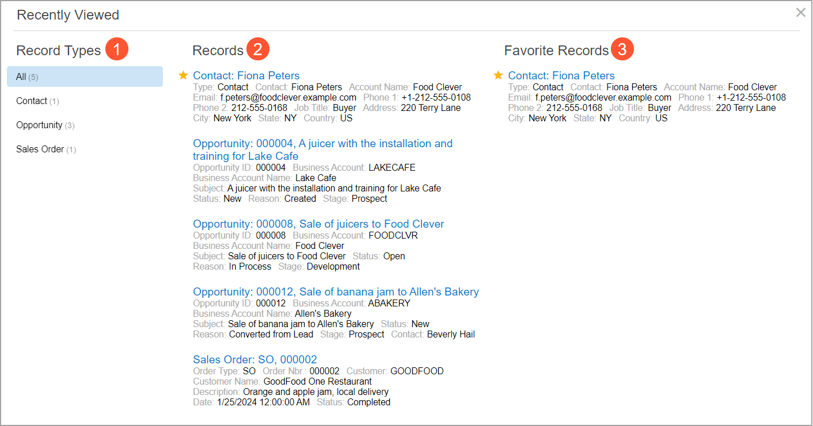

# The Acumatica ERP UI: Workspaces {#_9358371a-ae87-4527-9ebc-b782cac533d3 .concept}

In the following sections, you’ll find information about the workspaces in Acumatica ERP and the ways you use them in your routine work.

## Workspaces {#_17ccf92a-4beb-4062-874a-3ae049ecc1e8 .section}

In Acumatica ERP, a workspace is a menu that displays links to the forms, reports, and dashboards of the functional area. The basic elements of a workspace are shown below.

1.  The workspace title bar. This title bar has the title of the workspace and buttons you can use to perform various workspace-specific actions.
2.  Tiles. A tile is a shortcut in a workspace that you click to open a form, report, or other workspace item—possibly with settings filled in, depending on how the workspace was configured. Predefined workspaces contain tiles with the most commonly used workspace items for the functional area.
3.  A category. In each workspace, items are grouped into categories to make items easier to find. In the **Sales Orders** workspace, shown above, you can see these categories: **Transactions**, **Profiles**, **Processes**, **Inquiries**, **Printed Forms**, and **Reports**. For example, the **Transactions** category displays links to forms that you can use to create and work with individual transactions. Depending on the workspace, the set of categories may vary. The system provides a number of predefined categories. A category is displayed in a workspace if at least one link to a menu item has been added to the category in this workspace.
4.  Links to workspace items, such as forms, reports, dashboards, generic inquiries, or pivot tables. You can click any link to open the item.
5.  The **New** button, which is shown when you point at the name of a data entry form. You can click this button to create a new record on the form. If you click the link to the form instead, the system opens the list of records created on the form.
6.  The **Unpin from Main Menu Panel** button, which you can click to remove the workspace from the main menu. If the workspace is not displayed on the main menu, you’ll instead see the **Pin to Main Menu Panel** button. Click this button to add the workspace to the main menu.
7.  The **Configure Quick Menu** button. Click this button to open the workspace in configuration mode and select the links to workspace items to be displayed in the quick view of the workspace \(described in the next section\). If no links to workspace items are selected, the system shows all these links in the workspace.
8.  The **Close Workspace** button, which you can click to close the workspace.
9.  The **Show All** button, which is on the workspace footer. If the workspace is displayed in the full view, the **Show Less** button is displayed instead. You use these buttons to toggle between the workspace views.

## Views of the Workspace { .section}

A workspace in Acumatica ERP \(except for **Recently Viewed**\) can be displayed in one of these views:

-   Full view \(the **Show Less** button is displayed in the workspace footer\)
-   Quick view \(the **Show All** button is displayed in the workspace footer\)

The full view of the workspace contains all the tiles and links to menu items defined for the workspace, with the links grouped by categories.

The quick view of the workspace contains the most commonly used tiles of the workspace, as well as the links to menu items, which are grouped by categories.

## Recently Viewed Workspace {#_5ac9ff62-bf19-43aa-acd3-852ac0f22cad .section}

The **Recently Viewed** workspace is a menu that displays the most recently used records that you’ve created or opened on data entry or maintenance forms, as well as key information about these records, including their reference numbers or identifiers.

**Tip:** In Acumatica ERP, each record of a particular type is identified by a string of numbers only or numbers and letters—that is, a reference number or ID—that is unique to the record type.

Below you can see the elements of the **Recently Viewed** workspace.

1.  **Record Types**. You can use this list to filter records by their type. By default, the system displays all records \(**All**\). If needed, you can select another record type to view records of only the selected type in the **Records** or **Favorite Records** lists. Record types are predefined, and the system adds the appropriate record types to the **Recently Viewed** workspace automatically each time you open the workspace.
2.  **Records**. This list displays the last 500 records you’ve interacted with. If you’ve selected a record type other than **All**, the system filters the records and displays only records of the selected record type.
3.  **Favorite Records**. This list displays the records you’ve marked as favorites so you can open them quickly, regardless of when you last opened them. For details, see [The Acumatica ERP UI: Favorites](GS_Learning_UI_Favorites.md).

You can use the standard Search functionality to search among the recently viewed records. When the **Recently Viewed** workspace is open, the system runs the search only among the last 500 records you’ve interacted with. If this workspace is closed, then the system runs the system-wide search and displays all records that correspond to your search request. For details, see [Search Capabilities: General Information](GS_Searching_in_Acumatica_ERP_GeneralInfo.md).

**Parent topic:**[Learning About the Acumatica ERP UI](../UserGuide/GS_Learning_UI_Mapref.md)

