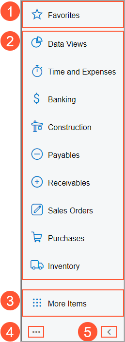

# The Acumatica ERP UI: Main Menu {#_a4784488-3d84-49c8-b9b9-58b64059f83f .concept}

The main menu, located on the left side of the Acumatica ERP screen, contains UI elements that help you easily go to workspaces and favorite forms, reports, and dashboard. You can also change the view of main menu and edit its items.

The main menu is initially shown in the expanded view. You can collapse it so that the names of the menu items are displayed in the compact view. You can also minimize the main menu so that it is displayed as the **Menu** button in the upper-left corner of the top pane instead of the Home button. Below you can see the elements of the main menu in the expanded view.

1.  The **Favorites** menu item
2.  The list of menu items that represent workspaces
3.  The **More Items** menu item
4.  The **Open Configuration Menu** button
5.  The **Collapse Main Menu Panel** \(or **Expand Main Menu Panel**\) button

## Favorites { .section}

The **Favorites** workspace provides links to the forms, reports, and dashboards you use most frequently. You open it by clicking the **Favorites** menu item.

You can add an item to the workspace by clicking the star icon next to its link in a workspace or next to the title of an open item. Favorites are personal and only visible to you. Items marked as favorites display a yellow star icon; you can remove them from favorites by clicking the star again. By default, this workspace is empty. For details, see [The Acumatica ERP UI: Favorites](GS_Learning_UI_Favorites.md).

## Workspace Menu Items { .section}

The main menu contains menu items that represent workspaces. When you click a menu item, the corresponding workspace opens over the working area.

In the workspace, you can see the links to the forms, reports, and dashboards for a particular functional area in Acumatica ERP.

For details, see [The Acumatica ERP UI: Workspaces](GS_Learning_UI_Workspaces.md).

## More Items { .section}

The main menu displays the workspaces \(except for **Recently Viewed**\) that are used most commonly by Acumatica ERP users. By clicking the **More Items** menu item, you can open workspaces that are used less frequently but are important to some users. If you don’t see a menu item corresponding to the functional area you want to use, click this menu item. This opens a menu in the working area with tiles for each workspace in the system. These workspaces are grouped by broader functional areas.

## Open Configuration Menu Button { .section}

You click this button to view a menu with additional commands that you can use to change the location of the main menu. \(If you’re signed in to an account with the *Administrator* role assigned, you can also click commands to edit the menu items for the whole system.

## Main Menu Toggle Button { .section}

In the out-of-the-box company, the main menu is shown in the expanded view, and you can see the **Collapse Main Menu Panel** button. By clicking this button, you can collapse the main menu to display the compact view of the icons and workspace names. In the collapsed main menu, the button name changes to **Expand Main Menu Panel**. By clicking this button, you can display the expanded view of the main menu.

**Parent topic:**[Learning About the Acumatica ERP UI](../UserGuide/GS_Learning_UI_Mapref.md)

