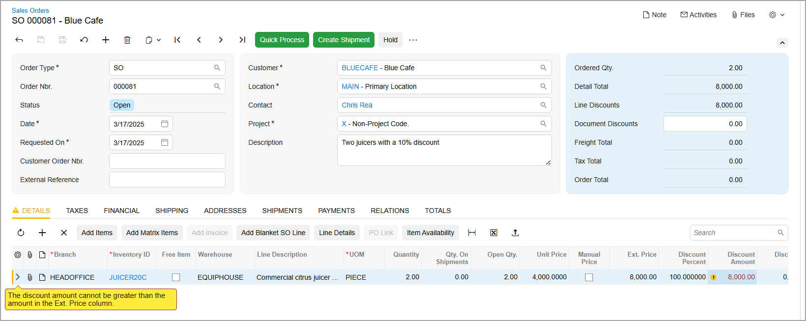

# Record Entry: To Create a New Record by Using a Lookup Table {#_845f8960-b4a7-4b45-90c5-4b135cfc59f5 .task}

The following activity will walk you through the process of creating a new contact by using a lookup table.

**Attention:** This activity is performed in the Modern UI based on the *U100* dataset. If you’re using the Classic UI, some features may not be available, which could affect processing. If you are using another dataset or if any system settings have been changed in *U100*, these changes can affect the workflow of the activity and the results of the processing. To avoid issues, restore the *U100* dataset to its initial state.

## Story { .section}

Suppose that you are David Chubb, a sales manager at the SweetLife Fruits &amp; Jams company. You’ve received a phone call from your customer, Blue Cafe. Chris Rea, the manager at Blue Cafe, said that two out of six juicers they purchased some time ago have broken. Instead of repairing the juicers, they plan to buy two new ones. You’ve agreed to offer a 10% discount on new juicers. Chris also mentioned that Blue Cafe’s new technology manager, Alex Carter, will be the primary contact for this process.

Acting as David Chubb, you need to create a case, add a contact record for Alex Carter, and create a new sales order for two juicers with the discount.

## Configuration Overview {#section_tz4_djx_cnb .section}

In the *U100* dataset, for the purposes of this activity, the following tasks have been performed:

-   On the [Enable/Disable Features](CS_10_00_00.md) \(CS100000\) form, the following features have been enabled:
    -   *Customer Management*: This feature provides the customer relationship management \(CRM\) functionality.
    -   *Case Management* in the *Customer Management* group of features: This feature gives customer support personnel the ability to create support cases, assign cases to owners, and process cases.
-   On the [Case Classes](CR_20_60_00.md) \(CR206000\) form, the *SUPPORT* case class, which defines cases related to issues with juicers, has been created.
-   On the [Business Accounts](CR_30_30_00.md) \(CR303000\) form, the *BLUECAFE* business account has been created in the system and extended to be a customer.

## Process Overview { .section}

In this activity, you’ll create a case on the [Cases](CR_30_60_00.md) \(CR306000\) form and create a new contact by using the **Contact** lookup table in the Summary area of the [Cases](CR_30_60_00.md) form. Then you’ll create a new sales order on the [Sales Orders](SO_30_10_00.md) \(SO301000\) form. You will mistakenly apply a discount of 110% and review the warning message about it.

## System Preparation { .section}

Before you begin performing the steps of this activity, do the following:

1.  Launch the Acumatica ERP website with the *U100* dataset preloaded and the Modern UI turned on.
2.  Sign in to the system as David Chubb by using the following credentials:
    -   **Username**: *chubb*
    -   **Password**: *123*
3.  Make sure that on the Company and Branch Selection menu, in the top pane of the Acumatica ERP screen, the *SweetLife Head Office and Wholesale Center* branch is selected.

## Step 1: Creating a Case { .section}

To create a case for the request submitted by Chris Rea from Blue Cafe, do the following:

1.  On the [Cases](CR_30_60_00.md) \(CR306000\) form, add a new record.
2.  In the Summary area, do the following:
    1.  In the **Case Class** box, select *SUPPORT*.
    2.  In the **Business Account** box, select *BLUECAFE*.
    3.  In the **Contact** box, notice that *Chris Rea* is automatically selected. Chris is defined as the primary contact of Blue Cafe.

        You will create a new contact for this customer on the next step.

    4.  In the **Subject** box, type `Return of two juicers`.
    5.  In the **Severity** box, select *Medium*.
    6.  In the **Priority** box, select *Medium*.
3.  On the **Details** tab, in the text area, type `Need to pick up two juicers from Blue Cafe`.
4.  On the form toolbar, click **Save**.

## Step 2: Creating a Contact from the Case { .section}

To create a new contact from the case, do the following:

1.  While you are still on the [Cases](CR_30_60_00.md) \(CR306000\) form viewing the case created in Step 1, click the magnifier button in the **Contact** box.
2.  In the **Select Contact** lookup table, which opens, click the Plus button on the table toolbar to create a new contact.

    The system opens the [Contacts](CR_30_20_00.md) \(CR302000\) form in a pop-up window.

3.  On the **General** tab, do the following:
    1.  In the **First Name** box, type `Alex`
    2.  In the **Last Name** box, type `Carter`
    3.  Notice that in the **Account Name** box, the system selects *Blue Cafe*; this value is read-only.
    4.  In the **Job Title** box, type `Technical manager`.
    5.  In the **Email** box, type `a.carter@bluecafe.com`
4.  On the form toolbar, click **Save**.
5.  Close the pop-up window.
6.  In the **Contact** box of the [Cases](CR_30_60_00.md) form, click the magnifier button.
7.  In the **Select Contact** dialog box, select *Alex Carter*.
8.  On the form toolbar, click **Save**.

You have created a new contact for the customer on the fly while working on the case. You can add more information to the new contact by clicking the *Alex Carter* link in the **Contact** box. The system will open the [Contacts](CR_30_20_00.md) form in a pop-up window.

## Step 3: Creating a Sales Order with a Discount Exceeding the Purchase Cost { .section}

To create a sales order and apply a discount that exceeds the total cost of the purchase \(to review the warning\), do the following:

1.  On the [Sales Orders](SO_30_10_00.md) \(SO301000\) form, add a new record.
2.  In the Summary area, do the following:
    1.  In the **Customer** box, select *BLUECAFE*
    2.  In the **Contact** box, select *Alex Carter*
    3.  In the **Description** box, type `Two juicers with a 10% discount`
3.  On the **Details** tab, add a row and specify the following settings:

    1.  In the **Inventory ID** column, select *JUICER20C*
    2.  In the **Warehouse** column, select *EQUIPHOUSE*
    3.  In the **Quantity** column, type `2`
    4.  In the **Discount Amount** column, enter `10000`

        Suppose that you did this by mistake instead of entering *10* in the **Discount Percent** column.

    5.  On the form toolbar, click **Save**.
    The system indicates a row with an issue by displaying a vertical yellow bar at the beginning of the row. Also, warning icons are shown next to the **Discount Amount** column and the name of the **Details** tab. The color of the tab has also changed to yellow. If you hover over any of the warning icons, a warning message will appear \(see below\).

    

    **Tip:** If an error occurs, the error icons and the vertical bar at the beginning of the row will be red.

4.  In the **Discount Percent** column, type `10`.
5.  On the form toolbar, click **Save**.

The warning icons disappear.

**Parent topic:**[Entering Records into the System](../UserGuide/GS_Working_With_Data_Entry_Forms_Mapref.md)

