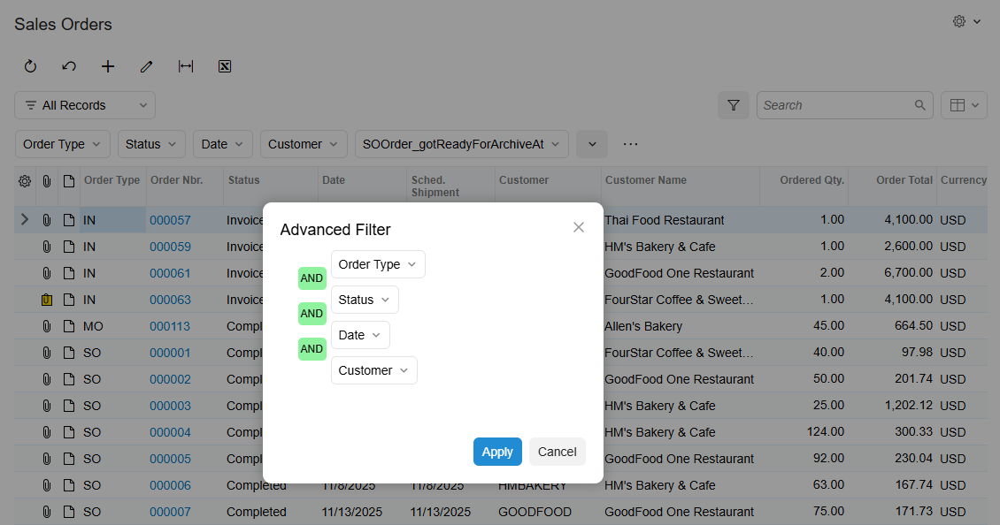
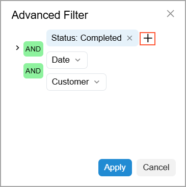
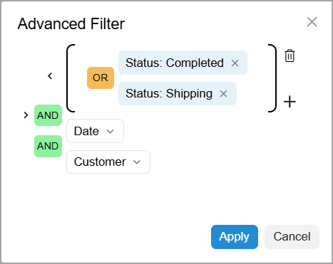
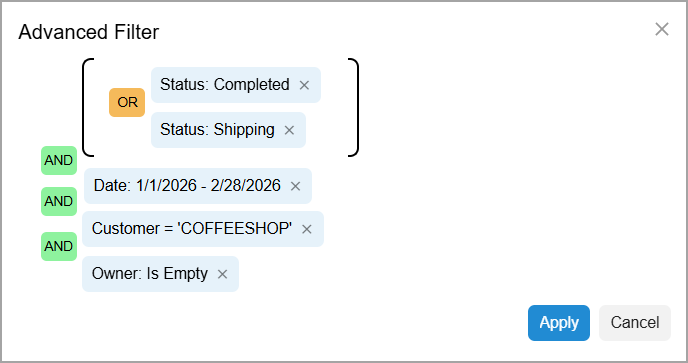
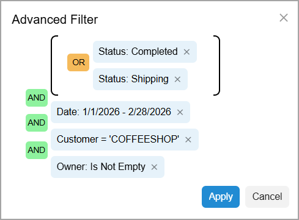

# Filtering and Sorting Capabilities: To Create an Advanced Filter {#_ea9093dd-276c-4833-bd20-bbad6689984c .task}

This activity will walk you through the process of creating an advanced filter for a list of records.

**Attention:** This activity is performed in the Modern UI based on the *U100* dataset. If you’re using the Classic UI, some features may not be available, which could affect processing. If you are using another dataset or if any system settings have been changed in *U100*, these changes can affect the workflow of the activity and the results of the processing. To avoid issues, restore the *U100* dataset to its initial state.

## Story { .section}

Suppose that you are David Chubb, a sales manager at the SweetLife Fruits &amp; Jams company. The FourStar Coffee &amp; Sweets Shop customer has reported a problem with delivery delays for orders placed in January and February of 2026. To understand the root cause, you need to analyze whether the issue is related to the lack of assigned managers for some of the sales orders.

Acting as David Chubb, you’ll create two advanced filters to compare the number of sales orders with the *Completed* and *Shipping* statuses that have an assigned owner and the number of orders with these statuses that do not have an owner.

## Configuration Overview {#section_tz4_djx_cnb .section}

In the *U100* dataset, for the purposes of this activity, the following tasks have been performed:

-   On the [Business Accounts](CR_30_30_00.md) \(CR303000\) form, the *COFFEESHOP* business account has been created in the system and extended to be a customer.
-   On the [Sales Orders](SO_30_10_00.md) \(SO301000\) form, multiple sales orders for the *COFFEESHOP* customer have been created.

## Process Overview { .section}

In this activity, you’ll create two advanced filters on the Sales Orders \(SO3010PL\) list of records in different ways and save them. You’ll also switch between them by using the Filter List menu.

## System Preparation { .section}

Before you begin performing the steps of this activity, do the following:

1.  Launch the Acumatica ERP website with the *U100* dataset preloaded and the Modern UI turned on.
2.  Sign in to the system as David Chubb by using the following credentials:
    -   **Username**: *chubb*
    -   **Password**: *123*

## Step 1: Creating the First Advanced Filter { .section}

To create an advanced filter for FourStar Coffee &amp; Sweets Shop sales orders without owners, do the following:

1.  On the Sales Orders \(SO3010PL\) list of records, click the Filter Settings button to open the filtering area.
2.  Click the More \(\) button in the filtering area and then click **Open Advanced Filter**. The **Advanced Filter** dialog box opens, as shown below.

    

3.  In the editor, click the **Order Type** filter criterion and at the top of the Quick Filter menu, which opens, click **Remove Filter**. You don’t need this filter criterion for your advanced filter.
4.  Click the **Status** filter criterion.
5.  In the Quick Filter menu, clear the **Select All** check box and then select the **Completed** check box.
6.  Click **Apply**.
7.  To the right of the **Status: Completed** filter criterion, click the Plus icon to add one more filter criterion next to **Status** \(see below\).

    

8.  In the **Add Quick Filter** dialog box, which opens, select *Status*.

    The additional **Status** filter criterion is added under the first one.

9.  Click the **Status** filter criterion.
10. In the Quick Filter menu, clear the **Select All** check box and then select the **Shipping** check box.
11. Click **Apply**.
12. Click the **AND** logical operator between the first and second **Status** filter conditions. It changes to **OR**.
13. Hover over the **OR** logical operator and click the  icon. The system groups the **Status** filter criteria to define the order of logical operations, as shown below.

    

14. Click the **Date** filter criterion.
15. In the Quick Filter menu, select the **Is Between** condition.
16. In the **From** box at the bottom of the dialog box, enter `01/01/2026`.
17. In the **To** box, enter `02/28/2026`.
18. Click **Apply**.
19. Click the **Customer** filter criterion.
20. In the Quick Filter menu, select *Equals*.
21. In the untitled box at the bottom of the dialog box, type `COFFEESHOP`.

    **Tip:** You can instead select this customer from the list of customers by using the magnifier button.

22. Click **Apply**.
23. To the right of the **Customer** filter criterion, click the Plus icon to add one more filter criterion.
24. In the **Add Quick Filter** dialog box, which opens, select *Owner*.
25. Click the **Owner** filter criterion.
26. In the Quick Filter menu, select *Is Empty*.
27. Click **Apply**.

    You have specified all the filter criteria for the advanced filter \(see below\).

    

28. Click **Apply**. The system applies the filter to the list of records.
29. Click the **Save Filter** button, which is next to the created advanced filter button in the filtering area.
30. In the **Save Filter As** dialog box, which opens, specify the name of the filter: `CoffeeShop SO without owners`.
31. Click **Save**.

    The dialog box closes. The system adds the saved advanced filter to the Filter List menu.

32. In the upper-left corner of the table toolbar, click the Settings button \(\). The Column Configuration dialog box opens.
33. Select the check box for the **Owner** column \(which is hidden by default\).
34. Click **OK**.

    The **Owner** column has been added to the table. Now you can review the filter results in the **Owner** column as configured in the advanced filter.

## Step 2: Creating the Second Advanced Filter { .section}

You will create a second advanced filter for FourStar Coffee &amp; Sweets Shop sales orders that have assigned owners by copying the first advanced filter. While you are still on the Sales Orders \(SO3010PL\) list of records with the *CoffeeShop SO without owners* advanced filter applied, do the following:

1.  Click the More button in the filtering area and then click **Save As**.
2.  In the **Save Filter As** dialog box, which opens, specify the name of the filter: `CoffeeShop SO with owners`.
3.  Click **Save**.

    The dialog box closes. The system adds the saved advanced filter to the Filter List menu.

4.  In the Filter List menu, click the *CoffeeShop SO with owners* filter.
5.  Click the More button in the filtering area and then click **Open Advanced Filter**.
6.  In the **Advanced Filter** dialog box, which opens, click the **Owner: Is Empty** filter criterion.
7.  In the Quick Filter menu, select *Is Not Empty*.
8.  Click **Apply**.

    You have corrected the copied advanced filter, as shown below.

    

9.  Click **Apply**. The system filters the list of records according to the new filter conditions.
10. Click the **Save Filter** button.

You have created two advanced filters and can now switch between them by using the Filter List menu.

**Parent topic:**[Filtering and Sorting in Acumatica ERP](../UserGuide/GS_Filtering_and_Sorting_Mapref.md)

