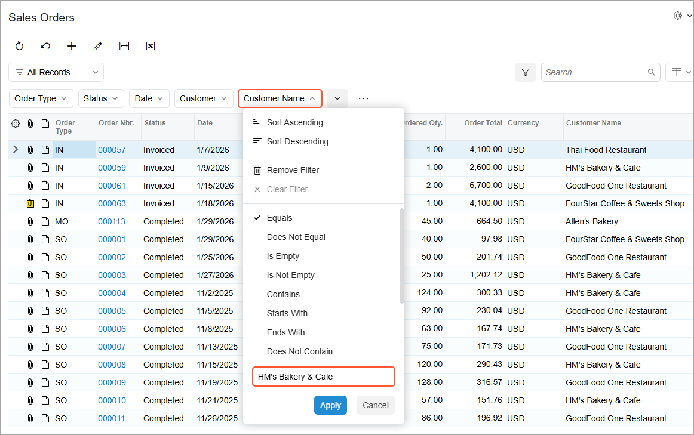
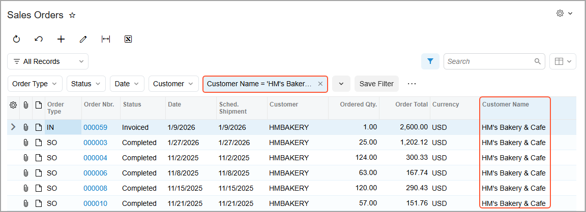
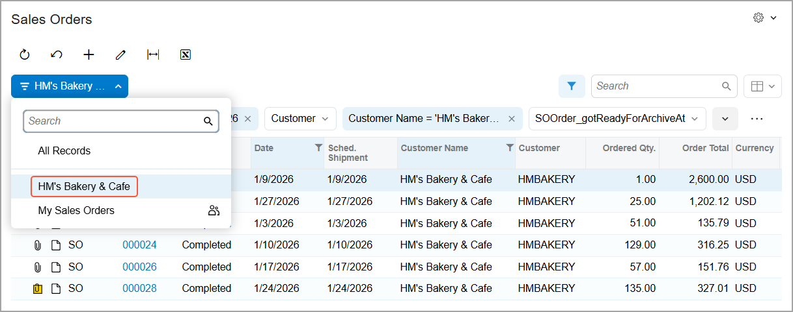
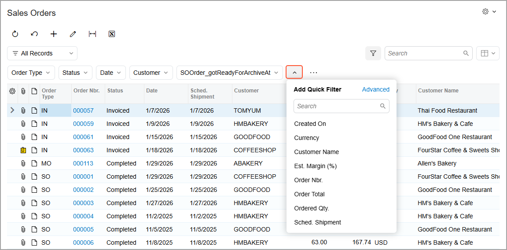
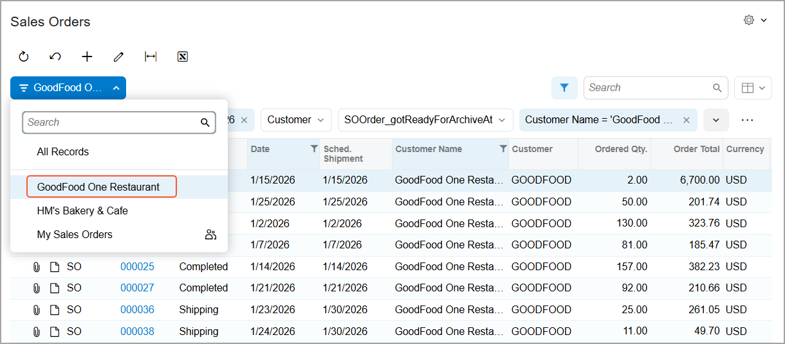
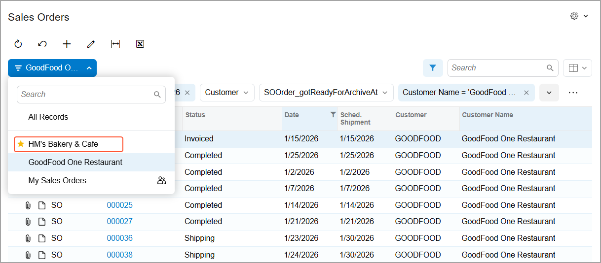

# Filtering and Sorting Capabilities: To Create and Manage Quick Filters {#_7095069c-51a1-4ca5-8a46-205f9f525546 .task}

This activity will walk you through the process of creating, applying, saving, and deleting quick filters to make the retrieving of data more convenient for your business purposes.

**Attention:** This activity is performed in the Modern UI based on the *U100* dataset. If you’re using the Classic UI, some features may not be available, which could affect processing. If you are using another dataset or if any system settings have been changed in *U100*, these changes can affect the workflow of the activity and the results of the processing. To avoid issues, restore the *U100* dataset to its initial state.

## Story { .section}

Suppose that you are David Chubb, a sales manager at the SweetLife Fruits &amp; Jams company. You have recently been promoted and started working with the company's most important customers, including HM's Bakery &amp; Cafe and GoodFood One Restaurant. To get detailed information about the products ordered by these customers, you need to find and analyze all the sales orders created for each customer after *01/01/2026*. You also want the list of sales orders for each customer to be displayed separately so that you can quickly switch between the lists.

Acting as David Chubb, you’ll create a quick filter for each customer, manage the filters, and then delete one of them.

## Configuration Overview {#section_tz4_djx_cnb .section}

In the *U100* dataset, for the purposes of this activity, the following tasks have been performed:

-   On the [Business Accounts](CR_30_30_00.md) \(CR303000\) form, the *GOODFOOD* and *HMBAKERY* business accounts have been created in the system and extended to be customers.
-   On the [Sales Orders](SO_30_10_00.md) \(SO301000\) form, multiple sales orders have been created for the *GOODFOOD* and *HMBAKERY* customers.

## Process Overview { .section}

In this activity, you’ll create two quick filters on the Sales Orders \(SO3010PL\) list of records in different ways and save the filters. Then you’ll mark one of the quick filters as a favorite to move it to the top of the filter list. Finally, you’ll delete a filter that you no longer need.

## System Preparation { .section}

Before you begin performing the steps of this activity, do the following:

1.  Launch the Acumatica ERP website with the *U100* dataset preloaded and the Modern UI turned on.
2.  Sign in to the system as David Chubb by using the following credentials:
    -   **Username**: *chubb*
    -   **Password**: *123*

## Step 1: Creating the First Quick Filter { .section}

To create a quick filter for sales orders of HM's Bakery &amp; Cafe, do the following:

1.  On the Sales Orders \(SO3010PL\) list of records, click the Filter Settings button to open the filtering area.
2.  Drag the **Customer Name** column header to the filtering area.
3.  Click the **Customer Name** quick filter button in the filtering area. The Quick Filter menu opens.
4.  On the Quick Filter menu, select the **Equals** condition.
5.  In the untitled box at the bottom of the menu, enter the customer name: `HM's Bakery & Cafe` \(see below\).

    

6.  Click **Apply**. The system closes the menu and shows the list of sales orders, which now contains only the sales orders that have been created for HM's Bakery &amp; Cafe.

    In the filtering area, notice the **Customer Name = 'HM's Bakery &amp; Cafe'** quick filter button, as shown below.

    

7.  Click the header of the **Date** column to set the date range for displaying sales orders created after *01/01/2026*.
8.  On the Quick Filter menu, do the following:
    1.  Select the **Is Greater Than** condition.
    2.  In the untitled box, specify *1/1/2026*.
    3.  Click **Apply**.
9.  Click the **Save Filter** button, which is next to the **Customer Name = 'HM's Bakery &amp; Cafe'** quick filter button.
10. In the **Save Filter As** dialog box, which opens, enter the name of the filter: `HM's Bakery & Cafe`.
11. Click **Save**.

    The dialog box closes, and the **Save Filter** button disappears from the filtering area. The system adds the saved quick filter to the Filter List menu \(see below\).

    

## Step 2: Creating the Second Quick Filter { .section}

To create a quick filter for sales orders of GoodFood One Restaurant, do the following while you are still viewing the Sales Orders \(SO3010PL\) list of records:

1.  Click the Filter List button and select *All Records* in the menu.
2.  In the filtering area, click the **Add Quick Filter** button, as shown below.

    

3.  In the **Add Quick Filter** dialog box, which opens \(as shown above\), select *Customer Name*.
4.  Click the **Customer Name** quick filter button, which appears in the filtering area. The Quick Filter menu opens.
5.  On the Quick Filter menu, select the **Equals** condition.
6.  In the untitled box at the bottom of the menu, enter the customer name: `GoodFood One Restaurant`.
7.  Click **Apply**. The system closes the menu and shows the list of only sales orders that have been created for GoodFood One Restaurant.

    In the filtering area, you can see the **Customer Name = 'GoodFood One Restaurant'** quick filter button.

8.  Click the header of the **Date** column to set the date range for displaying sales orders created after *01/01/2026*.
9.  On the Quick Filter menu, do the following:
    1.  Select the **Is Greater Than** condition.
    2.  In the untitled box, specify *1/1/2026*.
    3.  Click **Apply**.
10. Click the More \(\) button in the filtering area and then click **Save As**.
11. In the **Save Filter As** dialog box, which opens, specify the name of the filter: `GoodFood One Restaurant`.
12. Click **Save**.

    The dialog box closes. The system adds the saved quick filter to the Filter List menu \(see below\).

    

## Step 3: Marking a Quick Filter as a Favorite { .section}

Suppose that you have started using the *HM's Bakery &amp; Cafe* quick filter more frequently than the *GoodFood One Restaurant* filter. Also, assume that you have multiple saved filters in the Filter List menu. To make it easier to find the *HM's Bakery &amp; Cafe* filter by moving it at the top of the list, do the following while you are still viewing the Sales Orders \(SO3010PL\) list of records:

1.  Click the Filter List button.
2.  To the left of the *HM's Bakery &amp; Cafe* quick filter, click the star icon.

    The star icon turns yellow, and the system moves the *HM's Bakery &amp; Cafe* quick filter to the top of the filter list \(see below\).

    

## Step 4: Deleting a Quick Filter { .section}

Suppose that GoodFood One Restaurant has closed for renovation and you no longer need the quick filter for their sales orders. To delete this quick filter from the Filter List menu, do the following while you are still viewing the Sales Orders \(SO3010PL\) list of records:

1.  Click the Filter List button and select the *GoodFood One Restaurant* quick filter.

    The system applies the filter to the list of sales orders.

2.  Click the More \(\) button in the filtering area and then click **Delete Filter**.
3.  Click **OK** in the warning dialog box.

    The system deletes the *GoodFood One Restaurant* quick filter from the Filter List menu and shows all records in the list of sales orders.

You have created quick filters, saved them to the Filter List menu, marked one quick filter as a favorite, and finally deleted a quick filter that you no longer need.

**Parent topic:**[Filtering and Sorting in Acumatica ERP](../UserGuide/GS_Filtering_and_Sorting_Mapref.md)

