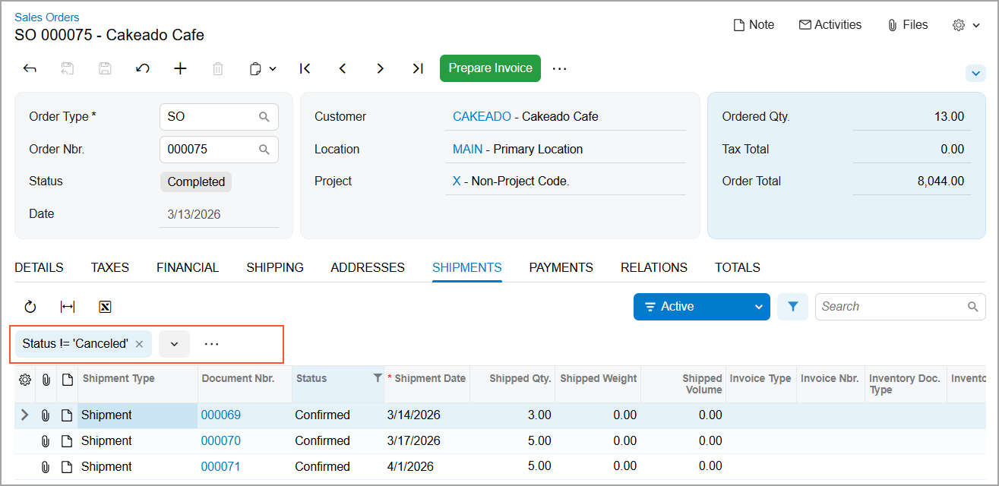
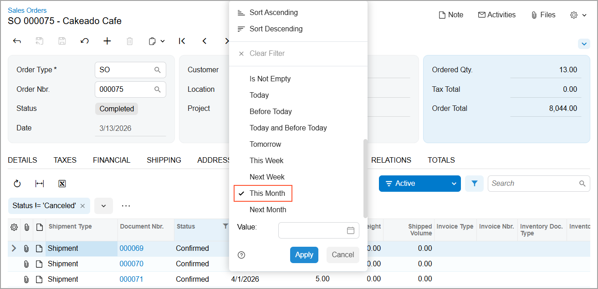
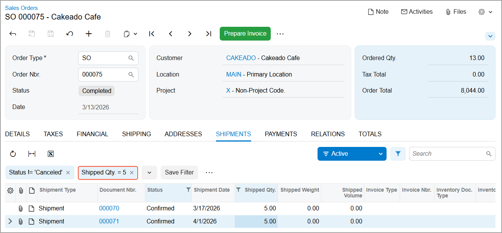

# Filtering and Sorting Capabilities: To Review and Create Quick Filters {#_913f91ce-5485-414d-a95e-5d15af4e5b08 .task}

This activity will walk you through the review of a predefined quick filter for data in a table on a form’s tab. You’ll then create new quick filters for this table.

**Attention:** This activity is performed in the Modern UI based on the *U100* dataset. If you’re using the Classic UI, some features may not be available, which could affect processing. If you are using another dataset or if any system settings have been changed in *U100*, these changes can affect the workflow of the activity and the results of the processing. To avoid issues, restore the *U100* dataset to its initial state.

## Story { .section}

Suppose that you are David Chubb, a sales manager at the SweetLife Fruits &amp; Jams company. Your customer, Cakeado Cafe, has recently placed an order for products that are shipped from different warehouses. You need to check which Cakeado Cafe shipments are scheduled for March to monitor them. Also, you need to review the Cakeado Cafe shipments with a quantity of 5 items.

Acting as David Chubb, you’ll review the predefined quick filter applied to the shipment records in the sales order for Cakeado Cafe and create new quick filters.

## Configuration Overview { .section}

In the *U100* dataset, for the purposes of this activity, the following tasks have been performed:

-   On the [Business Accounts](CR_30_30_00.md) \(CR303000\) form, the *CAKEADO* business account has been created in the system and extended to be a customer.
-   On the [Sales Orders](SO_30_10_00.md) \(SO301000\) form, a sales order has been created for the *CAKEADO* customer with the *000075* order number and the *Purchase of juicers and jams* description.
-   On the [Shipments](SO_30_20_00.md) \(SO302000\) form, the shipments for this sales order have been created and confirmed.

## Process Overview { .section}

In this activity, you’ll review a predefined quick filter and create new quick filters on the **Shipments** tab of the [Sales Orders](SO_30_10_00.md) \(SO301000\) form.

## System Preparation { .section}

Before you begin performing the steps of this activity, do the following:

1.  Launch the Acumatica ERP website with the *U100* dataset preloaded and the Modern UI turned on.
2.  Sign in to the system as David Chubb by using the following credentials:
    -   **Username**: *chubb*
    -   **Password**: *123*
3.  In the info area, in the upper-right corner of the top pane of the Acumatica ERP screen, set the business date in your system to *3/31/2026* by clicking the Business Date menu button and select *3/31/2026* in the calendar. For simplicity, in this process activity, you’ll perform some actions in the system on this business date.

## Step 1: Reviewing the Predefined Quick Filter { .section}

To review the predefined quick filter applied to shipment records in the sales order of Cakeado Cafe described above, do the following:

1.  On the [Sales Orders](SO_30_10_00.md) \(SO301000\) form, open sales order *000075* for the *CAKEADO* customer.
2.  Go to the **Shipments** tab. In the upper-right corner of the table toolbar, notice the **Filter Settings** button. Next to this button, the predefined *Active* filter is displayed. It shows only active shipments \(that is, those whose status is not *Canceled*\), see below.

    

3.  Click the **Filter Settings** button. The filtering area opens, as shown below.

    

4.  Click the **Status != 'Canceled'** quick filter button and review the filter conditions.
5.  Click **Cancel**. The Quick Filter menu closes.

## Step 2: Creating a Quick Filter for Date Values { .section}

To create a quick filter to review shipments in March, do the following while you are still on the **Shipments** tab of the [Sales Orders](SO_30_10_00.md) \(SO301000\) form:

1.  Click the header of the **Shipment Date** column.
2.  On the Quick Filter menu, which opens, click the *This Month* filter condition, as shown below.

    

3.  Click **Apply**. The system applies the filter, and the **Shipment Date: This Month** quick filter button appears in the filtering area.
4.  After reviewing the shipments, click the **Shipment Date: This Month** quick filter button.
5.  On the Quick Filter menu, click **Remove Filter**. The system removes the filter, and the **Shipment Date: This Month** quick filter button disappears from the filtering area.

## Step 3: Creating a Quick Filter for the Shipped Item Quantity { .section}

To create a quick filter to review shipments with a specific item quantity, do the following while you are still viewing the **Shipments** tab of the [Sales Orders](SO_30_10_00.md) \(SO301000\) form:

1.  Click within the cell that contains the quantity *5* in the **Shipped Qty.** column and press Shift+F.

    The system applies the filter, displays the shipment rows with a shipped quantity of *5* items, and adds the **Shipped Qty. = 5** quick filter button to the filtering area, as shown below.

    

2.  Review the shipment rows and click the **Shipped Qty. = 5** quick filter button.
3.  On the Quick Filter menu, click **Remove Filter**. The system removes the filter, and the **Shipped Qty. = 5** quick filter button disappears from the filtering area.

You have reviewed the predefined filter and created two quick filters for rows in the table on the form tab.

**Parent topic:**[Filtering and Sorting in Acumatica ERP](../UserGuide/GS_Filtering_and_Sorting_Mapref.md)

