# Adjustment of the Acumatica ERP UI: To Perform System-Wide Form Configuration {#_296c2551-ab0e-4d46-acd9-e898315225f3 .task}

This activity will walk you through the process of loading a personal configuration of a form layout, making changes to the form’s configuration, and applying these changes system-wide—while preserving individual users' configurations.

**Attention:** This activity is performed in the Modern UI based on the *U100* dataset. If you’re using the Classic UI, some features may not be available, which could affect processing. If you are using another dataset or if any system settings have been changed in *U100*, these changes can affect the workflow of the activity and the results of the processing. To avoid issues, restore the *U100* dataset to its initial state.

## Story { .section}

Suppose that you are Kimberly Gibbs, a system administrator and customizer at the SweetLife Fruits &amp; Jams company. You were asked to make some changes to the configuration of the [Invoices and Memos](AR_30_10_00.md) \(AR301000\) form and apply these changes system-wide.

You have also reviewed the personal configuration that David Chubb, a sales manager at the SweetLife Fruits &amp; Jams company, has made on this form and decided to apply this personal form configuration system-wide. While applying this configuration, however, you need to preserve other users’ personal configurations of the form \(if applicable\).

Acting as Kimberly, you’ll load David Chubb's configuration of the form, make additional changes, and apply the updated layout to all users, while preserving their personal configurations. Then acting as David, you need to review the system-wide changes and confirm that your personal configuration remains intact.

## Process Overview { .section}

In this activity, you’ll do the following on the [Invoices and Memos](AR_30_10_00.md) \(AR301000\) form:

1.  Load David Chubb's personal form configuration
2.  Manage UI elements in the sections of the Summary area
3.  Pin a UI element in the section
4.  Rename the section
5.  Delete a UI element from the section
6.  Change the order of tabs
7.  Change the set of visible columns in the table
8.  Apply the changes system-wide, preserving users’ personal form configurations
9.  Review the system-wide and personal changes

## System Preparation { .section}

Before you begin performing the steps of this activity, do the following:

1.  Launch the Acumatica ERP website with the *U100* dataset preloaded and the Modern UI turned on.
2.  Complete the [Adjustment of the Acumatica ERP UI: To Personalize a View of a Form](GS_ModernUI_User_Interface_Personalization_Activity.md) activity as David Chubb to make a personal configuration of the [Invoices and Memos](AR_30_10_00.md) \(AR301000\) form.
3.  Sign in to the system as Kimberly Gibbs by using the following credentials:
    -   **Username**: *gibbs*
    -   **Password**: *123*

## Step 1: Loading the Personal Form Configuration { .section}

To load David Chubb's personal configuration of the [Invoices and Memos](AR_30_10_00.md) \(AR301000\) form, do the following on the form:

1.  On the form title bar, click the Settings button and then click the **UI Configuration** menu item, as shown below.

    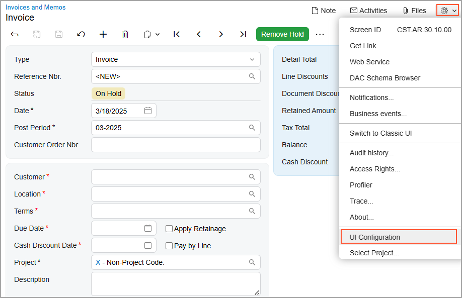

    This activates UI Configuration mode, and displays the **UI Configuration** pane at the top of the form \(see below\).

    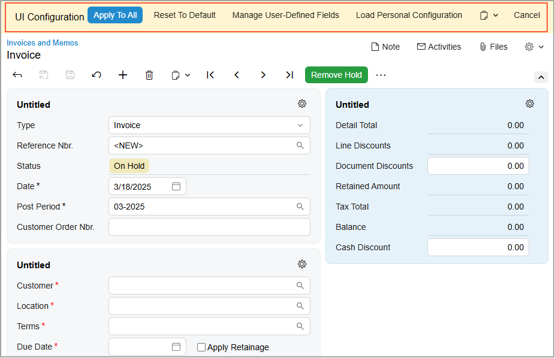

2.  In the **UI Configuration** pane, click **Load Personal Configuration**.
3.  In the **Load Personal Configuration** dialog box, which opens, select *David Chubb* in the **User** box. This is the user whose configuration you want to load.
4.  Click **Load**. The system loads David’s personal configuration of the form.
5.  Review the tabs’ order. It should match David Chubb’s layout exactly.

## Step 2: Customizing Sections { .section}

Suppose that you were asked to do the following in the Summary area of the [Invoices and Memos](AR_30_10_00.md) \(AR301000\) form:

-   Add the **Branch** box to the first section and pin it so that it stays visible when the section is collapsed
-   Add the **Base Currency ID** box to the second section after the **Cash Discount Date** box
-   Rename the third section to **Total**

Also suppose that after you added the **Base Currency ID** box to the second section, you were asked to remove it because management decided to postpone the addition of the element. To make these changes, do the following:

1.  While you are still on the [Invoices and Memos](AR_30_10_00.md) form in the Form Configuration mode, click the Settings button in the upper-right corner of the first section in the Summary area \(see below\).

    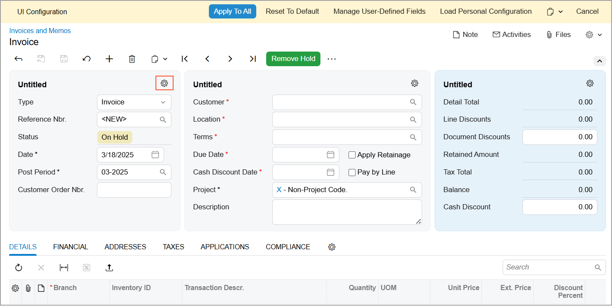

    The **Section Configuration** dialog box opens.

2.  In the **Available Elements** pane of the dialog box, expand the **CurrentDocument** group by clicking the arrow icon next to its name.
3.  Click **Branch** in the expanded group of UI elements and then click the arrow that appears to the right of its name \(see below\).

    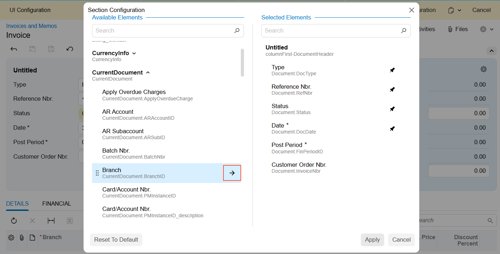

    The system moves **Branch** to the end of the list in the **Selected Elements** pane.

4.  Click the Pin icon next to **Branch** \(shown below\). This ensures that the **Branch** box will remain visible when the section is collapsed.

    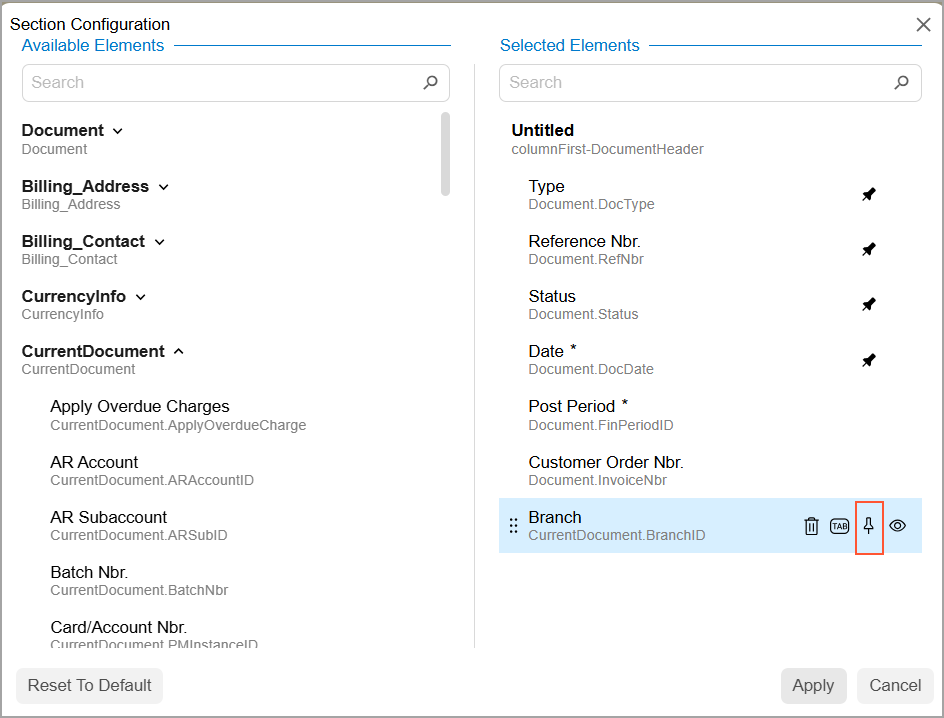

5.  Click **Apply**.

    The **Branch** box appears in the first section, as shown below.

    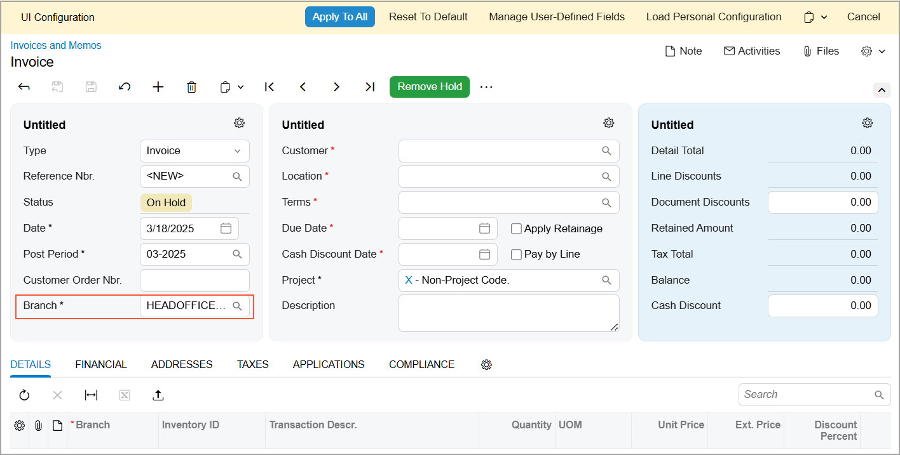

6.  Click the Settings button in the second section.
7.  In the **Available Elements** pane of the **Section Configuration** dialog box, type `Base Currency ID` in the Search box. The **CurrencyInfo** group appears.
8.  Expand the **CurrencyInfo** group \(see below\).

    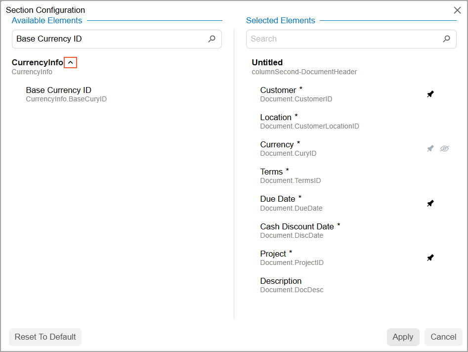

9.  Click **Base Currency ID** in the expanded group and then click the arrow next to its name.

    The system adds **Base Currency ID** to the end of the list in the **Selected Elements** pane.

10. Drag **Base Currency ID** immediately after **Cash Discount Date** \(see below\).

    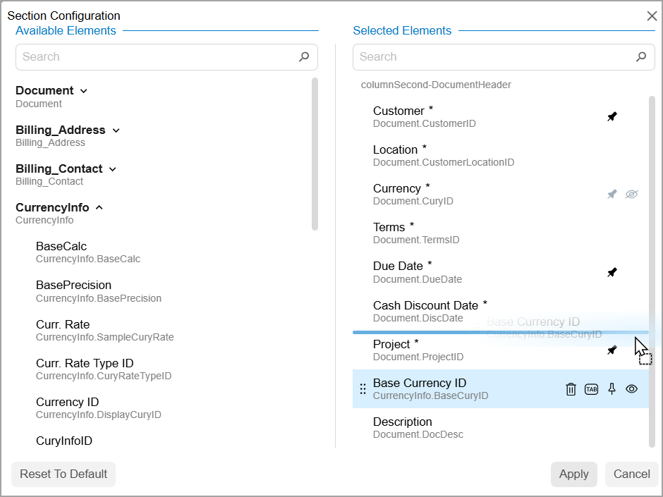

11. Click **Apply**.

    The **Base Currency ID** box appears in the second section after the **Cash Discount Date** box, as shown below.

    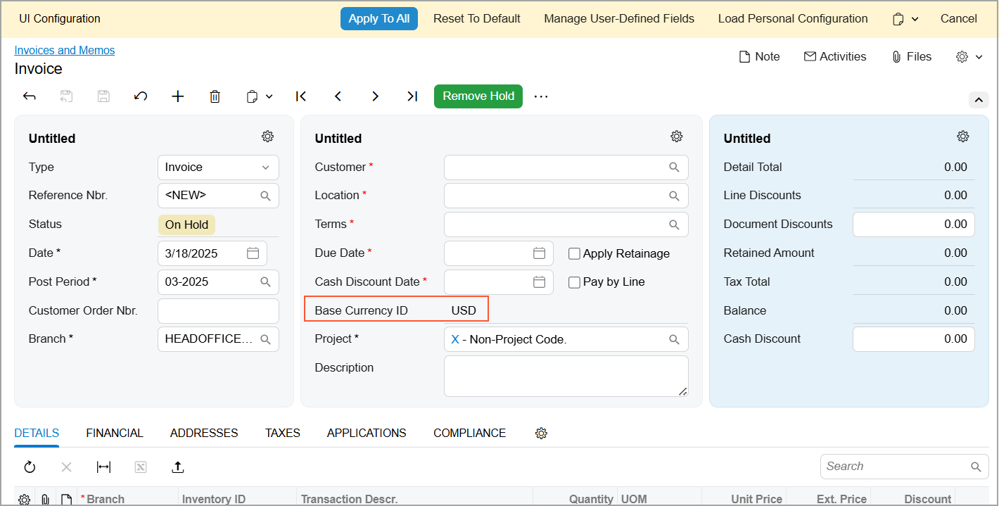

12. Click the Settings button in the third section.
13. In the **Selected Elements** pane of the **Section Configuration** dialog box, hover over **Untitled** and click the Edit button, which appears to the right of it.
14. In the editing area, type `Total`.
15. Click **Apply**.

    The name of the third section changes, as shown below.

    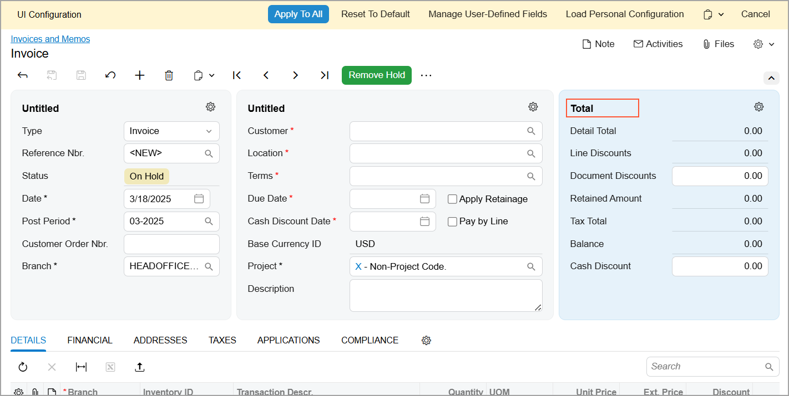

16. To remove the UI element that’s no longer needed, click the Settings button in the second section.
17. In the **Selected Elements** pane of the **Section Configuration** dialog box, hover over **Base Currency ID** and then click the Delete icon, as shown below.

    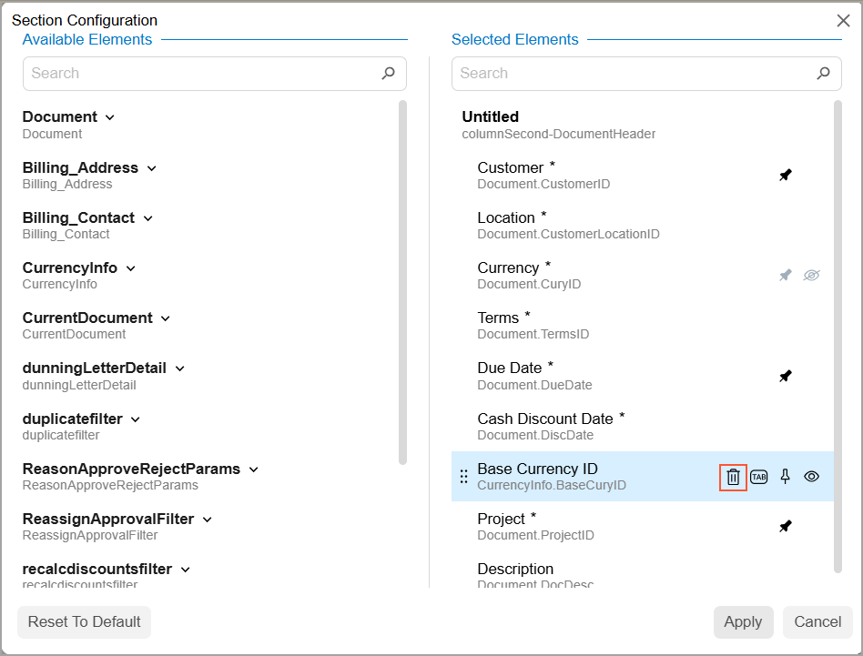

18. Click **Apply**.

    The system has removed the **Base Currency ID** box from the second section of the Summary area.

## Step 3: Changing Tabs’ Order and Visibility { .section}

Suppose that you were asked to apply the following changes system-wide on the [Invoices and Memos](AR_30_10_00.md) \(AR301000\) form:

-   Move the **Taxes** tab after the **Details** tab
-   Hide the **Applications** tab

To make these changes, do the following:

1.  While you are still on the [Invoices and Memos](AR_30_10_00.md) form in the Form Configuration mode, drag the **Taxes** tab to place it immediately after the **Details** tab.
2.  Drag the **Applications** tab to the More button and then move it to the **Hidden Tabs** section that appears below the More button \(see below\).

    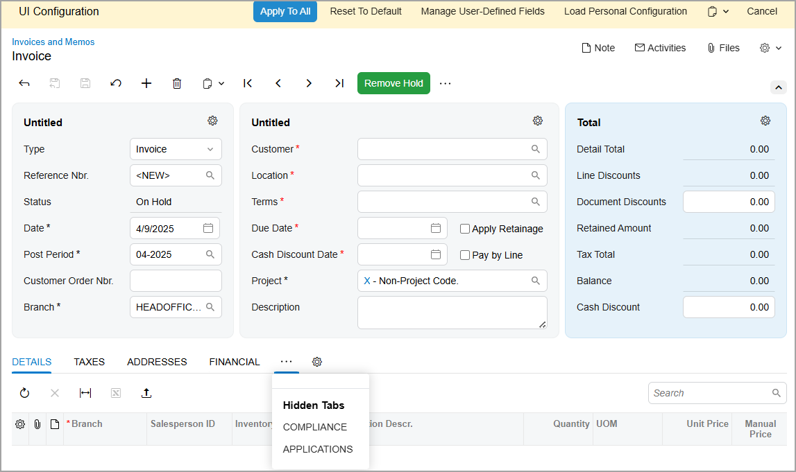

## Step 4: Managing Table Columns { .section}

Suppose that on the **Details** tab of the [Invoices and Memos](AR_30_10_00.md) \(AR301000\) form, you were asked to add the **Tax Amount** column to the table and hide the **Expense Date** column.

To change the set of columns of the table, do the following:

1.  While you are still on the [Invoices and Memos](AR_30_10_00.md) form, go to the **Details** tab.
2.  In the upper-left corner of the table toolbar, click the Settings button. The Column Configuration dialog box opens.
3.  Select the check box for **Tax Amount**.
4.  Clear the check box for **Expense Date**.
5.  Click **OK**.

## Step 5: Applying the Changes System-Wide { .section}

To apply the changes on the [Invoices and Memos](AR_30_10_00.md) \(AR301000\) form system-wide, do the following while you are still on this form in UI Configuration mode:

1.  Click **Apply to All** in the **UI Configuration** pane at the top of the form.
2.  In the **Apply to All** dialog box, which opens, click the **Preserve Personal Configuration** button.

    The system applies the changes \(except for users with their own configuration of the form\) and closes the UI Configuration pane.

3.  Sign out of the system.

## Step 6: Reviewing the System-Wide Changes { .section}

Now suppose that you are David Chubb. After Kimberly Gibbs has applied the system-wide changes on the [Invoices and Memos](AR_30_10_00.md) \(AR301000\) form, you need to review the form and verify that your personal configuration of it has been preserved. Do the following:

1.  Sign in to the system as David Chubb by using the following credentials:
    -   **Username**: *chubb*
    -   **Password**: *123*
2.  Open the [Invoices and Memos](AR_30_10_00.md) \(AR301000\) form and add a new record.
3.  Review the first section in the Summary area to confirm that the **Branch** box is there.
4.  Click the arrow icon in the upper-right corner of the area to collapse it.

    The sections collapse and show only pinned UI elements, including the **Branch** box in the first section.

5.  Review the third section to confirm that it’s named **Total**.
6.  Review the order and visibility of the tabs. They should be in the same order that you previously configured \(for example, the **Taxes** tab appears after the **Financial** tab, not after the **Details** tab\).
7.  On the **Details** tab of the form, review the **Manual Price** column that has been added to the table in your personal configuration and the **Tax Amount** column that has been added to the table in the system-wide configuration.
8.  On the **Addresses** tab, review the appearance of the **Bill-To Contact** and **Bill-To Address** sections. They should be collapsed while the other sections of the tab are expanded.

As a system administrator and customizer, you loaded the personal configuration of the form and made other changes to it. Then you applied all the changes, including the personal configuration, system-wide while preserving users’ personal configurations. As a user, you reviewed the applied system-wide changes and verified that your personal configuration had not changed.

**Parent topic:**[Adjusting the Acumatica ERP UI](../UserGuide/GS_Adjusting_Table_Layout_Mapref.md)

