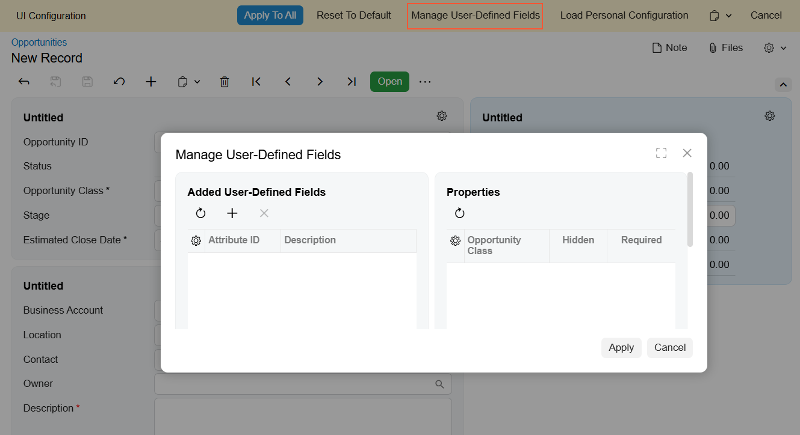
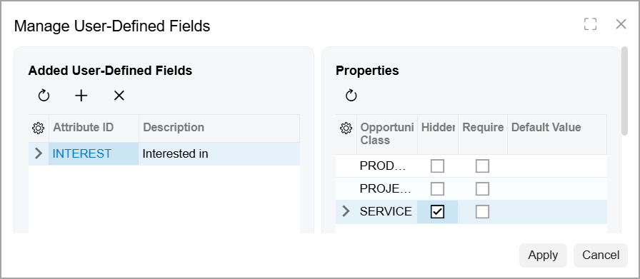
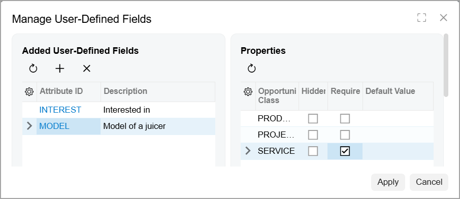
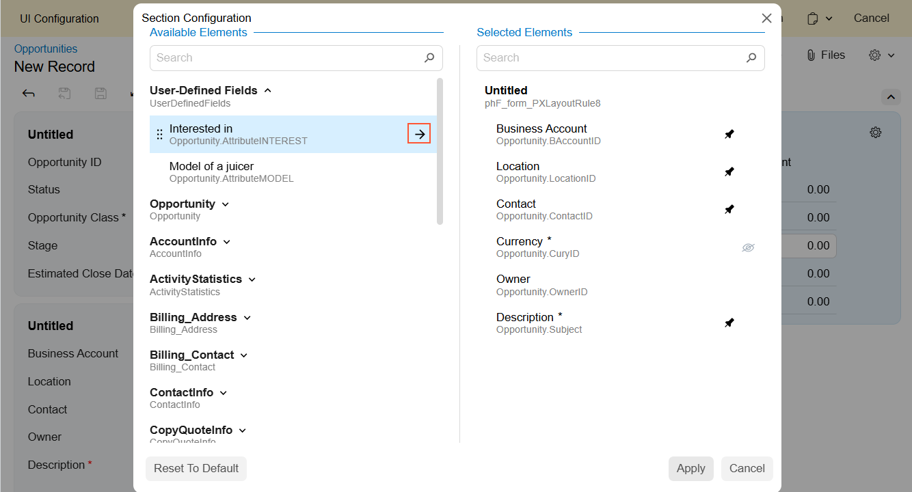
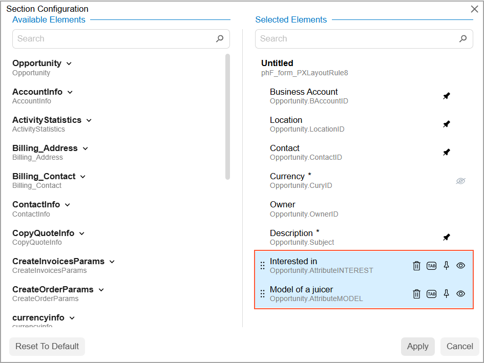
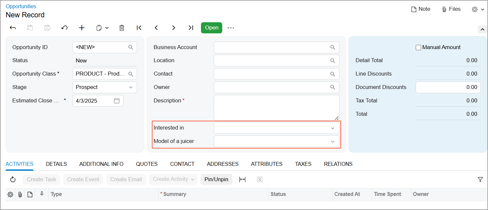

# Adjustment of the Acumatica ERP UI: To Manage User-Defined Fields {#_9fa55c27-c036-4d38-89f0-7061c86a4d4c .task}

This activity will walk you through the process of associating user-defined fields with a form and adding them to the form.

**Attention:** This activity is performed in the Modern UI based on the *U100* dataset. If you’re using the Classic UI, some features may not be available, which could affect processing. If you are using another dataset or if any system settings have been changed in *U100*, these changes can affect the workflow of the activity and the results of the processing. To avoid issues, restore the *U100* dataset to its initial state.

## Story { .section}

Suppose that you are Kimberly Gibbs, a system administrator and customizer at the SweetLife Fruits &amp; Jams company. You were asked to add the *INTEREST* and *MODEL* user-defined fields to the [Opportunities](CR_30_40_00.md) \(CR304000\) form so that users can specify their values while working on opportunities. The *INTEREST* user-defined field must be hidden for the *SERVICE* class, while the *MODEL* user-defined field must be shown and required for this class.

Acting as Kimberly, you need to associate user-defined fields with the [Opportunities](CR_30_40_00.md) form and specify their settings. Then you need to add them to the Summary area.

## Configuration Overview {#section_tz4_djx_cnb .section}

In the *U100* dataset, the following tasks have been performed to support this activity:

-   On the [Enable/Disable Features](CS_10_00_00.md) \(CS100000\) form, the *Customer Management* feature has been enabled.
-   On the [Opportunity Classes](CR_20_90_00.md) \(CR209000\) form, the *SERVICE* opportunity class has been created. This class defines opportunities related to requests requiring service consulting.
-   On the [Attributes](CS_20_50_00.md) \(CS205000\) form, the *INTEREST* and *MODEL* user-defined fields have been created.

## Process Overview { .section}

In this activity, you’ll associate the *INTEREST* and *MODEL* user-defined fields with the [Opportunities](CR_30_40_00.md) \(CR304000\) form and specify their settings. Then you’ll add these fields to the Summary area of the form.

## System Preparation { .section}

Before you begin performing the steps of this activity, do the following:

1.  Launch the Acumatica ERP website with the *U100* dataset preloaded and the Modern UI turned on.
2.  Sign in to the system as Kimberly Gibbs by using the following credentials:
    -   **Username**: *gibbs*
    -   **Password**: *123*

## Step 1: Associating User-Defined Fields with a Form { .section}

To associate the *INTEREST* and *MODEL* user-defined fields with the [Opportunities](CR_30_40_00.md) \(CR304000\) form and specify their settings, do the following:

1.  On the [Opportunities](CR_30_40_00.md) form, add a new record.
2.  Click the Settings button \(\) in the upper-right corner of the form title bar and then click the **UI Configuration** menu item.

    UI Configuration mode is activated, and the **UI Configuration** pane appears at the top of the form.

3.  On the **UI Configuration** pane, click the **Manage User-Defined Fields** button.

    The **Manage User-Defined Fields** dialog box opens, as shown below.

    

4.  In the **Added User-Defined Fields** pane of the dialog box, click the Plus button.

    **Important:** You can add a user-defined field only if it has first been created on the [Attributes](CS_20_50_00.md) \(CS205000\) form.

5.  In the **Attribute ID** column, select the *INTEREST* user-defined field.
6.  In the **Properties** pane of the dialog box, in the row with the *SERVICE* opportunity class, select the check box in the **Hidden** column, as shown below.

    

7.  In the **Added User-Defined Fields** pane, click the Plus button again.
8.  In the **Attribute ID** column, select *MODEL*.
9.  In the **Properties** pane, in the row with the *SERVICE* opportunity class, select the check box in the **Required** column, as shown below.

    

10. Click **Apply**.

    The system applies the changes.

## Step 2: Adding the User-Defined Fields to the Form { .section}

To add the associated user-defined fields to the [Opportunities](CR_30_40_00.md) \(CR304000\) form, do the following:

1.  While you are still on the [Opportunities](CR_30_40_00.md) form with Form Configuration mode activated, click the Settings button.

    The **Section Configuration** dialog box opens.

2.  In the **Available Elements** pane of the dialog box, locate the **User-Defined Fields** group and click the arrow icon next to its name to expand it.
3.  Click **Interested in** in the expanded **User-Defined Fields** group and then click the arrow that appears to the right of its name \(see below\).

    

    The system moves **Interested in** to the **Selected Elements** pane.

4.  In the **Available Elements** pane, select **Model of a juicer** in the expanded **User-Defined Fields** group and then click the arrow.

    The system moves **Model of a juicer** to the **Selected Elements** pane after the **Interested in** user-defined field \(see below\).

    

5.  Click **Apply**.

    The system closes the dialog box and adds both user-defined fields to the second section of the Summary area.

6.  In the **UI Configuration** pane, click **Apply to All**.
7.  In the **Apply to All** dialog box, which opens, click the **Preserve Personal Configuration** button.

    The system closes the **UI Configuration** pane and applies the changes \(see below\).

    

    Note that both fields are visible. The *PRODUCT* opportunity class is selected, and you configured the *INTEREST* user-defined field to be hidden for only the *SERVICE* opportunity class.

8.  In the **Opportunity Class** box, select *SERVICE*.

    The **Interested in** user-defined field disappears from the form.

**Parent topic:**[Adjusting the Acumatica ERP UI](../UserGuide/GS_Adjusting_Table_Layout_Mapref.md)

