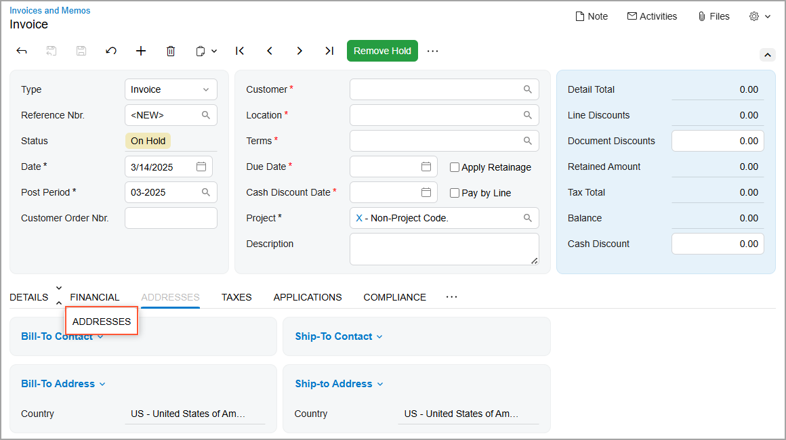
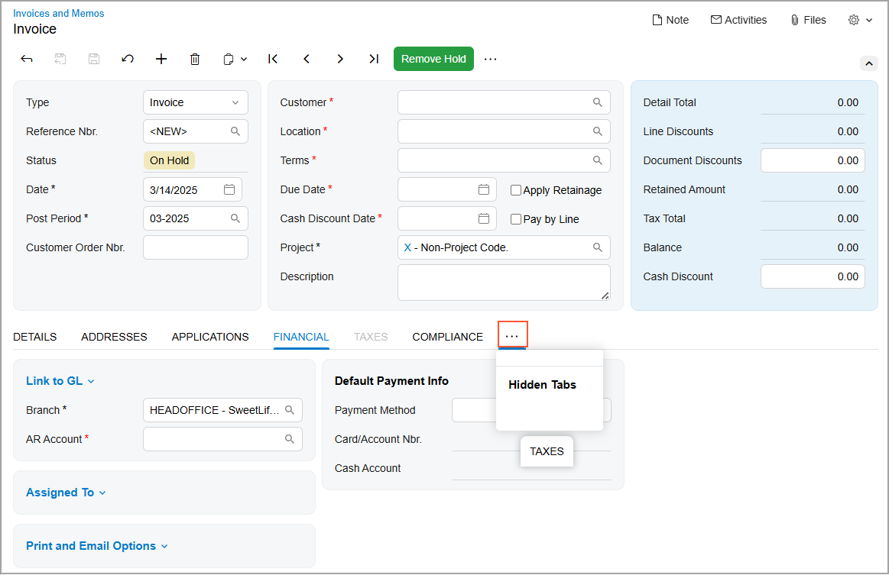
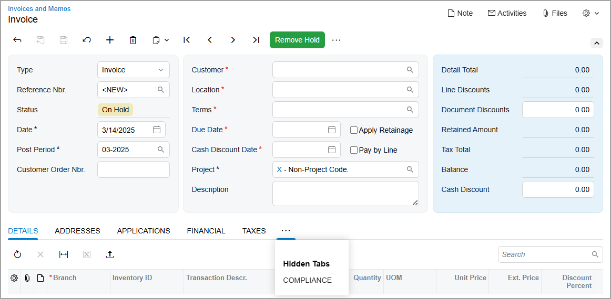
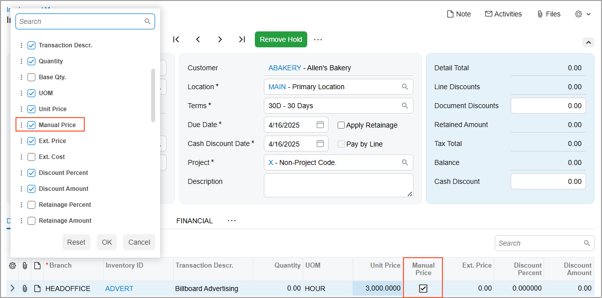
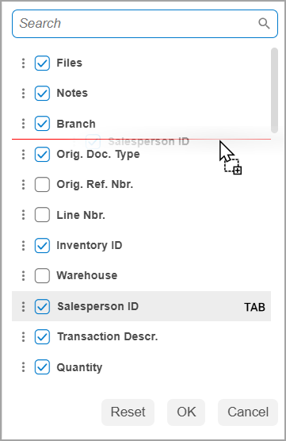
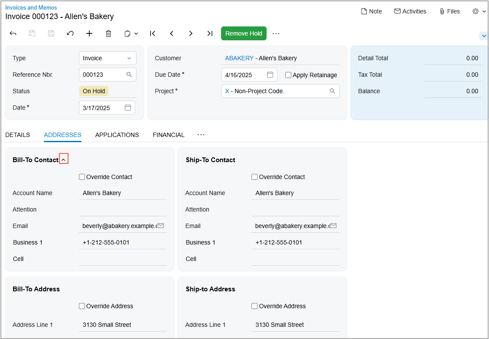
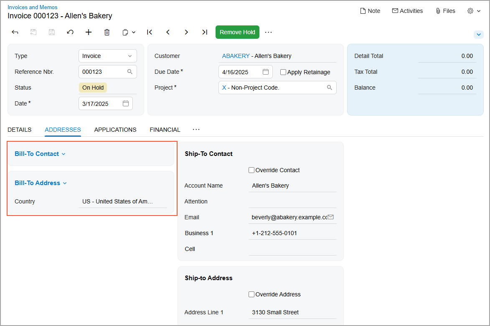

# Adjustment of the Acumatica ERP UI: To Personalize a View of a Form {#_39b51b01-51b5-4e74-9668-a9a1d5c6959a .task}

This activity will walk you through the process of personalizing the user interface on a data entry form.

**Attention:** This activity is performed in the Modern UI based on the *U100* dataset. If you’re using the Classic UI, some features may not be available, which could affect processing. If you are using another dataset or if any system settings have been changed in *U100*, these changes can affect the workflow of the activity and the results of the processing. To avoid issues, restore the *U100* dataset to its initial state.

## Story { .section}

Suppose that you are David Chubb, a sales manager at the SweetLife Fruits &amp; Jams company. The system administrator has recently switched the Acumatica ERP instance to the Modern UI. Acting as David Chubb, you need to personalize a data entry form to meet your working needs.

## Process Overview { .section}

In this activity, you’ll do the following on the [Invoices and Memos](AR_30_10_00.md) \(AR301000\) form:

1.  Reorder the most frequently used tabs
2.  Hide the tabs that you don’t use in your work, and then show one of them again
3.  Customize the set and order of columns in the table by using the Column Configuration dialog box
4.  Manage the appearance of sections on the tab

## System Preparation { .section}

Before you begin performing the steps of this activity, do the following:

1.  Launch the Acumatica ERP website with the *U100* dataset preloaded and the Modern UI turned on.
2.  Sign in to the system as David Chubb by using the following credentials:
    -   **Username**: *chubb*
    -   **Password**: *123*

## Step 1: Reordering Tabs { .section}

To change the order of tabs and move the most frequently used ones to the front, do the following:

1.  On the [Invoices and Memos](AR_30_10_00.md) \(AR301000\) form, add a new record.
2.  Drag the **Addresses** tab after the **Details** tab, as shown below.

    

3.  Drag the **Applications** tab after the **Addresses** tab.

## Step 2: Changing Tabs’ Visibility { .section}

Suppose that you seldom use some tabs and decide to hide two of them. Later, you realize that you need one of these tabs more frequently than you originally thought, so you decide to show it again. To change the visibility of tabs, do the following while you are still on the [Invoices and Memos](AR_30_10_00.md) \(AR301000\) form:

1.  Drag the **Taxes** tab to the More button and then move it to the **Hidden Tabs** section that appears on the screen \(see below\).

    

2.  Similarly, drag the **Compliance** tab to the **Hidden Tabs** section.
3.  To show the **Taxes** tab again, click the More button. Then drag the **Taxes** tab from the **Hidden Tabs** section and to the **Financial** tab \(see below\).

    

## Step 3: Managing Table Columns by Using the Column Configuration Dialog Box { .section}

Suppose that you want to personalize the columns on the **Details** tab of the [Invoices and Memos](AR_30_10_00.md) \(AR301000\) form as follows:

-   Add the **Manual Price** column to the table so that you know whether the price for each service was changed manually
-   Hide the unneeded **Project Task** and **Cost Code** columns
-   Change the column order by moving the **Salesperson ID** column after the **Branch** column

To customize the set and order of these columns, do the following while you are still on the [Invoices and Memos](AR_30_10_00.md) \(AR301000\) form:

1.  Go to the **Details** tab.
2.  In the upper-left corner of the table toolbar, click the Settings button. The Column Configuration dialog box opens.
3.  Select the check box for the **Manual Price** column.
4.  Click **OK**.

    The **Manual Price** column is added to the table \(as shown below\).

    

5.  On the table toolbar, click the Settings button again.
6.  In the Column Configuration dialog box, which opens, clear the check boxes for the **Project Task** and **Cost Code** columns.
7.  Click **OK**. The unneeded columns have been removed from the table.
8.  Click the Settings button.
9.  In the Column Configuration dialog box, find the **Salesperson ID** column. Drag it upward and place it immediately after the **Branch** column, as shown below.

    

10. Click **OK**

## Step 4: Customizing Sections { .section}

Suppose that during your work, you don’t need the information displayed in the **Bill-To Contact** and **Bill-To Address** sections of the **Addresses** tab of the [Invoices and Memos](AR_30_10_00.md) \(AR301000\) form. To collapse these sections, do the following while you are still on this form:

1.  Go to the **Addresses** tab.
2.  Hover over the **Bill-To Contact** section.
3.  Click the arrow icon that appears to the right of the section name, as shown below.

    

    The **Bill-To Contact** section collapses.

4.  Hover over the **Bill-To Address** section.
5.  Again click the arrow icon that appears to the right of the section name. The section collapses, as shown below.

    

    **Tip:** To expand a collapsed section, click the arrow icon.

**Parent topic:**[Adjusting the Acumatica ERP UI](../UserGuide/GS_Adjusting_Table_Layout_Mapref.md)

