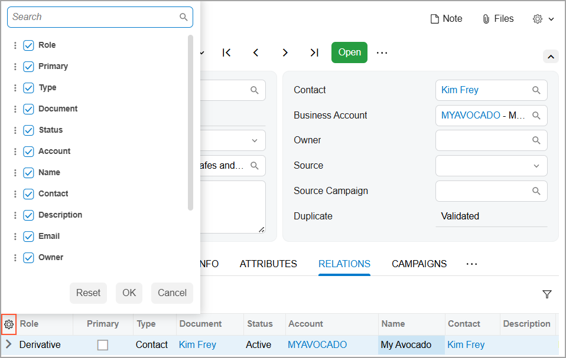
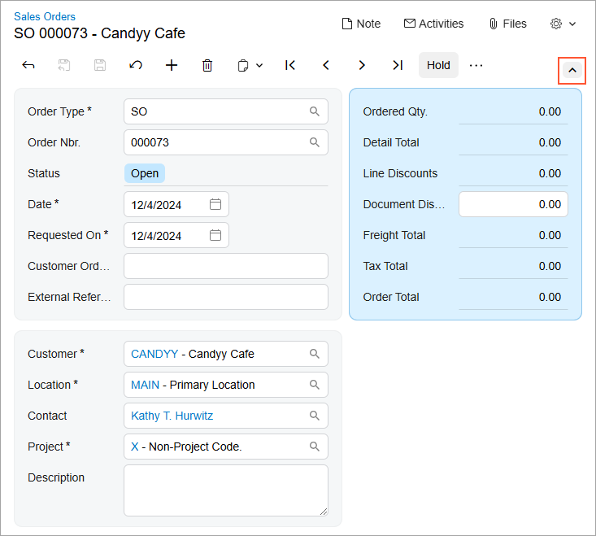
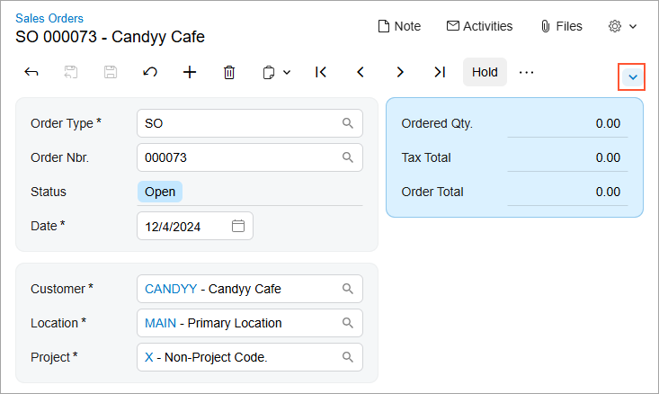

# Adjustment of the Acumatica ERP UI: General Information {#_915a9c92-660f-4242-9920-67530e12a47f .concept}

In the following sections, you’ll find information about adjustment of the Acumatica ERP form layout.

## Learning Objectives { .section}

In this chapter, you’ll learn how to do the following:

-   Manage tabs on a form
-   Manage table columns
-   Adjust sections on a form
-   Apply a user’s configuration system-wide \(for administrators\)
-   Manage user-defined fields to be used system-wide \(for administrators\)

## Applicable Scenarios { .section}

You adjust the form layout if you would like to view additional information or rearrange the data on a form according to your current work task.

## Form Layout { .section}

In Acumatica ERP, you can adjust the layout of any form to meet your needs. Specifically, you can reorder, hide or display tabs, change the set of UI elements on sections in the Summary area of the form, manage the order and visibility of table columns, collapse and extend sections on tabs.

When you have adjusted the layout of a particular form, your individual settings for the layout of this form are automatically saved to the server and applied in all your future user sessions. These changes are available to you on any browser or device and are applied to your user account only. Also, these changes are applied to only the specific form that you changed; they are not applied to any other forms. For details, see [Adjustment of the Acumatica ERP UI: To Personalize a View of a Form](GS_ModernUI_User_Interface_Personalization_Activity.md).

If you have both the *Administrator* and *Customizer* user roles assigned to your user account, you can customize the layout of the form and apply it for all users. Additionally, you can apply any user’s personal configuration—along with any needed changes—system-wide. For details, see [Adjustment of the Acumatica ERP UI: To Perform System-Wide Form Configuration](GS_ModernUI_System_Wide_Personalization_Activity.md).

## Order and Visibility of Tabs { .section}

You can change the order of tabs and hide or display individual tabs to fit your business needs.

To reorder a tab, you click and hold the tab name and then drag it to the needed position \(as shown below\).

To hide a tab, you click and hold the tab name, drag it first to the More button \(\) and then to the **Hidden Tabs** section, which appears on the form \(as shown below\).

To display a hidden tab, click the More button and then drag the tab name from the **Hidden Tabs** section to the needed position.

## Managing Table Columns { .section}

For each table, you can manage the set of columns to be displayed by using the Column Configuration dialog box. To open the dialog box, you click the Settings button \(\) in the upper-left corner of the table \(see below\).

In this dialog box, you can:

-   Hide or display a column by clearing or selecting the check box next to its name.
-   Modify the order of the columns by dragging the check box with the column name to the needed position in the list.
-   Change whether the column should receive focus when you press Tab by hovering over the column name and clicking **Tab** to change its state. This causes the word to be crossed out or appear normal.
-   Apply the column configuration by clicking **OK**.
-   Cancel the column customization by clicking **Cancel**.
-   Reset the customization and restore the default layout of the table by clicking **Reset**.

## Managing Sections { .section}

In Acumatica ERP, a section is a set of related UI elements visually grouped with color blocks on a tab or in the Summary or Selection area of a form. You can collapse and expand each section to display fewer or more elements. The collapsed or expanded state of the sections is retained for your user account between sessions.

To expand or collapse a section, click the arrow icon on the form toolbar, as shown below.

## User-Defined Fields { .section}

If you’re an administrator or customizer, you may need to make system-wide changes to a form’s layout, including adding custom elements for data your company wants to track. You can conveniently add user-defined fields directly to a form. For more information, see [Managing Attributes and User-Defined Fields](CS__con_Attributes_and_User_Defined_Fields.md).

Adding each user-defined field to a form involves the following steps:

1.  Selecting or creating the attribute that will be used as the user-defined field. User-defined fields are based on predefined and site-specific attributes that have been defined in the system.
2.  Associating the selected field with the applicable form.
3.  Adding the field as a UI element to the applicable section of the form.

For details, see [Adjustment of the Acumatica ERP UI: Managing User-Defined Fields](GS_Personalization_UI_User_Defined_Fields.md).

**Parent topic:**[Adjusting the Acumatica ERP UI](../UserGuide/GS_Adjusting_Table_Layout_Mapref.md)

