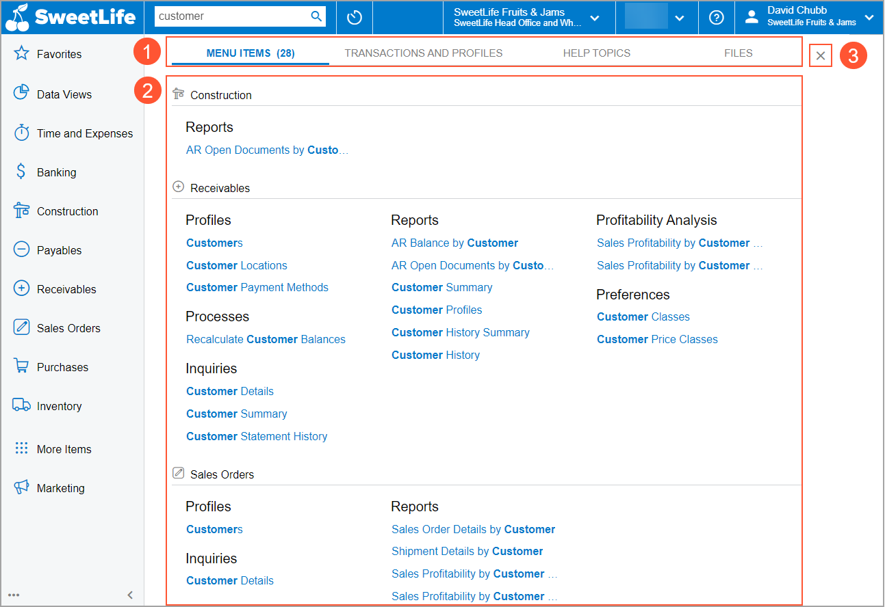

# Search Capabilities: General Information {#_6a7886a5-ed3f-4e5b-8b5f-5d8b517bc755 .concept}

The following sections provide information on how the universal search capabilities of Acumatica ERP help you find needed information.

## Learning Objectives { .section}

In this chapter, you’ll learn how to search for specific data in the system, such as profiles, menu items, records, attached files, and Help topics.

## Applicable Scenarios { .section}

In Acumatica ERP, you perform a search when you need to find any of the following:

-   A form or report
-   A dashboard
-   A particular transaction or profile \(record\)
-   Help content about a particular Acumatica ERP form or process
-   A particular file attached to a record

## Universal Search { .section}

With the universal search capabilities of Acumatica ERP, you can quickly find particular data in the system.

The Search box is located in the top pane of the Acumatica ERP screen. When you enter a keyword or phrase in the Search box, the results may include any of the following:

-   Menu items, such as forms, reports, dashboards, pivot tables, and generic inquiries
-   Help topics
-   Files and notes attached to records
-   Transactions
-   Documents
-   Profiles, such as vendors, customers, prospects, employees, leads, and cases

You can also search for a form or report by its title or ID.

**Tip:** You can find a form or report by using the Search box if the link to this form or report has been added to any workspace. If you cannot find a form or report that you need for your work, contact a system administrator.

The system searches for all matches of the keyword or phrase that you have entered in the Search box. On the tabs of the Search form, you’ll see all the search results with at least one match of the keyword or phrase.

The system narrows the search results based on your access rights. If you don’t have access rights to particular data \(such as vendor accounts\), the data doesn’t appear in the search results, even though the results match the search keyword or phrase. Your access rights to files that are attached to records are determined by your access rights to these records and to the forms where these records are created.

## Search Form { .section}

To start a search, you enter a keyword or phrase into the Search box. The system opens the Search form, which overlaps the working area. The basic elements of the Search form are shown below.

1.  The tabs of the Search form, which are described in the next section.
2.  The search results for the selected tab.
3.  The Close button. When you close the Search form, you go back to the form, report, or dashboard that was opened when you started your search.

## Tabs of the Search Form { .section}

When you enter your search string in the Search box, the system displays the search results on the following tabs of the Search form:

-   **Menu Items**: On this tab, you can view links to forms, reports, or dashboards with the search string in their name or ID.
-   **Transactions and Profiles**: Depending on the search string you have entered, you’ll see the following:
    -   You’ve entered a reference number or ID: The list of records and transactions identified by the reference number or ID. Entering a reference number or ID is the only way you can find a particular record through the Search form.

        **Attention:** In Acumatica ERP, each record of a particular type is identified by a reference number or ID that is unique to the record type.

    -   You’ve entered a keyword, partial keyword, or phrase: The list of profiles whose names contain this word or phrase from the search string. Also, the descriptions of transactions and profiles are searched for the search strings, and transactions are listed on this tab if their descriptions contain the search string.
-   **Help Topics**: This tab lists Help topics that contain the search string in their name or content. You can click any link to open the topic in a new browser tab.
-   **Files**: Here, you can view the list of the files attached to records if the files contain the search string in their name.

## Search Tips { .section}

You can search for a data entry form by entering in the Search box either of the following:

-   The name of the form, such as *Sales Orders*, *Customers*, or *Employees*
-   The form ID, such as *SO301000*, *AR303000*, or *EP203000*

On the **Menu Items** tab of the Search form, the system displays a link you can click to view the list of the records \(such as sales orders, customers, or employees\) that have been created by using the data entry form whose name or ID you entered.

You can search for a particular record or transaction by entering in the Search box the reference number of the record or transaction, such as sales order *000029* or invoice *000056*. The system displays the link to the record that you are searching for on the **Transactions and Profiles** tab of the Search form. When you click the link, the particular form of the record opens with that record selected.

## Known Limitations to Search Queries { .section}

The system performs a full-text search for the queries that contain words whose length is two or more characters.

A semantic search does not find related entities if the search query includes word breakers, such as AND or FOR.

For example, suppose that you want to find related entities by using a description as a search query. If the description includes at least one word breaker, the search returns no results.

**Parent topic:**[Searching in Acumatica ERP](../UserGuide/GS_Searching_in_Acumatica_ERP_Mapref.md)

