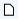
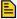
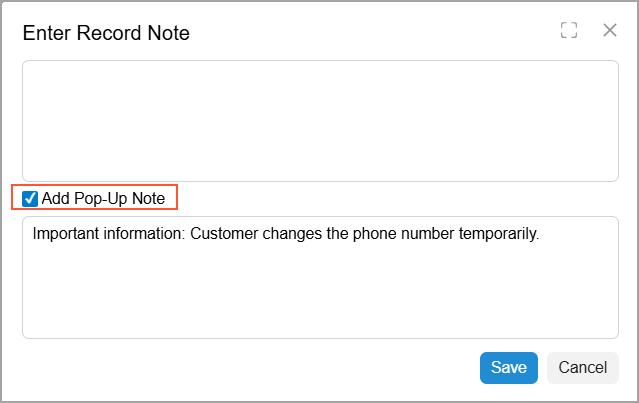
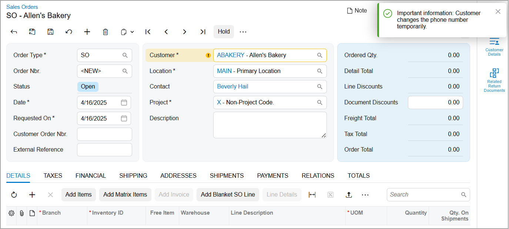
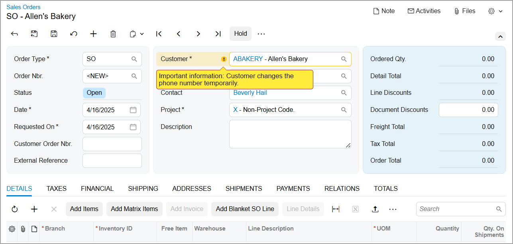

# Attachments: Note Attachments {#_b37ebeca-87c7-432f-8d14-7f7ab8c059f0 .concept}

You can attach a text note, such as important information for colleagues about a customer, to a record or a detail of a record. These capabilities include:

-   In a list of records: Attaching a note to any record, as well as viewing notes that have been attached to records.
-   On a data entry form: Attaching a note to the record as a whole or any of its details \(such as a purchase order or any purchase order line\). You can also view notes that have been attached to the selected record or its details.

## Attachment and Review of Notes { .section}

You can attach a note to a record in either of the following places:

-   In a list of records: Click the Note \(\) button in the **Notes** column of the row with the record to open the **Enter Record Note** dialog box, where you can add your note.

    If you’re viewing a list of records and a note has been attached to a record, you’ll see the Note button with a yellow background \(\) in the **Notes** column for the record. You can click  to open the **Enter Record Note** dialog box and view the note.

-   On the form title bar of a data entry form: Click the **Notes** button to open the **Enter Record Note** dialog box, where you can add your note.

    If you’re viewing a record on the data entry form and a note is attached to the record, on the form title bar, you’ll see the  icon left of the **Notes** button. You can click the **Notes** button to open the **Enter Record Note** dialog box and view the note.

You can also attach a note to a record detail. To do this, you click the Notes button in the table row and use the **Enter Record Note** dialog box.

If a note is attached to a record detail, in the **Notes** column of the row with the detail, you’ll see that the icon on the Note button now has a yellow background \(\). You can click the Note button to open the **Enter Record Note** dialog box and view the note attached to the record detail.

## Pop-Up Notes { .section}

You can attach pop-up note to any of the following records:

-   A customer on the [Customers](AR_30_30_00.md) \(AR303000\) form
-   A vendor on the [Vendors](AP_30_30_00.md) \(AP303000\) form
-   An inventory item on the [Stock Items](IN_20_25_00.md) \(IN202500\) or [Non-Stock Items](IN_20_20_00.md) \(IN202000\) forms
-   A business account on the [Business Accounts](CR_30_30_00.md) \(CR303000\) form

Then when a user selects this record while creating other documents in the system, the system displays the pop-up note. For example, suppose that you add important information about a customer for your colleagues who engage in activities with the customer. This note will be shown when the customer is selected in a relevant document, such as a sales order or an invoice.

To attach a pop-up note to one of these records, you open the **Enter Record Note** dialog box, as described above. In the dialog box, you select the **Add Pop-Up Note** check box in the bottom left corner. The system makes the text box below available, where you can type the information you want to share \(as shown below\).

When you create a document in the system with a record to which a pop-up note has been added, the system displays the note as a notification \(shown below\).

Also, you can view the note by pointing to the warning sign next to the box where you selected the entity \(see below\).

You can view a pop-up note added for a customer or inventory item when you create a document on one of the following forms and select this customer or item:

-   [Invoices and Memos](AR_30_10_00.md) \(AR301000\)
-   [Cash Sales](AR_30_40_00.md) \(AR304000\)
-   [Sales Orders](SO_30_10_00.md) \(SO301000\)
-   [Invoices](SO_30_30_00.md) \(SO303000\)
-   [Service Orders](FS_30_01_00.md) \(FS300100\)
-   [Appointments](FS_30_02_00.md) \(FS300200\)

You can view a pop-up note added for a vendor when you create a document on one of the following forms and select the vendor:

-   [Bills and Adjustments](AP_30_10_00.md) \(AP301000\)
-   [Purchase Orders](PO_30_10_00.md) \(PO301000\)
-   [Purchase Receipts](PO_30_20_00.md) \(PO302000\)

You can view a pop-up note added for a business account when you create a record associated with the account on one of the following forms:

-   [Leads](CR_30_10_00.md) \(CR301000\)
-   [Opportunities](CR_30_40_00.md) \(CR304000\)
-   [Contacts](CR_30_20_00.md) \(CR302000\)
-   [Cases](CR_30_60_00.md) \(CR306000\)

**Parent topic:**[Working with Attachments](../UserGuide/GS_Working_With_Attachments_Mapref.md)

