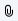
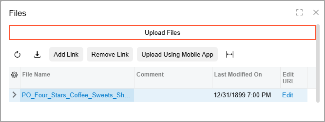
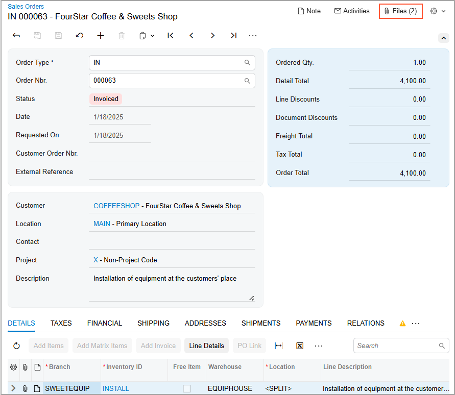
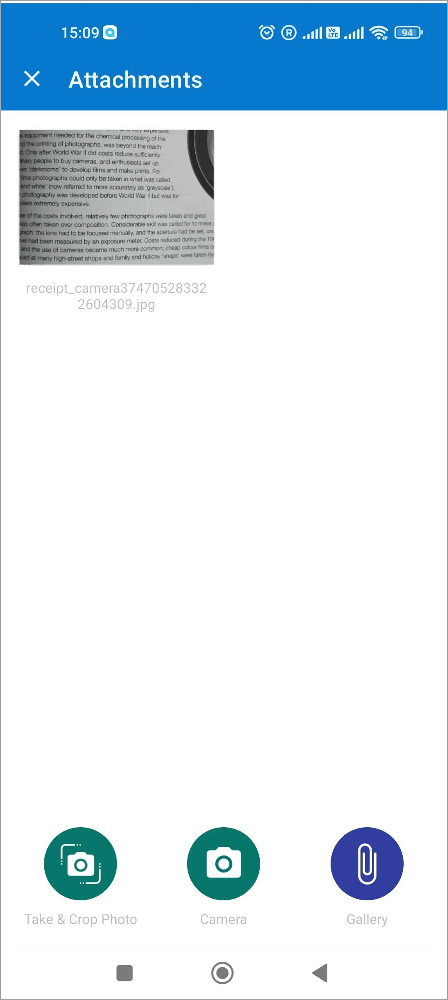
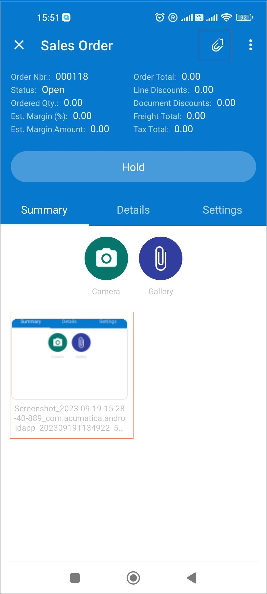

# Attachments: File Upload and Attachment {#_d5588b84-014c-485a-8ca3-526b794684b5 .concept}

A file, such as a scanned document with a signature, can be attached to a record and to a particular detail \(table row\) of a record. In a list of records—for example, the Customers \(AR3030PL\) list of customer records—you can attach a file to any listed record, as well as view files that have been attached to records. On a data entry form, you can attach a file to the record as a whole or to any of its details \(such as an AP bill or any bill line\); you can also view files that have previously been attached to the selected record or its details.

## File Upload and Attachment { .section}

You use the **Files** dialog box to upload a file and attach it to a record, notification template, wiki article, or record detail. Also, you can drag a file to the Summary area of a data entry form, and the system attaches the file to the record that is opened on the form.

You can open the **Files** dialog box and upload one or more files to attach to a record in either of the following ways:

-   In a list of records, such as sales orders: By clicking the Files \(\) button in the **Files** column of the row with the record.
-   On a data entry form: By clicking the **Files** button on the form title bar.

You can also attach a file to a particular detail of a record. To do this, you click the Files \(\) button in the table row and use the **Files** dialog box.

In the dialog box, you can click anywhere in the **Upload Files** area to find a file and upload it \(see below\). Alternatively, you can drag a file to the **Files** dialog box.

The system uploads the file and attaches it to the record for which the dialog box was opened. That is, the system creates a link between the file and the record and adds the information about the link to the **Linked to Entities** tab of the [File Maintenance](SM_20_25_10.md) \(SM202510\) form for the file. Also, the system fills the **Primary Screen** box on the **Access Rights** tab of the form with the form used to upload the file. The system uses the information about the links and the form used for upload to calculate access rights for the file. For details, see [Attachments: File Maintenance](GS_Working_with_Attachments_File_Maintenance_Concept.md).

## File Name Modification { .section}

When files are uploaded, the system modifies their names as follows:

-   For a file attached to a record, the resulting name consists of the form name, the record ID in parentheses, a backslash, and the name of the file, as shown in the following example: `Journal Transactions (GL333234231)\Note.txt` or `Bills and Adjustments (INV0023572)\Orig_doc.jpeg`.
-   For a file attached to a record detail \(a detail row or line of the record\), the resulting name consists of the form name, the record ID and record detail ID in parentheses, a backslash, and the name of the file, as shown in the following example: `Journal Transactions (GL333234231 3)\Note.txt`.
-   For a file attached to a wiki article, the resulting name consists of the wiki article name and the name of the file, separated by a backslash, as you can see in the following example: `Role-Based Access\Users.gif`.

## Review of the Existing Attachments { .section}

If you are viewing a list of records and a file has been attached to a record, the Files button displays a paperclip icon with a yellow background \(\) in the **Files** column of the row with the record. You can click the Files button to open the **Files** dialog box and view the attachments to the record.

If you are viewing a record on the data entry form and a file is attached to the record, on the form title bar, you can see the number of attached files in parentheses right of the **Files** button. Each time you attach a file to the record, the system increments the counter. You can click the **Files** button to open the **Files** dialog box and view the attachment.

Below you can see the number of files attached to a bill selected on the [Sales Orders](SO_30_10_00.md) \(SO301000\) form. If a file is attached to the record detail \(for example, a line of a bill\), the system doesn’t increment the counter on the form title bar.

If you are viewing a record on the data entry form and a file is attached to a particular record detail, in the **Files** column of the row with the detail, you can see that the paperclip icon on the Files button now has a yellow background \(\). You can click the Files button to open the **Files** dialog box and view the attachments to the record detail.

When you open the **Files** dialog box to view the list of attachments, you can open a file for maintenance by clicking the *Edit* link in the row with the file. The system opens the [File Maintenance](SM_20_25_10.md) \(SM202510\) form in a new browser tab with the file details.

## Attachment of an Existing File { .section}

By using the **Files** dialog box, you can also attach any other files that have been uploaded to the system. If you click the **Add Link** button in the dialog box, the system opens the [Search in Files](SM_20_25_20.md) \(SM202520\) form, where you can search for needed files that have been uploaded to Acumatica ERP and attach them to the record or record detail.

On the [Search in Files](SM_20_25_20.md) form, you can specify the following criteria in your search:

-   What the file name is \(you can also specify part of the name\)
-   When the file was added
-   Who added the file
-   Who is editing the file \(if the file is checked out for editing\)
-   What form was used to upload the file
-   What tags were assigned to that file

**Attention:** The system doesn’t check the access rights to file attachments for a user who searches the files by using this form.

The system displays the list of search results in the table. You select the file you want to attach and click either **Add Link** or **Add Link and Close** on the table toolbar of the form. The system attaches the selected file and adds information about the link to the **Linked to Entities** tab of the [File Maintenance](SM_20_25_10.md) form for the file. If a file is attached to a wiki article, the system displays this link on the **Linked to Articles** tab of the form for the file.

To remove the link between the record and the file, select the file and click **Remove Link** in the **Files** dialog box.

## Attachment of Files by Using a Mobile Device { .section}

To be able to capture images with a mobile device and upload them to Acumatica ERP, you should register the device first. To do this, you enable push notifications for the Acumatica mobile app and sign in to the system at least once. After that, you can view the mobile device on the **Devices** tab of the [User Profile](SM_20_30_10.md) \(SM203010\) form.

To start capturing of images with a mobile device, in Acumatica ERP, you open the **Files** dialog box for a record and click **Upload Using Mobile App** on the table toolbar of the **Files** dialog box. The system sends a push notification to your registered mobile device. You tap the notification, and the system opens the Attachments screen on the mobile device \(see below\). By using this screen, you can do the following:

-   Take a photo and perform some basic edits to it \(by tapping **Take &amp; Crop Photo**\)
-   Take a photo without any edits \(by tapping **Camera**\)
-   Upload any number of files from your mobile device from the gallery \(by tapping **Gallery**\)

While you are viewing the screen for a particular record, as shown below for the Sales Order screen, you can quickly attach any number of files to the record. To do this, you tap  at the top of the screen \(also shown below\). You can then take photos by tapping **Camera** or upload files by tapping **Gallery**. When you attach a file or multiple files, you can see the number of attached files next to the  icon, as shown below.

The system uploads the selected files to the system immediately. You can view the list of uploaded files in the **Files** dialog box for the applicable Acumatica ERP form and record.

## Attachment of Scanned Files { .section}

You can scan documents and attach these files to records and record lines if the *DeviceHub* feature is enabled on the [Enable/Disable Features](CS_10_00_00.md) \(CS100000\) form and at least one scanner has been configured in Acumatica ERP through integration with the DeviceHub application.

For more information on configuring scanners in DeviceHub, see the topics of the [Implementing DeviceHub](../ImplementationGuide/config_DH_Mapref.md) chapter. For more information on scanning and attaching files, see [To Scan a File and Attach It to a Record](../InterfaceGuide/UIG__how_Attach_File_Record.md) and [To Scan a File and Attach It to a Record Detail](../InterfaceGuide/UIG__how_Attach_File_Record_Detail.md).

**Parent topic:**[Working with Attachments](../UserGuide/GS_Working_With_Attachments_Mapref.md)

