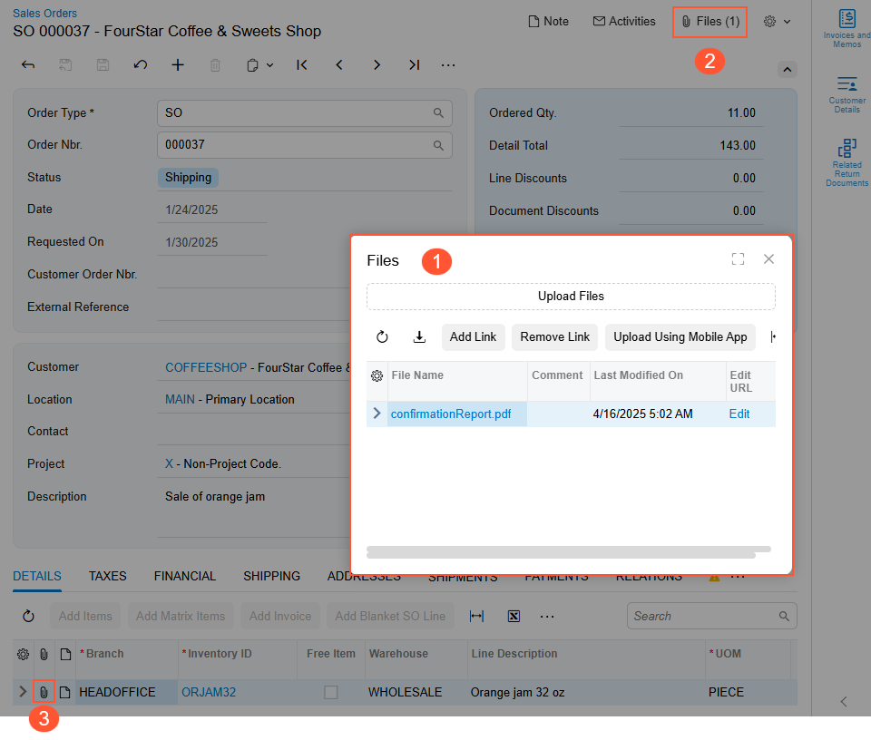
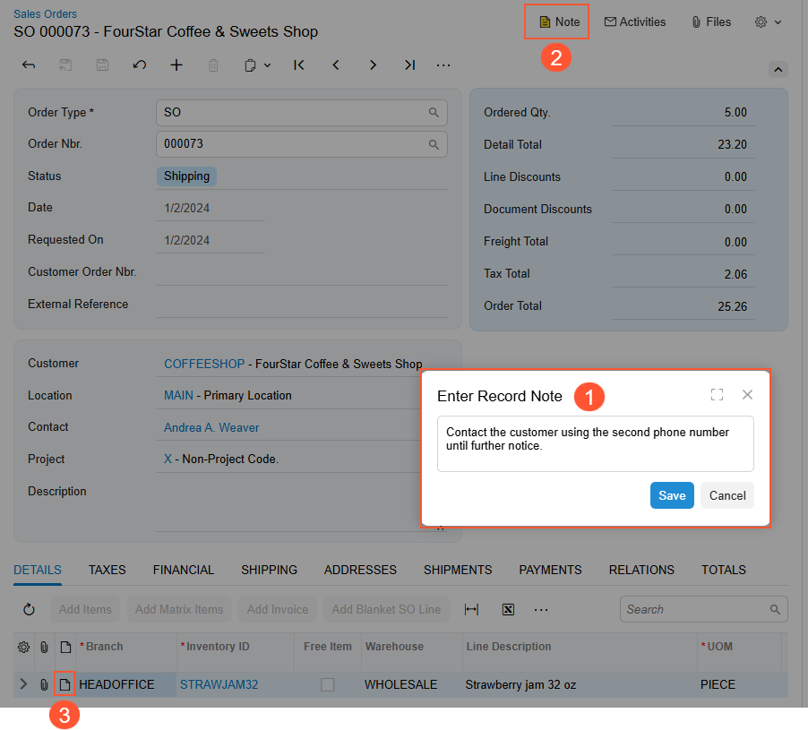

# Attachments: General Information {#_3a4b5259-068f-4b73-b42b-9072cb49eb47 .concept}

In Acumatica ERP, you can conveniently store files, such as temporary internal instructions, images of inventory items, or scanned images of original vendor invoices. You upload the files to the system and attach them to records, record details, notification templates, and wiki articles. You can easily manage and track the uploaded files.

Also, you can attach text notes to records, such as important information for colleagues about a customer.

## Learning Objectives { .section}

In this chapter, you’ll learn how to do the following:

-   Upload and attach a file to a record
-   Attach a note to a record
-   Search for existing files that have been uploaded to Acumatica ERP to attach them to records or record details
-   Maintain multiple versions of an attached file
-   Delete attached files

## Applicable Scenarios { .section}

You work with attachments if you need to keep additional information related to a record or record detail for future reference or need to notify your colleagues about any issues related to the record.

## File Attachments { .section}

You can attach a file to a record or a record detail \(that is, a row in a table of a record’s detail lines or rows\). You can use the **Files** dialog box to upload a file and attach it to a record, notification template, wiki article, or record detail.

You can open the **Files** dialog box \(Item 1 below\) in the following ways:

-   To attach a file to a record, notification template, or wiki article, click **Files** on the form title bar \(Item 2\).
-   To attach a file to a record detail, click the Files \(\) button in the **Files** column of the table that contains the record details on a particular form \(Item 3\).

Also, if you drag a file to the Summary area of a data entry form, the system attaches the file to the record that is selected on the form. If needed, you can upload files by using a registered mobile device with the Acumatica mobile app installed. For details, see [Attachments: File Upload and Attachment](GS_Working_With_Attachments_File_Upload_Concept.md).

By using the [File Maintenance](SM_20_25_10.md) \(SM202510\) form, you can control access to a file attachment and maintain multiple versions of a file \(if needed\). Also, if you are considering deleting a file, you can review the file’s links to system entities before you delete it.

On the [Search in Files](SM_20_25_20.md) \(SM202520\) form, you can search for an uploaded file to link it to a record. You can also search for files without any links, which you may opt to delete.

On the [File Upload Preferences](SM_20_25_50.md) \(SM202550\) form, you can define the possible types and sizes of files that may be uploaded.

For details on the management of attachments, see [Attachments: File Maintenance](GS_Working_with_Attachments_File_Maintenance_Concept.md).

## Note Attachments { .section}

You can attach a text note to a record or a detail of a record to communicate key information about the record or record detail to colleagues who work with it. You can use the **Enter Record Note** dialog box \(Item 1 below\) to create a note and attach it to a record or record detail, or view a note that was previously attached to a selected record or a record detail.

You can open the **Enter Record Note** dialog box in the following ways:

-   To attach a note to a record, click **Note** on the form title bar \(Item 2\).
-   To attach a note to a record detail, click the Note \(\) button in the **Notes** column of the table containing the record details on a particular form \(Item 3\).

You can also define a pop-up note for a particular customer, vendor, inventory item, or business account. As a result, when this record is selected during the creation of another record in the system, the system will display a pop-up message with the text you’ve specified. This ensures that users will see important information about these records while working with them.

For example, if a pop-up note has been defined for a customer on the [Customers](AR_30_30_00.md) \(AR303000\) form, and this customer is selected in a sales order, when a user opens the sales order on the [Sales Orders](SO_30_10_00.md) \(SO301000\) form, the system shows this pop-up note. For details, see [Attachments: Note Attachments](GS_Working_With_Attachments_Attachment_of_Notes_Concept.md).

**Parent topic:**[Working with Attachments](../UserGuide/GS_Working_With_Attachments_Mapref.md)

