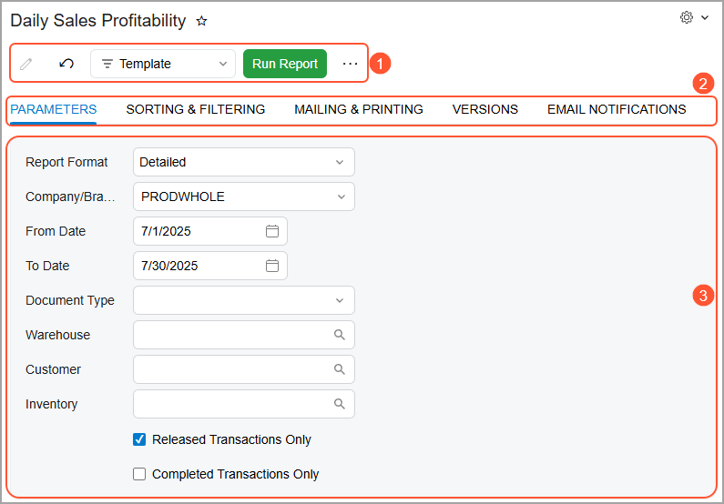
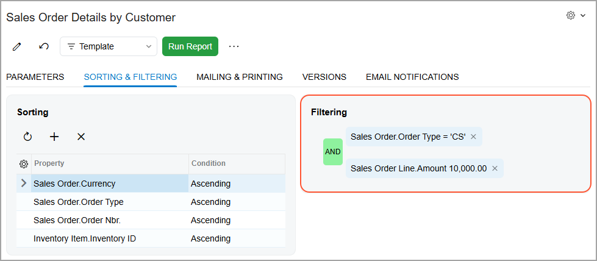

# Reports: General Information {#_9df357e5-9f58-4e08-a163-edf02461d3f3 .concept}

In the following sections, you’ll find information about typical Acumatica ERP reports and report parameters.

## Learning Objectives { .section}

In this chapter, you’ll learn how to do the following:

-   Identify the basic elements of a report form
-   Specify report parameters and generate a report
-   Create a report template
-   Share your report template
-   Set up an ad hoc filter for a report
-   Print a report
-   Export a report to Excel

## Applicable Scenarios { .section}

You learn about Acumatica ERP reports if you need to quickly obtain the required data from the system in a user-friendly, easy-to-grasp format in order to view and analyze this data. You can tailor the data in both data selection and format, and it’s easy to share key information with your colleagues or external organizations.

## Acumatica ERP Reports { .section}

Acumatica ERP reports are designed to give you a real-time view of your work, and you can adjust the report parameters to meet your specific information needs. You can drill down to the level of detail that you need or explore different report elements.

You can generate the following types of reports:

-   Standard reports, such as [Shipment Summary](SO_62_05_00.md) \(SO620500\), [Sales Order Details by Customer](SO_61_10_00.md) \(SO611000\), and [Daily Sales Profitability](AR_67_60_00.md) \(AR676000\).
-   Printed forms, such as [Sales Order](SO_64_10_10.md) \(SO641010\), [Pick List](SO_64_40_00.md) \(SO644000\), and [Shipment Confirmation](SO_64_20_00.md) \(SO642000\).
-   Analytical reports, such as [Balance Sheet](GL_63_40_00.md) \(GL634000\). For details, see [Managing Analytical Reports](GL__GL_ARM_Reports.md).

You can also use inquiry forms for building reports, such as the Leads BI \(CR3010BI\) or Cases BI \(CR3060BI\) form. For details, see [Managing Generic Inquiries](SM__MNG_Managing_Generic_Inquiry.md).

You run a report by accepting or modifying the report parameters and clicking the **Run Report** button on the report form toolbar. In most reports, you can select the format of the report \(detailed or summary\), specify the dates to be included in the report, select your company or company–branch combination, and specify other parameters that determine the data to be included in the report, such as the specific warehouse.

When you have generated a report, you can do any of the following:

-   Print the report, if printing settings are configured for Acumatica ERP, or save a copy of the report as a PDF file.
-   Send the report by email. If email settings are configured for Acumatica ERP, you can send a report to your colleagues or interested parties outside your organization.
-   Export the report to an Excel spreadsheet or a PDF file.
-   Save your report parameters in a template that you can reuse. You can designate the template as your default for the particular report, which means that every time you open the report form, it opens with the parameters that you’ve specified for the template.
-   Share your report template with other users, if the selected parameters may be used frequently to meet users’ needs for information.
-   Make changes to the report parameters and rerun the report if your initial parameters did not provide the needed information or you want a different picture of the data \(such as a different report format\).

## Basic Elements of the Report Form { .section}

Below you can see the basic elements of an Acumatica ERP report form.

1.  The report form toolbar and More menu with the following elements:
    -   The **Parameters** button, which you use to switch between the report parameters and the report after it has been run.
    -   The Template box, where you can select an existing template.
    -   The **Run Report** button, which you click to run the report.
    -   Commands that you use to save the report parameters as a template, edit the current template, or remove it.
    -   The **Edit Report** button, which you click to download the RPS file with the report \(for reports created in the Acumatica Report Designer\) or to open the [Report Definitions](CS_20_60_00.md) \(CS206000\) form with the report \(for ARM reports\).
2.  The tabs of the report form.
3.  The Tab area, which shows the elements of the selected tab.

## Sorting in Reports { .section}

When you are specifying the parameters of the report, you can specify sorting conditions for the report data on the **Sorting &amp; Filtering** tab of the report form.

## Ad Hoc Filters { .section}

You configure *ad hoc filters* on the **Sorting &amp; Filtering** tab \(**Filtering** section\) of report forms, shown below, to fine-tune the basic report parameters. You can’t save these filters directly and reuse them later. However, you can set up and save report templates that contain the filtering and sorting settings you use for an ad hoc filter.

**Parent topic:**[Working with Reports](../UserGuide/GS_Working_With_Reports_Mapref.md)

