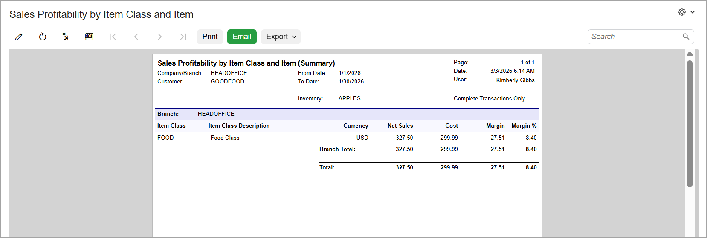
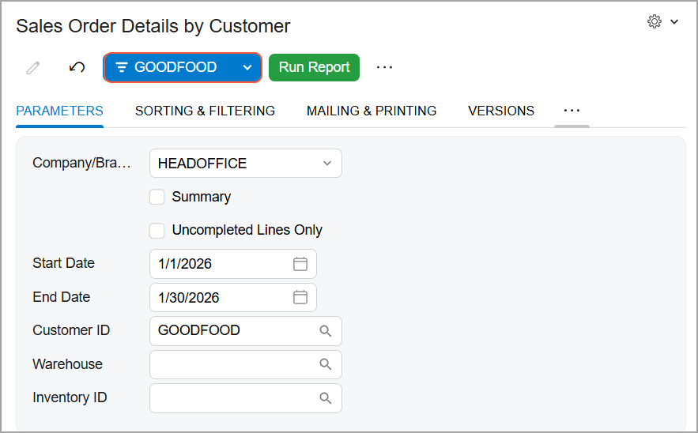
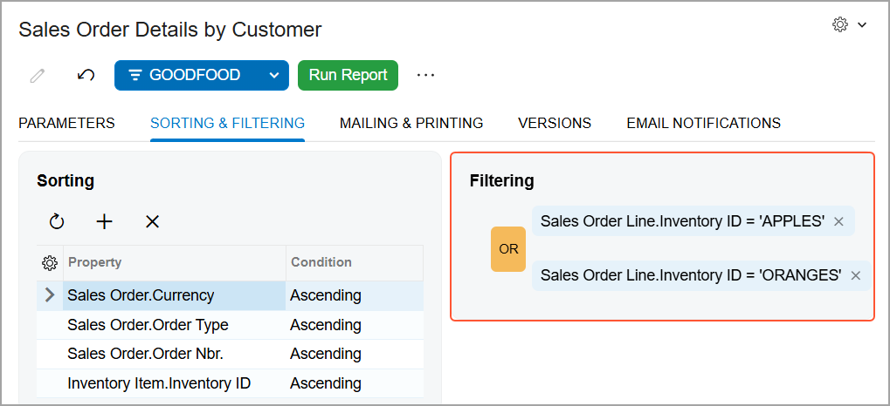

# Reports: Process Activity {#_2b4d7aa8-25dc-4777-880a-fee2274990c7 .task}

In the following activity, you’ll practice generating some Acumatica ERP reports to gain familiarity with the report parameters you can adjust to meet your needs.

**Attention:** This activity is based on the *U100* dataset. If you are using another dataset or if any system settings have been changed in *U100*, these changes can affect the workflow of the activity and the results of the processing. To avoid issues, restore the *U100* dataset to its initial state.

## Story { .section}

Suppose that you are David Chubb, a new sales manager of the SweetLife Fruits &amp; Jams company. It’s the end of January 2026, and you need to view the data about the inventory items that have been sold in January and the statuses of the sales orders that have been created for your customer, GoodFood One Restaurant.

## Process Overview { .section}

In this activity, you’ll do the following:

1.  Run a report
2.  Change the report parameters and rerun the report
3.  Create a template for a report
4.  Define the template as your default for the report
5.  Share the report template with other users
6.  Configure an ad hoc filter for the report
7.  Print a report to a PDF file
8.  Export a report to an Excel spreadsheet

## System Preparation { .section}

Before you start working with Acumatica ERP reports, make sure that the following tasks have been performed:

-   You have installed an Acumatica ERP instance with the *U100* dataset, or a system administrator has performed this task for you.
-   You have signed in to Acumatica ERP with the following credentials:

    -   **Username**: *chubb*
    -   **Password**: *123*
    For details, see [Acumatica ERP Access: Process Activity](GS_Accessing_Acumatica_ERP_Process_Activity.md).

-   The business date in your system is set to 1/30/2026. If a different date is displayed, click the Business Date menu button in the top pane of the Acumatica ERP screen, and select 1/30/2026 in the calendar.

## Step 1: Running a Report { .section}

Suppose that you need to find out sales profitability for stock items in January 2026. You’ll use the [Sales Profitability by Item Class and Item](AR_67_40_00.md) \(AR674000\) report to view this information.

To run this report, do the following:

1.  On the main menu, click **Sales Orders**. The **Sales Orders** workspace opens.
2.  In the **Reports** category of the workspace, click *Sales Profitability by Item Class and Item*. The report form opens, from which you can run the report.
3.  On the **Parameters** tab \(which is displayed automatically when a report form opens\), do the following:
    1.  In the **From Date** box, make sure that the *1/1/2026* value is selected.
    2.  In the **To Date** box, make sure that the *1/30/2026* value is selected.
    3.  On the report form toolbar, click **Run Report**. The report is generated and displayed in the working area.

        **Tip:**

        Notice that the report toolbar has a different set of buttons than the report form toolbar does. The **Parameters** button is still available, which you can use to switch between the report and the report form.

## Step 2: Changing the Report Parameters and Rerunning the Report { .section}

Suppose that you need to modify the parameters of the [Sales Profitability by Item Class and Item](AR_67_40_00.md) \(AR674000\) report so that you can see the completed transactions for apples sold to GoodFood One Restaurant in January 2026.

To change the report parameters, do the following:

1.  While you are still viewing the generated [Sales Profitability by Item Class and Item](AR_67_40_00.md) report, click **Parameters** on the report toolbar to switch to the report form.
2.  On the **Parameters** tab, do the following:
    1.  In the **Report Format** box, select *Summary*.
    2.  In the **Inventory** box, select *APPLES*.
    3.  In the **Customer** box, select *GOODFOOD*.
    4.  Clear the **Released Transactions Only** check box.
    5.  Select the **Completed Transactions Only** check box.
3.  On the report form toolbar, click **Run Report**. The report, which displays the summary data on sales profitability for apples in January 2026, is generated and displayed in the working area.

    

## Step 3: Creating a Template for a Report { .section}

Suppose that currently, you work with sales to only the GoodFood One Restaurant customer. At the end of every month, you need to monitor the status of the customer’s sales orders by using the [Sales Order Details by Customer](SO_61_10_00.md) \(SO611000\) report. You’d like to specify the parameters for the report once and save the template of the report so that you can quickly reuse the report parameters. In February, you are going on vacation, and you’d like to share the report template with your colleague who will be working with the customer during your absence.

To create a template for the report, do the following:

1.  On the main menu, click **Sales Orders**. The **Sales Orders** workspace opens.
2.  In the **Reports** category of the workspace, click *Sales Order Details by Customer*. The report form opens.
3.  On the **Parameters** tab, do the following:
    1.  In the **Start Date** box, make sure that the *1/1/2026* value is selected.
    2.  In the **End Date** box, make sure that the *1/30/2026* value is selected.
    3.  In the **Customer ID** box, select *GOODFOOD*.
4.  On the report form toolbar, click **Save Template**.
5.  In the **Save Template** dialog box, which opens, do the following:

    1.  In the **Name** box, type `GOODFOOD`.
    2.  Click **Save**. The system closes the dialog box and saves the template. In the **Template** box of the form toolbar, you can see the name of the template: *GOODFOOD*.
    

6.  Run the report.

## Step 4: Defining the Template as Your Default { .section}

Suppose that you’d like to make the *GOODFOOD* template, which you created in the previous step, your default template for the [Sales Order Details by Customer](SO_61_10_00.md) \(SO611000\) report. This means that each time you open the report form, the report parameters of the template are automatically filled in.

To make *GOODFOOD* your default report template, do the following:

1.  While you are still viewing the generated [Sales Order Details by Customer](SO_61_10_00.md) report, click the **Parameters** button on the report toolbar to switch to the report form.
2.  In the More menu, click **Edit Template**.
3.  In the **Edit Template** dialog box, select the **Default** check box.
4.  Click **Save**. Each time you open the [Sales Order Details by Customer](SO_61_10_00.md) report form, your report parameters for the *GOODFOOD* template will be inserted by default.

## Step 5: Configuring an Ad Hoc Filter for the Report { .section}

Suppose that you need to know the statuses of GoodFood One Restaurant’s sales orders that contain apples and oranges. The [Sales Order Details by Customer](SO_61_10_00.md) \(SO611000\) report provides this information, but it can take you quite long to scan for specific details. By using an ad hoc filter, you can narrow the report to view the needed data.

To configure an ad hoc filter for a report, do the following:

1.  While you are still viewing the [Sales Order Details by Customer](SO_61_10_00.md) report form, make sure that the *GOODFOOD* report template is selected.
2.  On the **Sorting and Filtering** tab, in the **Filtering** section, do the following:

    1.  Click the Plus button to add a filter condition.
    2.  In **Add Quick Filter**, select *Sales Order Line.Inventory ID*. The system adds it to the section.
    3.  Click *Sales Order Line.Inventory ID* and in the filter menu, select *Equals*.
    4.  In the unlabeled box at the bottom of the filter menu, select *APPLES*.
    5.  Click **Apply**.
    6.  Hover over *Sales Order Line.Inventory ID* and click the Plus button to add another filter condition.
    7.  In **Add Quick Filter**, select *Sales Order Line.Inventory ID*. The system adds it to the section.
    8.  Click the second *Sales Order Line.Inventory ID* and in the filter menu, select *Equals*.
    9.  In the unlabeled box at the bottom of the filter menu, select *ORANGES*.
    10. Click **Apply**.
    11. Click the *And* operator. It switches to *Or*.
    

3.  On the report form toolbar, click **Run Report**. The report is generated and displayed in the working area and now it shows only sales orders that contain apples and oranges.
4.  Optional: Save the report template that has the settings of your ad hoc filter as follows:

    1.  Click **Parameters** to switch to the report form.
    2.  On the report form toolbar, click **Save Template As**.
    3.  In the **Save Template** dialog box, which opens, type `GOODFOOD: apples & oranges` in the **Name** box.
    4.  Clear the **Default** check box \(if applicable\).
    5.  Click **Save** to save the template.
    In the future, you can select *GOODFOOD: apples &amp; oranges* in the **Template** box and run this report.

## Step 6: Sharing the Report Template { .section}

Suppose that in February, you are going on vacation and you’d like to share the *GOODFOOD* report template \(which you created in Step 3\) with your colleague who will be working with the customer during your absence.

To modify the report template so that it can be shared with other users, do the following:

1.  While you are still viewing the [Sales Order Details by Customer](SO_61_10_00.md) \(SO611000\) report form, in the Template area, select the *GOODFOOD* template.
2.  On the More menu, click **Edit Template**.
3.  In the **Edit Template** dialog box, clear the **Default** check box.

    **Attention:** You cannot share a default template. If you select the **Shared** check box, the **Default** check box becomes cleared and unavailable for editing.

4.  Select the **Shared** check box.
5.  Click **Save**. Now other users can select your template in the **Template** box of the [Sales Order Details by Customer](SO_61_10_00.md) report form.

## Step 7: Printing a Report to a PDF File { .section}

Suppose that you need to print a pick list for a warehouse employee who is shipping an order to the HM’s Bakery &amp; Cafe customer. The [Pick List](SO_64_40_00.md) \(SO644000\) report provides an easy-to-comprehend version of any pick list.

To print the report to a PDF file, do the following:

1.  On the main menu, click **Sales Orders**.
2.  In the **Printed Forms** category of the workspace, click *Pick List*. The report form opens.
3.  In the **Shipment Nbr.** box of the **Parameters** tab, select *000028*.
4.  On the report form toolbar, click **Run Report**. The report is displayed.
5.  On the report toolbar, click **Print**.
6.  In the dialog box that opens, do the following:

    1.  Select the option related to printing the report as a PDF file, and click **Save**.
    2.  In the dialog box that opens, select the destination folder and click **Save** to save the PDF file to your computer.
    **Tip:** If a printer is configured in your Acumatica ERP system, you could instead select the printer from the list and print the document.

## Step 8: Exporting a Report to Excel { .section}

Suppose that you need to run the [Shipment Register](SO_61_25_00.md) \(SO612500\) report and then export the report to Excel for a warehouse employee who will use the exported report data as a template to prepare a register for the warehouse.

To export a report to Excel, do the following:

1.  On the main menu, click **Sales Orders**. The **Sales Orders** workspace opens.
2.  Click the **Show All** button to switch to the full view of the workspace.
3.  In the **Reports** category of the workspace, click *Shipment Register*. The report form opens.
4.  In the **Start Date** box of the **Parameters** tab, make sure that the *1/1/2026* value is selected.
5.  In the **End Date** box, make sure that the *1/30/2026* value is selected.
6.  On the report form toolbar, click **Run Report**. The report is displayed.
7.  On the report toolbar, click **Export** &gt; **Excel**. The report is exported in Excel and downloaded to your computer.

**Parent topic:**[Working with Reports](../UserGuide/GS_Working_With_Reports_Mapref.md)

