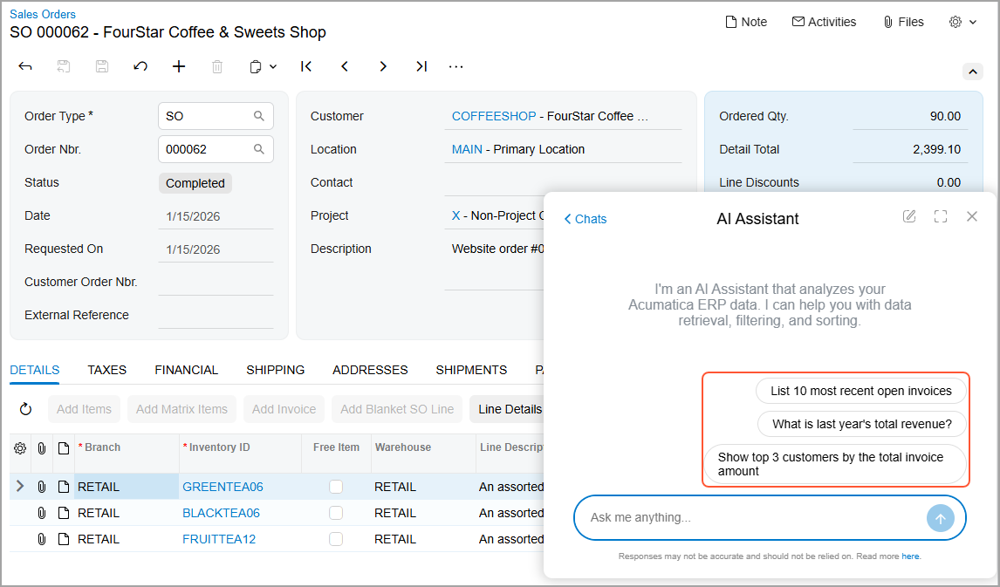
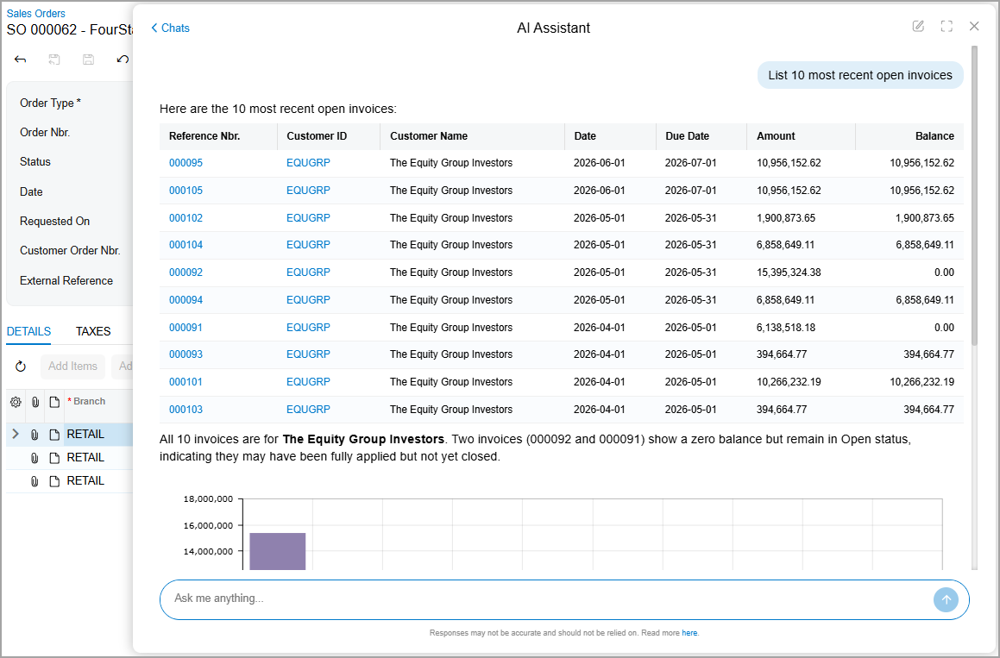
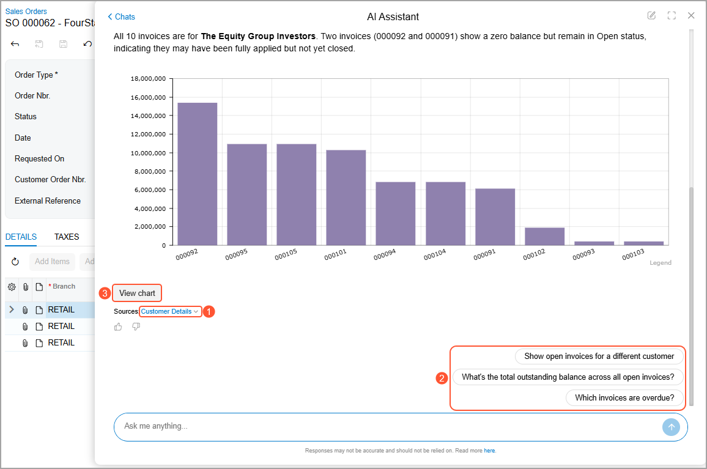
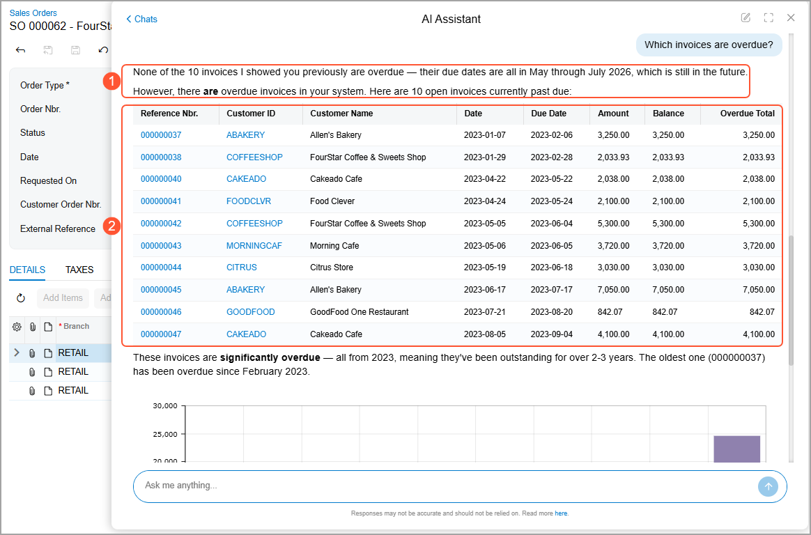
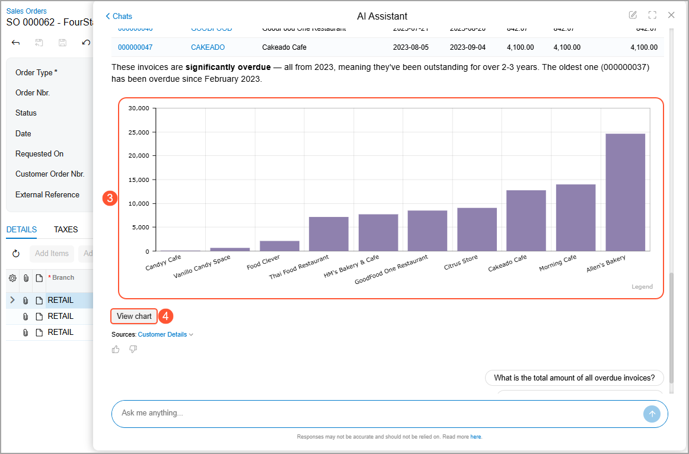
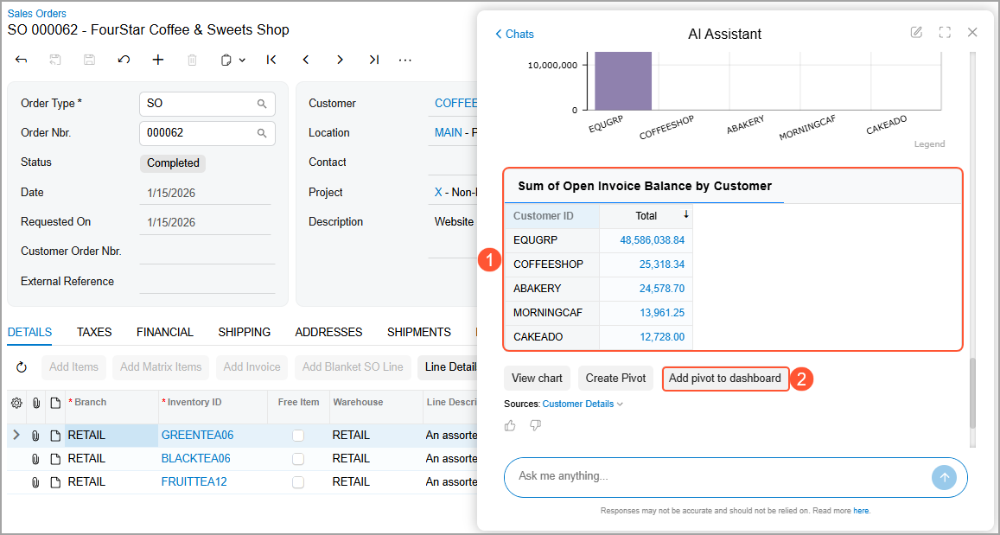
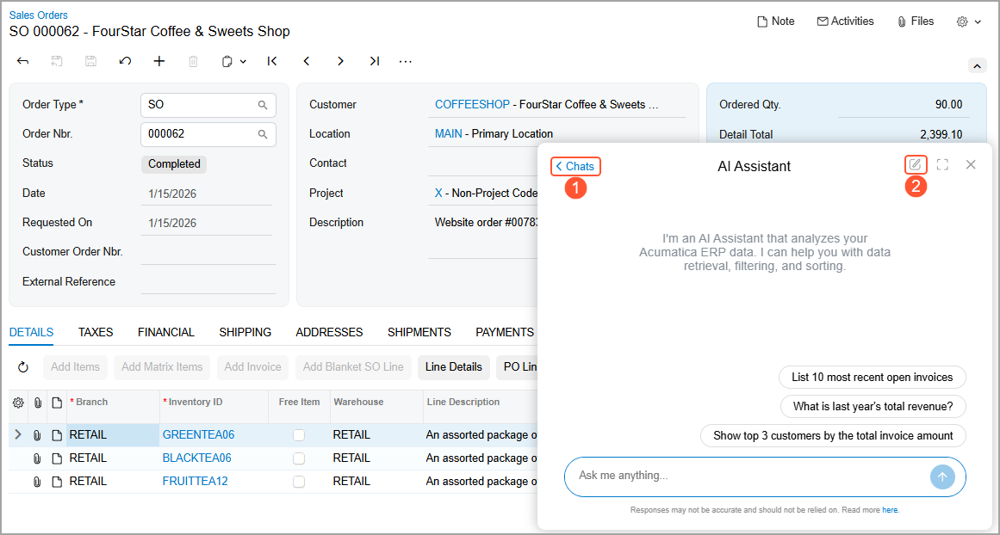
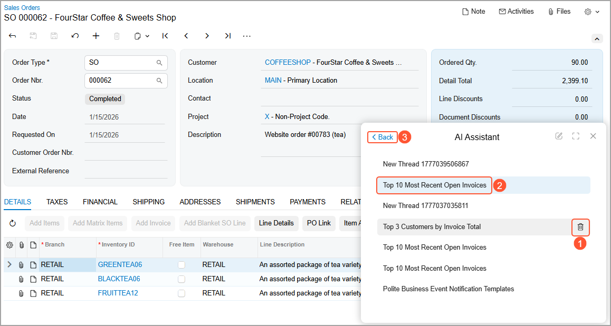

# Working with AI Assistant: General Information {#_7243fdf5-e52d-4f4f-a31b-d26bcd684d62 .concept}

In the following sections, you’ll learn how to solve various tasks with the help of AI Assistant. These tasks include starting a conversation, asking questions, reviewing results, drilling down into records, and organizing work with chats.

**Attention:** These capabilities are available only if the *AI Assistant* feature is enabled on the [Enable/Disable Features](CS_10_00_00.md) \(CS100000\) form. Also, you need to have one of the following roles to be able to use AI Assistant:

-   *AI Assistant User*
-   *Administrator*
-   *Acumatica Support*

## Applicable Scenarios { .section}

You use AI Assistant in the following cases:

-   You need a fast answer to an operational question \(for example, find what the totals are, review recent activity, or list open invoices\).
-   You want to move from a summarized answer to the underlying records without manually searching.
-   You want to visualize results and turn them into dashboards or pivot-style analytics for further review.
-   You’re doing multistep investigation and want to keep questions and follow-ups organized in separate chats.

## AI Assistant Capabilities {#section_nlj_vm4_g3c .section}

With AI Assistant, you can do the following:

-   **Ask questions in everyday language**: You can type a question using language you’d use with colleagues, such as *What is this month's total income?* or *List 10 open invoices that were modified most recently*.
-   **Drill down into records with just a click**: If an answer includes the record ID or name, this ID or name is displayed as a link. Clicking the link opens the record in the main working area of the form—not in the chat window.
-   **Turn insights into dashboards and pivots**: For certain answers, AI Assistant offers to performs actions for you, such as creating a widget from a chart or generating a pivot table and placing it on a new dashboard. These actions also occur in the working area of the form, so you can build tools for further analytics straight from your conversation.
-   **Keep related questions together**: Conversations are grouped into chats. Each chat stores your previous questions and answers—so you can return to your research later or build on it.

## Asking Your Questions { .section}

Behind the scenes, AI Assistant relies on a defined set of generic inquiries and their descriptions. Your system administrator can add generic inquiries to this set or remove them from it. They can also add descriptions—using business language that’s familiar to your users. By helping the AI Assistant associate users' language with specific generic inquiries, fields, and parameters, administrators can increase the likelihood of users getting high-quality answers. For details, see [Exposing Generic Inquiries to AI Assistant: General Information](GI_Exposing_Inquiry_to_AI_Assistant_GeneralInfo.md).

To start working with your AI Assistant, click  in the top pane. The chat window opens with the three predefined prompts \(shown below\). You can click one of these prompts or type your own.

Suppose that you want to see the most recent open invoices. AI Assistant’s results are listed in a table \(shown below\).

You can click *Customer Details* \(Item 1 below\) to open the Customer Details \(AR0010DB\) list of records, which lists all customers documents; you can also select a customer to view only their documents. Alternatively, you can click another follow-up prompt \(Item 2\)

**Tip:** You can view different forms and records in the main working area while continuing your conversation with AI Assistant. AI Assistant doesn’t switch between chats when you do this.

For the third follow-up prompt, notice in the next two screenshots that AI Assistant displays the results as text \(Item 1\), a table \(Item 2\), and a chart \(Item 3\). The columns in the chart are also links to the corresponding records. You can click **View Chart** \(Item 4\) to open a dashboard with this widget.

AI Assistant can also organize data into a pivot table \(Item 1 below\). Click the links in the table to open the corresponding records. You can add a pivot table from the response to a dashboard \(Item 2\).

## Managing Your Chats {#section_vv2_1y4_y4b .section}

Each time you click a predefined prompt or type a new question, AI Assistant creates a chat. You can continue asking questions in this chat or go back to the list of chats, switch to another chat, or start a new one.

To get back to the list of chats, click the *Chats* link in the upper left corner of the window \(Item 1 below\). From this list, you can click another chat to switch to it. To start a new chat, click **Create Chat** \(Item 2\).

If you no longer need a chat, you can delete it \(Item 1 below\). Notice that the system has assigned a name to each chat based on your request \(Item 2\). Click the *Back* link to return to the previous chat \(Item 3\).

**Tip:** You can resize the chat window by dragging its borders and move it as needed.

**Parent topic:**[Working with AI Assistant](../UserGuide/GS_Working_with_AI_Assistant_Mapref.md)

